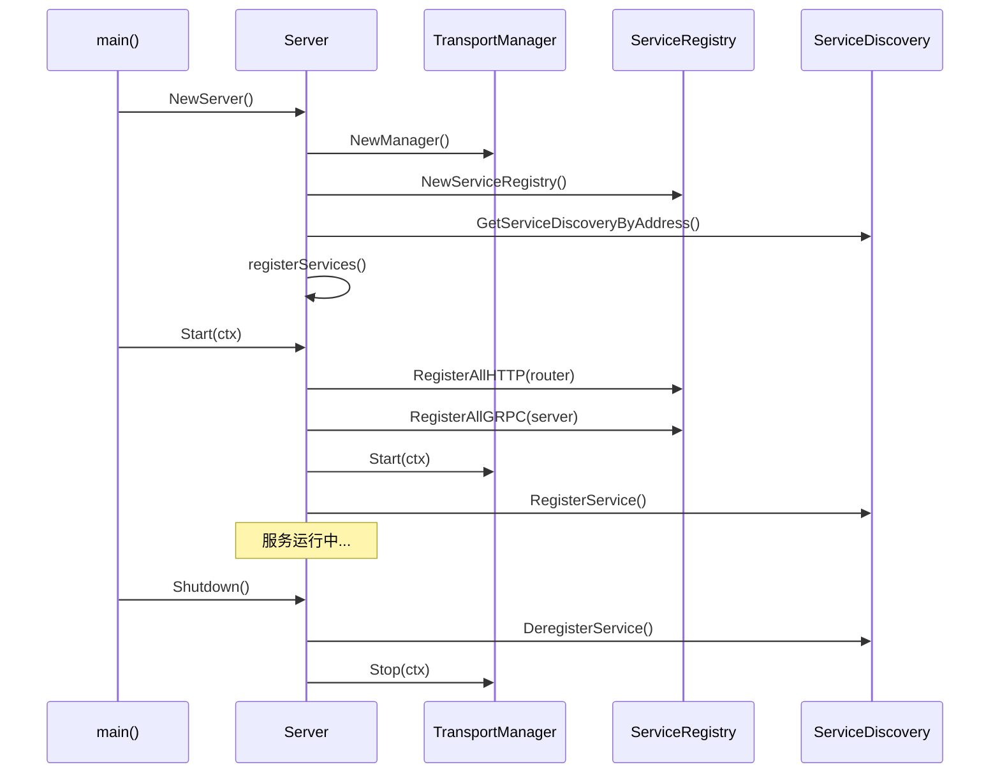

# SWIT 项目服务架构分析文档

## 概述

本文档详细分析了 `switauth` 和 `switserve` 两个项目的服务架构和注册逻辑，总结了它们的设计模式、核心组件以及架构特点。

## 项目架构对比

### 整体架构模式

两个项目都采用了相同的分层架构模式：

```
┌─────────────────────────────────────────┐
│                Server                   │
├─────────────────────────────────────────┤
│           Transport Layer               │
│  ┌─────────────────┬─────────────────┐  │
│  │  HTTPTransport  │  GRPCTransport  │  │
│  └─────────────────┴─────────────────┘  │
├─────────────────────────────────────────┤
│            Service Layer                │
│  ┌─────────────────────────────────────┐ │
│  │        ServiceRegistry              │ │
│  │  ┌───────────┬───────────────────┐  │ │
│  │  │ Service A │ Service B │ ... │  │ │
│  │  └───────────┴───────────────────┘  │ │
│  └─────────────────────────────────────┘ │
├─────────────────────────────────────────┤
│           Handler Layer                 │
│  ┌─────────────────┬─────────────────┐  │
│  │   HTTP Handler  │   gRPC Handler  │  │
│  └─────────────────┴─────────────────┘  │
└─────────────────────────────────────────┘
```

## 核心组件分析

### 1. 服务注册器 (ServiceRegistrar)

#### 接口定义

两个项目都定义了相同的 `ServiceRegistrar` 接口：

```go
type ServiceRegistrar interface {
    // RegisterGRPC 注册 gRPC 服务
    RegisterGRPC(server *grpc.Server) error
    // RegisterHTTP 注册 HTTP 路由
    RegisterHTTP(router *gin.Engine) error
    // GetName 返回服务名称
    GetName() string
}
```

#### 实现对比

**switserve 服务实现：**
- `greeter.ServiceRegistrar` - 问候服务
- `notification.ServiceRegistrar` - 通知服务
- `health.ServiceRegistrar` - 健康检查服务
- `stop.ServiceRegistrar` - 停止服务
- `user.ServiceRegistrar` - 用户服务
- `debug.ServiceRegistrar` - 调试服务

**switauth 服务实现：**
- `auth.ServiceRegistrar` - 认证服务
- `health.ServiceRegistrar` - 健康检查服务

### 2. 传输层管理 (Transport Layer)

#### Transport Manager

```go
type Manager struct {
    transports []Transport
    mu         sync.RWMutex
}

type Transport interface {
    Start(ctx context.Context) error
    Stop(ctx context.Context) error
    Name() string
    Address() string
}
```

#### HTTP Transport

**switserve 实现特点：**
```go
type HTTPTransport struct {
    server    *http.Server
    router    *gin.Engine
    address   string
    testPort  string // 测试端口覆盖
    ready     chan struct{}
    readyOnce sync.Once
    mu        sync.RWMutex
}
```

**switauth 实现特点：**
```go
type HTTPTransport struct {
    server *http.Server
    router *gin.Engine
    addr   string
    mu     sync.RWMutex
}
```

#### gRPC Transport

**switserve 实现：**
```go
type GRPCTransport struct {
    server   *grpc.Server
    listener net.Listener
    address  string
    testPort string
    mu       sync.RWMutex
}
```

**switauth 实现：**
```go
type GRPCTransport struct {
    server *grpc.Server
    addr   string
    mu     sync.RWMutex
}
```

### 3. 服务注册表 (ServiceRegistry)

#### 核心功能

```go
type ServiceRegistry struct {
    mu         sync.RWMutex  // switserve 有锁保护
    registrars []ServiceRegistrar
}

// 主要方法
func (sr *ServiceRegistry) Register(registrar ServiceRegistrar)
func (sr *ServiceRegistry) RegisterAllHTTP(router *gin.Engine) error
func (sr *ServiceRegistry) RegisterAllGRPC(server *grpc.Server) error
```

#### 线程安全性对比

- **switserve**: 使用 `sync.RWMutex` 保护并发访问
- **switauth**: 没有锁保护（可能存在并发安全问题）

### 4. 服务发现 (Service Discovery)

#### 架构设计

```go
type ServiceDiscovery struct {
    client          *api.Client  // Consul 客户端
    mu              sync.Mutex
    roundRobinIndex int
}

type Manager struct {
    instances map[string]*ServiceDiscovery
    mu        sync.RWMutex
}
```

#### 功能特性

1. **服务注册/注销**
   - 自动注册 HTTP 和 gRPC 服务
   - 优雅关闭时自动注销服务

2. **负载均衡策略**
   - Round Robin 轮询
   - Random 随机选择

3. **实例管理**
   - 单例模式管理服务发现实例
   - 支持多个 Consul 地址

### 5. 配置管理 (Configuration)

#### switserve 配置结构

```go
type ServeConfig struct {
    Database struct {
        Host     string `json:"host" yaml:"host"`
        Port     string `json:"port" yaml:"port"`
        Username string `json:"username" yaml:"username"`
        Password string `json:"password" yaml:"password"`
        DBName   string `json:"dbname" yaml:"dbname"`
    } `json:"database" yaml:"database"`
    Server struct {
        Port     string `json:"port" yaml:"port"`
        GRPCPort string `json:"grpcPort" yaml:"grpcPort"`
    } `json:"server" yaml:"server"`
    ServiceDiscovery struct {
        Address string `json:"address" yaml:"address"`
    } `json:"serviceDiscovery" yaml:"serviceDiscovery"`
}
```

#### switauth 配置结构

```go
type AuthConfig struct {
    Database struct {
        Username string `json:"username" yaml:"username"`
        Password string `json:"password" yaml:"password"`
        Host     string `json:"host" yaml:"host"`
        Port     string `json:"port" yaml:"port"`
        DBName   string `json:"dbname" yaml:"dbname"`
    } `json:"database"`
    Server struct {
        Port     string `json:"port" yaml:"port"`
        GRPCPort string `json:"grpcPort" yaml:"grpcPort"`
    } `json:"server" yaml:"server"`
    ServiceDiscovery struct {
        Address string `json:"address" yaml:"address"`
    } `json:"serviceDiscovery" yaml:"serviceDiscovery"`
}
```

#### 配置文件命名

- **switserve**: `swit.yaml`
- **switauth**: `switauth.yaml`

### 6. 中间件系统 (Middleware)

#### 全局中间件注册器

```go
type GlobalMiddlewareRegistrar struct{}

func (gmr *GlobalMiddlewareRegistrar) RegisterMiddleware(router *gin.Engine) error {
    // 注册超时中间件
    router.Use(TimeoutMiddleware(30 * time.Second))
    // 注册其他全局中间件
    router.Use(Logger(), CORSMiddleware())
    return nil
}
```

#### 认证中间件

```go
type AuthConfig struct {
    WhiteList               []string // 白名单路径
    AuthServiceName         string   // 认证服务名称
    AuthEndpoint           string   // 认证端点
    ServiceDiscoveryAddress string   // 服务发现地址
}

// 中间件函数
func AuthMiddleware() gin.HandlerFunc
func AuthMiddlewareWithWhiteList(whiteList []string) gin.HandlerFunc
func AuthMiddlewareWithConfig(config *AuthConfig) gin.HandlerFunc
```

## 服务启动流程

### 通用启动流程



### switserve 启动流程

1. **初始化阶段**
   ```go
   func NewServer() (*Server, error) {
       server := &Server{
           transportManager: transport.NewManager(),
           serviceRegistry:  transport.NewServiceRegistry(),
       }
       
       // 设置服务发现
       cfg := config.GetConfig()
       sd, err := discovery.GetServiceDiscoveryByAddress(cfg.ServiceDiscovery.Address)
       server.sd = sd
       
       // 初始化传输层
       server.httpTransport = transport.NewHTTPTransport()
       server.grpcTransport = transport.NewGRPCTransport()
       
       // 注册传输层
       server.transportManager.Register(server.httpTransport)
       server.transportManager.Register(server.grpcTransport)
       
       // 注册服务
       server.registerServices()
       
       return server, nil
   }
   ```

2. **服务注册阶段**
   ```go
   func (s *Server) registerServices() {
       // 注册各种服务
       s.serviceRegistry.Register(greeter.NewServiceRegistrar())
       s.serviceRegistry.Register(notification.NewServiceRegistrar())
       s.serviceRegistry.Register(health.NewServiceRegistrar())
       s.serviceRegistry.Register(stop.NewServiceRegistrar(shutdownFunc))
       s.serviceRegistry.Register(user.NewServiceRegistrar())
       s.serviceRegistry.Register(debug.NewServiceRegistrar(s.serviceRegistry, s.httpTransport.GetRouter()))
   }
   ```

3. **启动阶段**
   ```go
   func (s *Server) Start(ctx context.Context) error {
       // 注册所有服务到传输层
       s.serviceRegistry.RegisterAllGRPC(s.grpcTransport.GetServer())
       s.serviceRegistry.RegisterAllHTTP(s.httpTransport.GetRouter())
       
       // 启动所有传输层
       return s.transportManager.Start(ctx)
   }
   ```

### switauth 启动流程

1. **初始化阶段**
   ```go
   func NewServer() (*Server, error) {
       cfg := config.GetConfig()
       
       // 创建传输管理器和服务注册表
       transportManager := transport.NewManager()
       serviceRegistry := transport.NewServiceRegistry()
       
       // 创建传输层
       httpTransport := transport.NewHTTPTransport()
       httpTransport.SetAddress(":" + cfg.Server.Port)
       
       grpcTransport := transport.NewGRPCTransport()
       grpcTransport.SetAddress(":" + cfg.Server.GRPCPort)
       
       // 设置服务发现
       sd, err := discovery.GetServiceDiscoveryByAddress(cfg.ServiceDiscovery.Address)
       
       return &Server{
           transportManager: transportManager,
           serviceRegistry:  serviceRegistry,
           httpTransport:    httpTransport,
           grpcTransport:    grpcTransport,
           sd:               sd,
           config:           cfg,
       }, nil
   }
   ```

2. **服务注册阶段**
   ```go
   func (s *Server) registerServices() error {
       // 初始化依赖
       userClient := client.NewUserClient(s.sd)
       tokenRepo := repository.NewTokenRepository(db.GetDB())
       
       // 注册认证服务
       authService, err := auth.NewServiceRegistrar(userClient, tokenRepo)
       s.serviceRegistry.Register(authService)
       
       // 注册健康检查服务
       healthService := health.NewServiceRegistrar()
       s.serviceRegistry.Register(healthService)
       
       return nil
   }
   ```

3. **启动阶段**
   ```go
   func (s *Server) Start(ctx context.Context) error {
       // 注册服务到传输层
       s.serviceRegistry.RegisterAllHTTP(s.httpTransport.GetRouter())
       s.serviceRegistry.RegisterAllGRPC(s.grpcTransport.GetServer())
       
       // 配置中间件
       s.configureMiddleware()
       
       // 启动传输层
       s.transportManager.Start(ctx)
       
       // 注册到服务发现
       return s.registerWithDiscovery()
   }
   ```

## 架构特点对比

### 相似点

1. **统一的服务注册模式**
   - 都使用 `ServiceRegistrar` 接口
   - 都有 `ServiceRegistry` 管理服务
   - 都支持 HTTP 和 gRPC 双协议

2. **分层架构设计**
   - Transport Layer（传输层）
   - Service Layer（服务层）
   - Handler Layer（处理层）

3. **服务发现集成**
   - 都使用 Consul 作为服务发现
   - 自动服务注册/注销
   - 支持负载均衡

4. **配置管理**
   - 都使用 Viper 进行配置管理
   - YAML 格式配置文件
   - 相似的配置结构

### 差异点

1. **线程安全性**
   - **switserve**: ServiceRegistry 使用锁保护
   - **switauth**: ServiceRegistry 无锁保护

2. **传输层实现**
   - **switserve**: 更完善的测试支持（testPort）
   - **switauth**: 更简单的实现

3. **服务数量**
   - **switserve**: 6个服务（greeter, notification, health, stop, user, debug）
   - **switauth**: 2个服务（auth, health）

4. **中间件配置**
   - **switauth**: 显式配置中间件
   - **switserve**: 在服务层配置中间件

5. **依赖管理**
   - **switauth**: 更复杂的依赖注入（数据库、客户端）
   - **switserve**: 相对简单的依赖关系

## 最佳实践建议

### 1. 线程安全改进

**问题**: switauth 的 ServiceRegistry 缺少并发保护

**建议**: 参考 switserve 的实现，添加 `sync.RWMutex`

```go
type ServiceRegistry struct {
    mu         sync.RWMutex  // 添加锁保护
    registrars []ServiceRegistrar
}

func (sr *ServiceRegistry) Register(registrar ServiceRegistrar) {
    sr.mu.Lock()
    defer sr.mu.Unlock()
    sr.registrars = append(sr.registrars, registrar)
}
```

### 2. 错误处理统一

**建议**: 统一错误处理模式，使用包装错误

```go
if err := s.serviceRegistry.RegisterAllHTTP(router); err != nil {
    return fmt.Errorf("failed to register HTTP services: %w", err)
}
```

### 3. 配置验证

**建议**: 添加配置验证逻辑

```go
func (c *AuthConfig) Validate() error {
    if c.Database.Host == "" {
        return errors.New("database host is required")
    }
    if c.Server.Port == "" {
        return errors.New("server port is required")
    }
    return nil
}
```

### 4. 测试覆盖率提升

**建议**: 增加集成测试和端到端测试

```go
func TestServerIntegration(t *testing.T) {
    server, err := NewServer()
    require.NoError(t, err)
    
    ctx, cancel := context.WithTimeout(context.Background(), 5*time.Second)
    defer cancel()
    
    go func() {
        err := server.Start(ctx)
        assert.NoError(t, err)
    }()
    
    // 测试服务可用性
    time.Sleep(100 * time.Millisecond)
    
    err = server.Shutdown()
    assert.NoError(t, err)
}
```

### 5. 监控和可观测性

**建议**: 添加 Prometheus 指标和链路追踪

```go
// 在中间件中添加指标收集
func MetricsMiddleware() gin.HandlerFunc {
    return func(c *gin.Context) {
        start := time.Now()
        c.Next()
        duration := time.Since(start)
        
        // 记录请求指标
        requestDuration.WithLabelValues(
            c.Request.Method,
            c.FullPath(),
            strconv.Itoa(c.Writer.Status()),
        ).Observe(duration.Seconds())
    }
}
```

## 总结

`switauth` 和 `switserve` 两个项目采用了一致的架构设计模式，体现了良好的代码复用和设计一致性。主要优势包括：

1. **模块化设计**: 清晰的分层架构，职责分离明确
2. **可扩展性**: 通过 ServiceRegistrar 接口易于添加新服务
3. **协议支持**: 同时支持 HTTP 和 gRPC 协议
4. **服务发现**: 集成 Consul 实现自动服务注册和发现
5. **配置管理**: 统一的配置管理方式

同时也存在一些改进空间：

1. **线程安全**: switauth 需要改进并发安全性
2. **错误处理**: 可以进一步统一错误处理模式
3. **测试覆盖**: 需要增加更多的集成测试
4. **监控**: 可以添加更完善的监控和可观测性功能

整体而言，两个项目的架构设计体现了现代微服务架构的最佳实践，为后续的扩展和维护奠定了良好的基础。