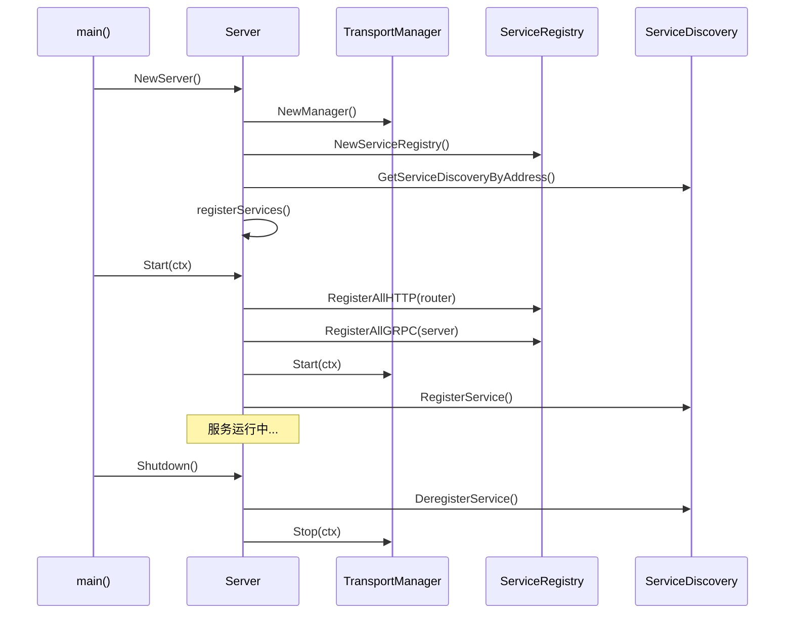

# SWIT 项目服务架构分析文档

## 概述

本文档详细分析了 `switauth` 和 `switserve` 两个项目的服务架构和注册逻辑，总结了它们的设计模式、核心组件以及架构特点。本文档基于最新的代码结构，特别反映了 `switauth` 服务的 v1.0 架构重构成果。

## 最新架构更新

### switauth v1.0 架构重构

`switauth` 服务已完成重大架构重构，主要变化包括：

1. **移除适配器模式**: 删除了 `AuthServiceAdapter`，直接使用 `v1.AuthSrv` 接口
2. **版本化设计**: 采用 `/service/auth/v1/` 目录结构，支持 API 版本管理
3. **统一接口**: 所有认证方法返回统一的 `*v1.AuthResponse` 类型
4. **简化依赖**: 通过选项模式 (Options Pattern) 进行依赖注入
5. **完整测试覆盖**: 重构了所有测试用例，确保与新接口兼容

## 项目架构对比

### 整体架构模式

两个项目都采用了相同的分层架构模式，但在具体实现上有所差异：

```
┌─────────────────────────────────────────┐
│                Server                   │
├─────────────────────────────────────────┤
│           Transport Layer               │
│  ┌─────────────────┬─────────────────┐  │
│  │  HTTPTransport  │  GRPCTransport  │  │
│  └─────────────────┴─────────────────┘  │
├─────────────────────────────────────────┤
│            Service Layer                │
│  ┌─────────────────────────────────────┐ │
│  │        ServiceRegistry              │ │
│  │  ┌───────────┬───────────────────┐  │ │
│  │  │ Service A │ Service B │ ... │  │ │
│  │  │    v1     │    v1     │     │  │ │
│  │  └───────────┴───────────────────┘  │ │
│  └─────────────────────────────────────┘ │
├─────────────────────────────────────────┤
│           Handler Layer                 │
│  ┌─────────────────┬─────────────────┐  │
│  │   HTTP Handler  │   gRPC Handler  │  │
│  │      /v1        │      /v1        │  │
│  └─────────────────┴─────────────────┘  │
└─────────────────────────────────────────┘
```

### 最新目录结构对比

**switauth 项目结构 (v1.0 重构后):**
```
switauth/
├── client/                 # 外部服务客户端
├── cmd/                    # 命令行入口
├── config/                 # 配置管理
├── db/                     # 数据库连接
├── handler/                # 处理器层
│   ├── grpc/auth/         # gRPC 处理器
│   └── http/auth/         # HTTP 处理器
│       └── v1/            # v1 版本处理器
├── model/                  # 数据模型
├── repository/             # 数据访问层
├── service/                # 业务逻辑层
│   ├── auth/              # 认证服务
│   │   ├── registrar.go   # 服务注册器
│   │   └── v1/            # v1 版本接口
│   └── health/            # 健康检查服务
└── transport/              # 传输层
```

**switserve 项目结构:**
```
switserve/
├── cmd/                    # 命令行入口
├── config/                 # 配置管理
├── db/                     # 数据库连接
├── handler/                # 处理器层
│   ├── grpc/greeter/      # gRPC 处理器
│   └── http/              # HTTP 处理器
│       ├── health/
│       ├── stop/
│       └── user/
├── model/                  # 数据模型
├── repository/             # 数据访问层
├── service/                # 业务逻辑层
│   ├── greeter/v1/        # 问候服务 v1
│   ├── health/            # 健康检查服务
│   ├── notification/v1/   # 通知服务 v1
│   ├── stop/              # 停止服务
│   └── user/v1/           # 用户服务 v1
└── transport/              # 传输层
```

## 核心组件分析

### 1. 服务注册器 (ServiceRegistrar)

#### 接口定义

两个项目都定义了相同的 `ServiceRegistrar` 接口：

```go
type ServiceRegistrar interface {
    // RegisterGRPC 注册 gRPC 服务
    RegisterGRPC(server *grpc.Server) error
    // RegisterHTTP 注册 HTTP 路由
    RegisterHTTP(router *gin.Engine) error
    // GetName 返回服务名称
    GetName() string
}
```

#### 实现对比

**switserve 服务实现：**
- `greeter.ServiceRegistrar` - 问候服务 (支持 gRPC + HTTP)
- `notification.ServiceRegistrar` - 通知服务
- `health.ServiceRegistrar` - 健康检查服务
- `stop.ServiceRegistrar` - 停止服务
- `user.ServiceRegistrar` - 用户服务

**switauth 服务实现 (v1.0 重构后)：**
- `auth.ServiceRegistrar` - 认证服务 (基于 v1.AuthSrv 接口)
- `health.ServiceRegistrar` - 健康检查服务

#### switauth v1.0 认证服务接口

```go
// AuthSrv defines the interface for authentication business logic
type AuthSrv interface {
    // Login authenticates a user and returns access and refresh tokens
    Login(ctx context.Context, username, password string) (*AuthResponse, error)
    
    // RefreshToken generates new tokens using a refresh token
    RefreshToken(ctx context.Context, refreshToken string) (*AuthResponse, error)
    
    // ValidateToken validates an access token and returns token details
    ValidateToken(ctx context.Context, tokenString string) (*model.Token, error)
    
    // Logout invalidates a token and logs out the user
    Logout(ctx context.Context, tokenString string) error
}

// AuthResponse represents the unified authentication response
type AuthResponse struct {
    AccessToken  string    `json:"access_token"`
    RefreshToken string    `json:"refresh_token"`
    ExpiresAt    time.Time `json:"expires_at"`
    TokenType    string    `json:"token_type"`
}
```

#### 依赖注入模式

**switauth 采用选项模式 (Options Pattern):**
```go
// 创建认证服务
service, err := v1.NewAuthSrv(
    v1.WithUserClient(userClient),
    v1.WithTokenRepository(tokenRepo),
)

// 创建服务注册器
registrar, err := auth.NewServiceRegistrar(userClient, tokenRepo)
```

### 2. 传输层管理 (Transport Layer)

#### Transport Manager

```go
type Manager struct {
    transports []Transport
    mu         sync.RWMutex
}

type Transport interface {
    Start(ctx context.Context) error
    Stop(ctx context.Context) error
    Name() string
    Address() string
}
```

#### HTTP Transport

**switserve 实现特点：**
```go
type HTTPTransport struct {
    server    *http.Server
    router    *gin.Engine
    address   string
    testPort  string // 测试端口覆盖
    ready     chan struct{}
    readyOnce sync.Once
    mu        sync.RWMutex
}
```

**switauth 实现特点：**
```go
type HTTPTransport struct {
    server *http.Server
    router *gin.Engine
    addr   string
    mu     sync.RWMutex
}
```

#### gRPC Transport

**switserve 实现：**
```go
type GRPCTransport struct {
    server   *grpc.Server
    listener net.Listener
    address  string
    testPort string
    mu       sync.RWMutex
}
```

**switauth 实现：**
```go
type GRPCTransport struct {
    server *grpc.Server
    addr   string
    mu     sync.RWMutex
}
```

### 3. 服务注册表 (ServiceRegistry)

#### 核心功能

```go
type ServiceRegistry struct {
    mu         sync.RWMutex  // 两个项目都有锁保护
    registrars []ServiceRegistrar
}

// 主要方法
func (sr *ServiceRegistry) Register(registrar ServiceRegistrar)
func (sr *ServiceRegistry) RegisterAllHTTP(router *gin.Engine) error
func (sr *ServiceRegistry) RegisterAllGRPC(server *grpc.Server) error
```

#### 线程安全性

两个项目都使用 `sync.RWMutex` 保护并发访问，确保服务注册的线程安全性。

#### 版本化路由注册

**switauth 路由注册 (v1.0):**
```go
func (a *ServiceRegistrar) RegisterHTTP(router *gin.Engine) error {
    // Create API v1 group
    v1Group := router.Group("/api/v1")
    
    // Register authentication routes
    authGroup := v1Group.Group("/auth")
    {
        authGroup.POST("/login", a.controller.Login)
        authGroup.POST("/logout", a.controller.Logout)
        authGroup.POST("/refresh", a.controller.RefreshToken)
        authGroup.GET("/validate", a.controller.ValidateToken)
    }
    return nil
}
```

**switserve 路由注册:**
```go
func (sr *ServiceRegistrar) RegisterHTTP(router *gin.Engine) error {
    v1 := router.Group("/api/v1")
    {
        greeter := v1.Group("/greeter")
        {
            greeter.POST("/hello", sr.sayHelloHTTP)
        }
    }
    return nil
}
```

### 4. 服务发现 (Service Discovery)

#### 架构设计

```go
type ServiceDiscovery struct {
    client          *api.Client  // Consul 客户端
    mu              sync.Mutex
    roundRobinIndex int
}

type Manager struct {
    instances map[string]*ServiceDiscovery
    mu        sync.RWMutex
}
```

#### 功能特性

1. **服务注册/注销**
   - 自动注册 HTTP 和 gRPC 服务
   - 优雅关闭时自动注销服务

2. **负载均衡策略**
   - Round Robin 轮询
   - Random 随机选择

3. **实例管理**
   - 单例模式管理服务发现实例
   - 支持多个 Consul 地址

### 5. 配置管理 (Configuration)

#### switserve 配置结构

```go
type ServeConfig struct {
    Database struct {
        Host     string `json:"host" yaml:"host"`
        Port     string `json:"port" yaml:"port"`
        Username string `json:"username" yaml:"username"`
        Password string `json:"password" yaml:"password"`
        DBName   string `json:"dbname" yaml:"dbname"`
    } `json:"database" yaml:"database"`
    Server struct {
        Port     string `json:"port" yaml:"port"`
        GRPCPort string `json:"grpcPort" yaml:"grpcPort"`
    } `json:"server" yaml:"server"`
    ServiceDiscovery struct {
        Address string `json:"address" yaml:"address"`
    } `json:"serviceDiscovery" yaml:"serviceDiscovery"`
}
```

#### switauth 配置结构

```go
type AuthConfig struct {
    Database struct {
        Username string `json:"username" yaml:"username"`
        Password string `json:"password" yaml:"password"`
        Host     string `json:"host" yaml:"host"`
        Port     string `json:"port" yaml:"port"`
        DBName   string `json:"dbname" yaml:"dbname"`
    } `json:"database"`
    Server struct {
        Port     string `json:"port" yaml:"port"`
        GRPCPort string `json:"grpcPort" yaml:"grpcPort"`
    } `json:"server" yaml:"server"`
    ServiceDiscovery struct {
        Address string `json:"address" yaml:"address"`
    } `json:"serviceDiscovery" yaml:"serviceDiscovery"`
}
```

#### 配置文件命名

- **switserve**: `swit.yaml`
- **switauth**: `switauth.yaml`

### 6. 中间件系统 (Middleware)

#### 全局中间件注册器

```go
type GlobalMiddlewareRegistrar struct{}

func (gmr *GlobalMiddlewareRegistrar) RegisterMiddleware(router *gin.Engine) error {
    // 注册超时中间件
    router.Use(TimeoutMiddleware(30 * time.Second))
    // 注册其他全局中间件
    router.Use(Logger(), CORSMiddleware())
    return nil
}
```

#### 认证中间件

```go
type AuthConfig struct {
    WhiteList               []string // 白名单路径
    AuthServiceName         string   // 认证服务名称
    AuthEndpoint           string   // 认证端点
    ServiceDiscoveryAddress string   // 服务发现地址
}

// 中间件函数
func AuthMiddleware() gin.HandlerFunc
func AuthMiddlewareWithWhiteList(whiteList []string) gin.HandlerFunc
func AuthMiddlewareWithConfig(config *AuthConfig) gin.HandlerFunc
```

## 服务启动流程

### 通用启动流程



### switserve 启动流程

1. **初始化阶段**
   ```go
   func NewServer() (*Server, error) {
       server := &Server{
           transportManager: transport.NewManager(),
           serviceRegistry:  transport.NewServiceRegistry(),
       }
       
       // 设置服务发现
       cfg := config.GetConfig()
       sd, err := discovery.GetServiceDiscoveryByAddress(cfg.ServiceDiscovery.Address)
       server.sd = sd
       
       // 初始化传输层
       server.httpTransport = transport.NewHTTPTransport()
       server.grpcTransport = transport.NewGRPCTransport()
       
       // 注册传输层
       server.transportManager.Register(server.httpTransport)
       server.transportManager.Register(server.grpcTransport)
       
       // 注册服务
       server.registerServices()
       
       return server, nil
   }
   ```

2. **服务注册阶段**
   ```go
   func (s *Server) registerServices() {
       // 注册各种服务
       s.serviceRegistry.Register(greeter.NewServiceRegistrar())
       s.serviceRegistry.Register(notification.NewServiceRegistrar())
       s.serviceRegistry.Register(health.NewServiceRegistrar())
       s.serviceRegistry.Register(stop.NewServiceRegistrar(shutdownFunc))
       s.serviceRegistry.Register(user.NewServiceRegistrar())
       s.serviceRegistry.Register(debug.NewServiceRegistrar(s.serviceRegistry, s.httpTransport.GetRouter()))
   }
   ```

3. **启动阶段**
   ```go
   func (s *Server) Start(ctx context.Context) error {
       // 注册所有服务到传输层
       s.serviceRegistry.RegisterAllGRPC(s.grpcTransport.GetServer())
       s.serviceRegistry.RegisterAllHTTP(s.httpTransport.GetRouter())
       
       // 启动所有传输层
       return s.transportManager.Start(ctx)
   }
   ```

### switauth 启动流程

1. **初始化阶段**
   ```go
   func NewServer() (*Server, error) {
       cfg := config.GetConfig()
       
       // 创建传输管理器和服务注册表
       transportManager := transport.NewManager()
       serviceRegistry := transport.NewServiceRegistry()
       
       // 创建传输层
       httpTransport := transport.NewHTTPTransport()
       httpTransport.SetAddress(":" + cfg.Server.Port)
       
       grpcTransport := transport.NewGRPCTransport()
       grpcTransport.SetAddress(":" + cfg.Server.GRPCPort)
       
       // 设置服务发现
       sd, err := discovery.GetServiceDiscoveryByAddress(cfg.ServiceDiscovery.Address)
       
       return &Server{
           transportManager: transportManager,
           serviceRegistry:  serviceRegistry,
           httpTransport:    httpTransport,
           grpcTransport:    grpcTransport,
           sd:               sd,
           config:           cfg,
       }, nil
   }
   ```

2. **服务注册阶段**
   ```go
   func (s *Server) registerServices() error {
       // 初始化依赖
       userClient := client.NewUserClient(s.sd)
       tokenRepo := repository.NewTokenRepository(db.GetDB())
       
       // 注册认证服务
       authService, err := auth.NewServiceRegistrar(userClient, tokenRepo)
       s.serviceRegistry.Register(authService)
       
       // 注册健康检查服务
       healthService := health.NewServiceRegistrar()
       s.serviceRegistry.Register(healthService)
       
       return nil
   }
   ```

3. **启动阶段**
   ```go
   func (s *Server) Start(ctx context.Context) error {
       // 注册服务到传输层
       s.serviceRegistry.RegisterAllHTTP(s.httpTransport.GetRouter())
       s.serviceRegistry.RegisterAllGRPC(s.grpcTransport.GetServer())
       
       // 配置中间件
       s.configureMiddleware()
       
       // 启动传输层
       s.transportManager.Start(ctx)
       
       // 注册到服务发现
       return s.registerWithDiscovery()
   }
   ```

## 架构特点对比

### 相似点

1. **统一的服务注册模式**
   - 都使用 `ServiceRegistrar` 接口
   - 都有 `ServiceRegistry` 管理服务
   - 都支持 HTTP 和 gRPC 双协议

2. **分层架构设计**
   - Transport Layer（传输层）
   - Service Layer（服务层）
   - Handler Layer（处理层）

3. **版本化设计**
   - 都采用 `/api/v1` 路由前缀
   - 服务接口按版本组织 (`/service/*/v1/`)
   - 支持 API 版本演进

4. **服务发现集成**
   - 都使用 Consul 作为服务发现
   - 自动服务注册/注销
   - 支持负载均衡

5. **配置管理**
   - 都使用 Viper 进行配置管理
   - YAML 格式配置文件
   - 相似的配置结构

6. **线程安全性**
   - 都使用 `sync.RWMutex` 保护 ServiceRegistry
   - 确保并发安全

### 差异点

1. **架构成熟度**
   - **switauth**: 经过 v1.0 重构，架构更加简洁统一
   - **switserve**: 保持原有架构，功能更加丰富

2. **接口设计**
   - **switauth**: 统一返回 `*AuthResponse` 类型，接口一致性更好
   - **switserve**: 各服务接口相对独立

3. **依赖注入模式**
   - **switauth**: 采用选项模式 (Options Pattern)，更加灵活
   - **switserve**: 传统的构造函数注入

4. **服务数量和复杂度**
   - **switserve**: 5个服务（greeter, notification, health, stop, user）
   - **switauth**: 2个服务（auth, health），专注认证领域

5. **测试覆盖**
   - **switauth**: 重构后测试覆盖更完整，Mock 服务更统一
   - **switserve**: 传统测试模式

6. **gRPC 支持**
   - **switserve**: 完整的 gRPC 服务实现（如 greeter 服务）
   - **switauth**: gRPC 服务为占位符实现，主要提供 HTTP API

## 最佳实践建议

### 1. 版本化设计模式 ✅

**switauth v1.0 重构已实现的最佳实践:**

- **接口版本化**: 采用 `/service/auth/v1/` 目录结构
- **统一响应格式**: 所有认证方法返回 `*AuthResponse`
- **选项模式**: 使用 Options Pattern 进行依赖注入

**建议 switserve 采用类似模式:**
```go
// 统一服务响应格式
type ServiceResponse struct {
    Data    interface{} `json:"data"`
    Message string      `json:"message"`
    Code    int         `json:"code"`
}

// 选项模式创建服务
service, err := v1.NewGreeterSrv(
    v1.WithLogger(logger),
    v1.WithCache(cache),
)
```

### 2. gRPC 服务完善

**当前状态**: switauth 的 gRPC 服务为占位符实现

**建议**: 完善 gRPC 认证服务

```go
// 定义 protobuf 服务
service AuthService {
    rpc Login(LoginRequest) returns (AuthResponse);
    rpc RefreshToken(RefreshTokenRequest) returns (AuthResponse);
    rpc ValidateToken(ValidateTokenRequest) returns (ValidateTokenResponse);
    rpc Logout(LogoutRequest) returns (LogoutResponse);
}

// 实现 gRPC 处理器
func (a *ServiceRegistrar) RegisterGRPC(server *grpc.Server) error {
    authpb.RegisterAuthServiceServer(server, a.grpcHandler)
    return nil
}
```

### 3. 错误处理标准化 ✅

**switauth v1.0 已实现统一错误处理:**

```go
// 统一的错误响应格式
type ErrorResponse struct {
    Error   string `json:"error"`
    Code    int    `json:"code"`
    Message string `json:"message"`
}

// 包装错误处理
if err := s.serviceRegistry.RegisterAllHTTP(router); err != nil {
    return fmt.Errorf("failed to register HTTP services: %w", err)
}
```

### 4. 测试覆盖率提升 ✅

**switauth v1.0 重构后的测试改进:**

- 统一的 Mock 服务接口
- 完整的单元测试覆盖
- 集成测试支持

**建议 switserve 采用类似测试模式:**

```go
// 统一的 Mock 接口
type MockGreeterSrv struct {
    mock.Mock
}

func (m *MockGreeterSrv) GenerateGreeting(ctx context.Context, name, language string) (string, error) {
    args := m.Called(ctx, name, language)
    return args.String(0), args.Error(1)
}
```

### 5. 监控和可观测性

**建议**: 添加统一的监控中间件

```go
// 请求指标中间件
func MetricsMiddleware() gin.HandlerFunc {
    return func(c *gin.Context) {
        start := time.Now()
        c.Next()
        duration := time.Since(start)
        
        // 记录请求指标
        requestDuration.WithLabelValues(
            c.Request.Method,
            c.FullPath(),
            strconv.Itoa(c.Writer.Status()),
        ).Observe(duration.Seconds())
    }
}

// 链路追踪中间件
func TracingMiddleware() gin.HandlerFunc {
    return func(c *gin.Context) {
        span := trace.SpanFromContext(c.Request.Context())
        span.SetAttributes(
            attribute.String("http.method", c.Request.Method),
            attribute.String("http.url", c.Request.URL.String()),
        )
        c.Next()
    }
}
```

## 总结

`switauth` 和 `switserve` 两个项目采用了一致的架构设计模式，体现了良好的代码复用和设计一致性。特别是 `switauth` 经过 v1.0 重构后，架构设计更加成熟和统一。

### 主要优势

1. **模块化设计**: 清晰的分层架构，职责分离明确
2. **版本化支持**: 采用 `/api/v1` 路由和 `/service/*/v1/` 目录结构
3. **可扩展性**: 通过 ServiceRegistrar 接口易于添加新服务
4. **协议支持**: 同时支持 HTTP 和 gRPC 协议
5. **服务发现**: 集成 Consul 实现自动服务注册和发现
6. **配置管理**: 统一的配置管理方式
7. **线程安全**: 两个项目都使用锁保护并发访问

### switauth v1.0 重构成果

1. **✅ 架构简化**: 移除适配器模式，直接使用业务接口
2. **✅ 接口统一**: 所有认证方法返回统一的 `*AuthResponse` 类型
3. **✅ 依赖注入**: 采用选项模式，提高代码灵活性
4. **✅ 测试完善**: 重构所有测试用例，确保接口兼容性
5. **✅ 版本管理**: 支持 API 版本演进和向后兼容

### 待改进空间

1. **gRPC 完善**: switauth 的 gRPC 服务需要完整实现
2. **监控增强**: 可以添加更完善的监控和可观测性功能
3. **统一响应**: switserve 可以采用类似 switauth 的统一响应格式
4. **选项模式**: switserve 可以采用选项模式进行依赖注入

### 架构演进建议

基于 `switauth` v1.0 重构的成功经验，建议：

1. **标准化接口设计**: 统一服务接口返回类型和错误处理
2. **版本化管理**: 所有服务都采用版本化目录结构
3. **依赖注入优化**: 使用选项模式提高代码可测试性
4. **测试策略统一**: 采用统一的 Mock 接口和测试模式

整体而言，两个项目的架构设计体现了现代微服务架构的最佳实践，特别是 `switauth` v1.0 重构为其他服务的架构演进提供了良好的参考模板。