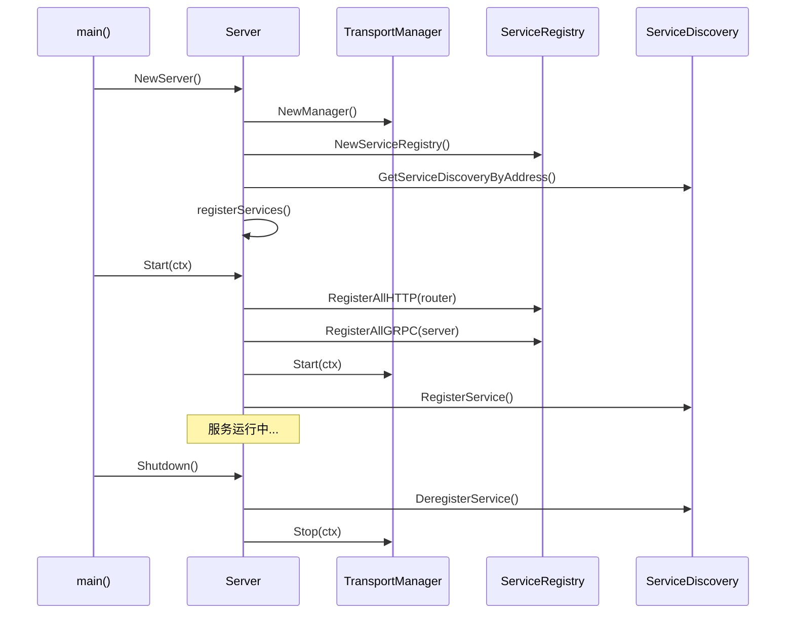

# SWIT 项目服务架构分析文档

## 概述

本文档详细分析了 `switauth` 和 `switserve` 两个项目的服务架构和注册逻辑，总结了它们的设计模式、核心组件以及架构特点。本文档基于最新的代码结构，特别反映了统一 ServiceHandler 模式的架构重构成果。

## 最新架构更新

### 统一 ServiceHandler 架构重构

两个项目已完成重大架构重构，采用统一的 ServiceHandler 模式，主要变化包括：

1. **统一服务接口**: 引入 `transport.ServiceHandler` 接口，替代原有的 `ServiceRegistrar`
2. **接口标准化**: 所有服务实现统一的生命周期管理和健康检查
3. **依赖注入优化**: 通过 `EnhancedServiceRegistry` 实现更好的服务管理
4. **共享类型系统**: 使用 `types` 包统一数据类型和错误处理
5. **接口分离**: 通过 `interfaces` 包实现业务逻辑与实现的解耦
6. **生命周期管理**: 支持服务初始化、健康检查和优雅关闭

## 项目架构对比

### 新架构模式 (ServiceHandler Pattern)

两个项目现在都采用统一的 ServiceHandler 架构模式：

```
┌─────────────────────────────────────────┐
│                Server                   │
├─────────────────────────────────────────┤
│           Transport Layer               │
│  ┌─────────────────┬─────────────────┐  │
│  │  HTTPTransport  │  GRPCTransport  │  │
│  └─────────────────┴─────────────────┘  │
├─────────────────────────────────────────┤
│       EnhancedServiceRegistry           │
│  ┌─────────────────────────────────────┐ │
│  │         ServiceHandler              │ │
│  │  ┌─────────────────────────────────┐ │ │
│  │  │ RegisterHTTP | RegisterGRPC    │ │ │
│  │  │ Initialize   | IsHealthy       │ │ │
│  │  │ GetMetadata  | Shutdown        │ │ │
│  │  └─────────────────────────────────┘ │ │
│  └─────────────────────────────────────┘ │
├─────────────────────────────────────────┤
│            Service Layer                │
│  ┌─────────────────────────────────────┐ │
│  │        Business Interfaces          │ │
│  │  ┌───────────┬───────────────────┐  │ │
│  │  │UserService│NotificationService│  │ │
│  │  │AuthService│   HealthService   │  │ │
│  │  └───────────┴───────────────────┘  │ │
│  └─────────────────────────────────────┘ │
├─────────────────────────────────────────┤
│           Handler Layer                 │
│  ┌─────────────────┬─────────────────┐  │
│  │   HTTP Handler  │   gRPC Handler  │  │
│  │      /v1        │      /v1        │  │
│  └─────────────────┴─────────────────┘  │
├─────────────────────────────────────────┤
│            Types Package                │
│  ┌─────────────────────────────────────┐ │
│  │ ResponseStatus | HealthStatus      │ │
│  │ ServiceError   | PaginationRequest │ │
│  └─────────────────────────────────────┘ │
└─────────────────────────────────────────┘
```

### 最新目录结构对比

**switauth 项目结构 (v1.0 重构后):**
```
switauth/
├── client/                 # 外部服务客户端
├── cmd/                    # 命令行入口
├── config/                 # 配置管理
├── db/                     # 数据库连接
├── handler/                # 处理器层
│   ├── grpc/auth/         # gRPC 处理器
│   └── http/auth/         # HTTP 处理器
│       └── v1/            # v1 版本处理器
├── model/                  # 数据模型
├── repository/             # 数据访问层
├── service/                # 业务逻辑层
│   ├── auth/              # 认证服务
│   │   ├── registrar.go   # 服务注册器
│   │   └── v1/            # v1 版本接口
│   └── health/            # 健康检查服务
└── transport/              # 传输层
```

**switserve 项目结构:**
```
switserve/
├── cmd/                    # 命令行入口
├── config/                 # 配置管理
├── db/                     # 数据库连接
├── handler/                # 处理器层
│   ├── grpc/greeter/      # gRPC 处理器
│   └── http/              # HTTP 处理器
│       ├── health/
│       ├── stop/
│       └── user/
├── model/                  # 数据模型
├── repository/             # 数据访问层
├── service/                # 业务逻辑层
│   ├── greeter/v1/        # 问候服务 v1
│   ├── health/            # 健康检查服务
│   ├── notification/v1/   # 通知服务 v1
│   ├── stop/              # 停止服务
│   └── user/v1/           # 用户服务 v1
└── transport/              # 传输层
```

## 核心组件分析

### 1. 服务处理器 (ServiceHandler)

#### 接口定义

新架构采用统一的 `ServiceHandler` 接口，提供完整的服务生命周期管理：

```go
type ServiceHandler interface {
    // RegisterHTTP 注册 HTTP 路由
    RegisterHTTP(router *gin.Engine) error
    // RegisterGRPC 注册 gRPC 服务
    RegisterGRPC(server *grpc.Server) error
    // GetMetadata 返回服务元数据
    GetMetadata() *ServiceMetadata
    // GetHealthEndpoint 返回健康检查端点
    GetHealthEndpoint() string
    // Initialize 初始化服务
    Initialize(ctx context.Context) error
    // IsHealthy 检查服务健康状态
    IsHealthy(ctx context.Context) (*types.HealthStatus, error)
    // Shutdown 优雅关闭服务
    Shutdown(ctx context.Context) error
}

// ServiceMetadata 服务元数据
type ServiceMetadata struct {
    Name           string            `json:"name"`
    Version        string            `json:"version"`
    Description    string            `json:"description"`
    HealthEndpoint string            `json:"health_endpoint"`
    Tags           []string          `json:"tags"`
    Dependencies   []string          `json:"dependencies"`
    Metadata       map[string]string `json:"metadata"`
}
```

#### 实现对比

**switserve ServiceHandler 实现：**
- `UserServiceHandler` - 用户管理服务
- `HealthServiceHandler` - 健康检查服务
- `ExampleServiceHandler` - 示例服务
- 所有服务都实现完整的生命周期管理

**switauth ServiceHandler 实现：**
- `AuthServiceHandler` - 认证服务
- `HealthServiceHandler` - 健康检查服务
- 基于统一的 ServiceHandler 接口

#### switauth v1.0 认证服务接口

```go
// AuthSrv defines the interface for authentication business logic
type AuthSrv interface {
    // Login authenticates a user and returns access and refresh tokens
    Login(ctx context.Context, username, password string) (*AuthResponse, error)
    
    // RefreshToken generates new tokens using a refresh token
    RefreshToken(ctx context.Context, refreshToken string) (*AuthResponse, error)
    
    // ValidateToken validates an access token and returns token details
    ValidateToken(ctx context.Context, tokenString string) (*model.Token, error)
    
    // Logout invalidates a token and logs out the user
    Logout(ctx context.Context, tokenString string) error
}

// AuthResponse represents the unified authentication response
type AuthResponse struct {
    AccessToken  string    `json:"access_token"`
    RefreshToken string    `json:"refresh_token"`
    ExpiresAt    time.Time `json:"expires_at"`
    TokenType    string    `json:"token_type"`
}
```

#### 依赖注入模式

**switauth 采用选项模式 (Options Pattern):**
```go
// 创建认证服务
service, err := v1.NewAuthSrv(
    v1.WithUserClient(userClient),
    v1.WithTokenRepository(tokenRepo),
)

// 创建服务注册器
registrar, err := auth.NewServiceRegistrar(userClient, tokenRepo)
```

### 2. 传输层管理 (Transport Layer)

#### Transport Manager

```go
type Manager struct {
    transports []Transport
    mu         sync.RWMutex
}

type Transport interface {
    Start(ctx context.Context) error
    Stop(ctx context.Context) error
    Name() string
    Address() string
}
```

#### HTTP Transport

**switserve 实现特点：**
```go
type HTTPTransport struct {
    server    *http.Server
    router    *gin.Engine
    address   string
    testPort  string // 测试端口覆盖
    ready     chan struct{}
    readyOnce sync.Once
    mu        sync.RWMutex
}
```

**switauth 实现特点：**
```go
type HTTPTransport struct {
    server *http.Server
    router *gin.Engine
    addr   string
    mu     sync.RWMutex
}
```

#### gRPC Transport

**switserve 实现：**
```go
type GRPCTransport struct {
    server   *grpc.Server
    listener net.Listener
    address  string
    testPort string
    mu       sync.RWMutex
}
```

**switauth 实现：**
```go
type GRPCTransport struct {
    server *grpc.Server
    addr   string
    mu     sync.RWMutex
}
```

### 3. 增强服务注册表 (EnhancedServiceRegistry)

#### 核心功能

```go
type EnhancedServiceRegistry struct {
    mu       sync.RWMutex
    services map[string]ServiceHandler
    order    []string  // 维护注册顺序
    logger   *slog.Logger
}

// 主要方法
func (r *EnhancedServiceRegistry) Register(handler ServiceHandler) error
func (r *EnhancedServiceRegistry) InitializeAll(ctx context.Context) error
func (r *EnhancedServiceRegistry) RegisterAllHTTP(router *gin.Engine) error
func (r *EnhancedServiceRegistry) RegisterAllGRPC(server *grpc.Server) error
func (r *EnhancedServiceRegistry) CheckAllHealth(ctx context.Context) (map[string]*types.HealthStatus, error)
func (r *EnhancedServiceRegistry) ShutdownAll(ctx context.Context) error
```

#### 增强特性

1. **服务名称验证**: 防止重复注册同名服务
2. **顺序管理**: 维护服务注册和初始化顺序
3. **生命周期管理**: 支持服务初始化和优雅关闭
4. **健康检查**: 统一的健康状态检查
5. **错误处理**: 详细的错误信息和日志记录
6. **线程安全**: 使用 `sync.RWMutex` 保护并发访问

#### 版本化路由注册

**新架构 ServiceHandler 示例：**
```go
// UserServiceHandler 路由注册
func (h *UserServiceHandler) RegisterHTTP(router *gin.Engine) error {
    // 创建版本化路由组
    v1 := router.Group("/api/v1")
    
    // 应用认证中间件
    v1.Use(middleware.AuthRequired())
    
    // 用户管理路由
    users := v1.Group("/users")
    {
        users.GET("", h.httpHandler.GetUsers)
        users.POST("", h.httpHandler.CreateUser)
        users.GET("/:id", h.httpHandler.GetUser)
        users.PUT("/:id", h.httpHandler.UpdateUser)
        users.DELETE("/:id", h.httpHandler.DeleteUser)
    }
    
    // 健康检查路由
    router.GET("/health/users", h.httpHandler.HealthCheck)
    
    return nil
}
```

**认证服务 ServiceHandler 示例：**
```go
// AuthServiceHandler 路由注册
func (h *AuthServiceHandler) RegisterHTTP(router *gin.Engine) error {
    v1 := router.Group("/api/v1")
    
    auth := v1.Group("/auth")
    {
        auth.POST("/login", h.httpHandler.Login)
        auth.POST("/logout", h.httpHandler.Logout)
        auth.GET("/verify", h.httpHandler.Verify)
        auth.POST("/refresh", h.httpHandler.RefreshToken)
    }
    
    return nil
}
```

### 4. 服务发现 (Service Discovery)

#### 架构设计

```go
type ServiceDiscovery struct {
    client          *api.Client  // Consul 客户端
    mu              sync.Mutex
    roundRobinIndex int
}

type Manager struct {
    instances map[string]*ServiceDiscovery
    mu        sync.RWMutex
}
```

#### 功能特性

1. **服务注册/注销**
   - 自动注册 HTTP 和 gRPC 服务
   - 优雅关闭时自动注销服务

2. **负载均衡策略**
   - Round Robin 轮询
   - Random 随机选择

3. **实例管理**
   - 单例模式管理服务发现实例
   - 支持多个 Consul 地址

### 5. 配置管理 (Configuration)

#### switserve 配置结构

```go
type ServeConfig struct {
    Database struct {
        Host     string `json:"host" yaml:"host"`
        Port     string `json:"port" yaml:"port"`
        Username string `json:"username" yaml:"username"`
        Password string `json:"password" yaml:"password"`
        DBName   string `json:"dbname" yaml:"dbname"`
    } `json:"database" yaml:"database"`
    Server struct {
        Port     string `json:"port" yaml:"port"`
        GRPCPort string `json:"grpcPort" yaml:"grpcPort"`
    } `json:"server" yaml:"server"`
    ServiceDiscovery struct {
        Address string `json:"address" yaml:"address"`
    } `json:"serviceDiscovery" yaml:"serviceDiscovery"`
}
```

#### switauth 配置结构

```go
type AuthConfig struct {
    Database struct {
        Username string `json:"username" yaml:"username"`
        Password string `json:"password" yaml:"password"`
        Host     string `json:"host" yaml:"host"`
        Port     string `json:"port" yaml:"port"`
        DBName   string `json:"dbname" yaml:"dbname"`
    } `json:"database"`
    Server struct {
        Port     string `json:"port" yaml:"port"`
        GRPCPort string `json:"grpcPort" yaml:"grpcPort"`
    } `json:"server" yaml:"server"`
    ServiceDiscovery struct {
        Address string `json:"address" yaml:"address"`
    } `json:"serviceDiscovery" yaml:"serviceDiscovery"`
}
```

#### 配置文件命名

- **switserve**: `swit.yaml`
- **switauth**: `switauth.yaml`

### 6. 中间件系统 (Middleware)

#### 全局中间件注册器

```go
type GlobalMiddlewareRegistrar struct{}

func (gmr *GlobalMiddlewareRegistrar) RegisterMiddleware(router *gin.Engine) error {
    // 注册超时中间件
    router.Use(TimeoutMiddleware(30 * time.Second))
    // 注册其他全局中间件
    router.Use(Logger(), CORSMiddleware())
    return nil
}
```

#### 认证中间件

```go
type AuthConfig struct {
    WhiteList               []string // 白名单路径
    AuthServiceName         string   // 认证服务名称
    AuthEndpoint           string   // 认证端点
    ServiceDiscoveryAddress string   // 服务发现地址
}

// 中间件函数
func AuthMiddleware() gin.HandlerFunc
func AuthMiddlewareWithWhiteList(whiteList []string) gin.HandlerFunc
func AuthMiddlewareWithConfig(config *AuthConfig) gin.HandlerFunc
```

## 服务启动流程

### 通用启动流程



### switserve 启动流程

1. **初始化阶段**
   ```go
   func NewServer() (*Server, error) {
       server := &Server{
           transportManager: transport.NewManager(),
           serviceRegistry:  transport.NewServiceRegistry(),
       }
       
       // 设置服务发现
       cfg := config.GetConfig()
       sd, err := discovery.GetServiceDiscoveryByAddress(cfg.ServiceDiscovery.Address)
       server.sd = sd
       
       // 初始化传输层
       server.httpTransport = transport.NewHTTPTransport()
       server.grpcTransport = transport.NewGRPCTransport()
       
       // 注册传输层
       server.transportManager.Register(server.httpTransport)
       server.transportManager.Register(server.grpcTransport)
       
       // 注册服务
       server.registerServices()
       
       return server, nil
   }
   ```

2. **服务注册阶段**
   ```go
   func (s *Server) registerServices() {
       // 注册各种服务
       s.serviceRegistry.Register(greeter.NewServiceRegistrar())
       s.serviceRegistry.Register(notification.NewServiceRegistrar())
       s.serviceRegistry.Register(health.NewServiceRegistrar())
       s.serviceRegistry.Register(stop.NewServiceRegistrar(shutdownFunc))
       s.serviceRegistry.Register(user.NewServiceRegistrar())
       s.serviceRegistry.Register(debug.NewServiceRegistrar(s.serviceRegistry, s.httpTransport.GetRouter()))
   }
   ```

3. **启动阶段**
   ```go
   func (s *Server) Start(ctx context.Context) error {
       // 注册所有服务到传输层
       s.serviceRegistry.RegisterAllGRPC(s.grpcTransport.GetServer())
       s.serviceRegistry.RegisterAllHTTP(s.httpTransport.GetRouter())
       
       // 启动所有传输层
       return s.transportManager.Start(ctx)
   }
   ```

### switauth 启动流程

1. **初始化阶段**
   ```go
   func NewServer() (*Server, error) {
       cfg := config.GetConfig()
       
       // 创建传输管理器和服务注册表
       transportManager := transport.NewManager()
       serviceRegistry := transport.NewServiceRegistry()
       
       // 创建传输层
       httpTransport := transport.NewHTTPTransport()
       httpTransport.SetAddress(":" + cfg.Server.Port)
       
       grpcTransport := transport.NewGRPCTransport()
       grpcTransport.SetAddress(":" + cfg.Server.GRPCPort)
       
       // 设置服务发现
       sd, err := discovery.GetServiceDiscoveryByAddress(cfg.ServiceDiscovery.Address)
       
       return &Server{
           transportManager: transportManager,
           serviceRegistry:  serviceRegistry,
           httpTransport:    httpTransport,
           grpcTransport:    grpcTransport,
           sd:               sd,
           config:           cfg,
       }, nil
   }
   ```

2. **服务注册阶段**
   ```go
   func (s *Server) registerServices() error {
       // 初始化依赖
       userClient := client.NewUserClient(s.sd)
       tokenRepo := repository.NewTokenRepository(db.GetDB())
       
       // 注册认证服务
       authService, err := auth.NewServiceRegistrar(userClient, tokenRepo)
       s.serviceRegistry.Register(authService)
       
       // 注册健康检查服务
       healthService := health.NewServiceRegistrar()
       s.serviceRegistry.Register(healthService)
       
       return nil
   }
   ```

3. **启动阶段**
   ```go
   func (s *Server) Start(ctx context.Context) error {
       // 注册服务到传输层
       s.serviceRegistry.RegisterAllHTTP(s.httpTransport.GetRouter())
       s.serviceRegistry.RegisterAllGRPC(s.grpcTransport.GetServer())
       
       // 配置中间件
       s.configureMiddleware()
       
       // 启动传输层
       s.transportManager.Start(ctx)
       
       // 注册到服务发现
       return s.registerWithDiscovery()
   }
   ```

## 架构特点对比

### 相似点

1. **统一的服务注册模式**
   - 都使用 `ServiceRegistrar` 接口
   - 都有 `ServiceRegistry` 管理服务
   - 都支持 HTTP 和 gRPC 双协议

2. **分层架构设计**
   - Transport Layer（传输层）
   - Service Layer（服务层）
   - Handler Layer（处理层）

3. **版本化设计**
   - 都采用 `/api/v1` 路由前缀
   - 服务接口按版本组织 (`/service/*/v1/`)
   - 支持 API 版本演进

4. **服务发现集成**
   - 都使用 Consul 作为服务发现
   - 自动服务注册/注销
   - 支持负载均衡

5. **配置管理**
   - 都使用 Viper 进行配置管理
   - YAML 格式配置文件
   - 相似的配置结构

6. **线程安全性**
   - 都使用 `sync.RWMutex` 保护 ServiceRegistry
   - 确保并发安全

### 差异点

1. **架构成熟度**
   - **switauth**: 经过 v1.0 重构，架构更加简洁统一
   - **switserve**: 保持原有架构，功能更加丰富

2. **接口设计**
   - **switauth**: 统一返回 `*AuthResponse` 类型，接口一致性更好
   - **switserve**: 各服务接口相对独立

3. **依赖注入模式**
   - **switauth**: 采用选项模式 (Options Pattern)，更加灵活
   - **switserve**: 传统的构造函数注入

4. **服务数量和复杂度**
   - **switserve**: 5个服务（greeter, notification, health, stop, user）
   - **switauth**: 2个服务（auth, health），专注认证领域

5. **测试覆盖**
   - **switauth**: 重构后测试覆盖更完整，Mock 服务更统一
   - **switserve**: 传统测试模式

6. **gRPC 支持**
   - **switserve**: 完整的 gRPC 服务实现（如 greeter 服务）
   - **switauth**: gRPC 服务为占位符实现，主要提供 HTTP API

## 最佳实践建议

基于新的 ServiceHandler 架构，为服务开发提供以下建议：

### 1. ServiceHandler 实现模式

**完整的接口实现:**

```go
type UserServiceHandler struct {
    service     interfaces.UserService
    httpHandler *http.UserHandler
    grpcHandler *grpc.UserHandler
}

func (h *UserServiceHandler) GetMetadata() *transport.ServiceMetadata {
    return &transport.ServiceMetadata{
        Name:           "user-service",
        Version:        "v1.0.0",
        Description:    "User management service",
        HealthEndpoint: "/health/users",
        Tags:           []string{"user", "management"},
        Dependencies:   []string{"database", "auth-service"},
    }
}

func (h *UserServiceHandler) Initialize(ctx context.Context) error {
    // 初始化服务依赖
    return h.service.Initialize(ctx)
}

func (h *UserServiceHandler) IsHealthy(ctx context.Context) (*types.HealthStatus, error) {
    return h.service.CheckHealth(ctx)
}
```

### 2. 接口分离原则

**业务接口定义:**

```go
// interfaces/user.go
type UserService interface {
    CreateUser(ctx context.Context, req *types.CreateUserRequest) (*types.User, error)
    GetUser(ctx context.Context, id string) (*types.User, error)
    UpdateUser(ctx context.Context, id string, req *types.UpdateUserRequest) (*types.User, error)
    DeleteUser(ctx context.Context, id string) error
    ListUsers(ctx context.Context, req *types.PaginationRequest) (*types.UserList, error)
    
    // 生命周期方法
    Initialize(ctx context.Context) error
    CheckHealth(ctx context.Context) (*types.HealthStatus, error)
    Shutdown(ctx context.Context) error
}
```

### 3. 依赖注入优化

**使用 EnhancedServiceRegistry:**

```go
func (s *Server) registerServices() error {
    // 创建服务实例
    userService := user.NewService(
        user.WithRepository(s.userRepo),
        user.WithLogger(s.logger),
    )
    
    // 创建 ServiceHandler
    userHandler := user.NewServiceHandler(userService)
    
    // 注册到增强服务注册表
    if err := s.serviceRegistry.Register(userHandler); err != nil {
        return fmt.Errorf("failed to register user service: %w", err)
    }
    
    return nil
}
```

### 4. 统一错误处理

**使用 types.ServiceError:**

```go
// types/errors.go
type ServiceError struct {
    Code    string `json:"code"`
    Message string `json:"message"`
    Details string `json:"details,omitempty"`
}

func (e *ServiceError) Error() string {
    return e.Message
}

// 业务层错误处理
func (s *userService) GetUser(ctx context.Context, id string) (*types.User, error) {
    user, err := s.repo.GetByID(ctx, id)
    if err != nil {
        return nil, &types.ServiceError{
            Code:    "USER_NOT_FOUND",
            Message: "User not found",
            Details: fmt.Sprintf("User with ID %s does not exist", id),
        }
    }
    return user, nil
}
```

### 5. 健康检查和监控

**实现健康检查:**

```go
func (h *UserServiceHandler) IsHealthy(ctx context.Context) (*types.HealthStatus, error) {
    status := &types.HealthStatus{
        Service: "user-service",
        Status:  "healthy",
        Checks:  make(map[string]string),
    }
    
    // 检查数据库连接
    if err := h.service.CheckDatabaseHealth(ctx); err != nil {
        status.Status = "unhealthy"
        status.Checks["database"] = err.Error()
    } else {
        status.Checks["database"] = "ok"
    }
    
    return status, nil
}
```

### 6. 测试策略

**ServiceHandler 单元测试:**

```go
func TestUserServiceHandler_RegisterHTTP(t *testing.T) {
    mockService := &mocks.MockUserService{}
    handler := user.NewServiceHandler(mockService)
    
    router := gin.New()
    err := handler.RegisterHTTP(router)
    
    assert.NoError(t, err)
    // 验证路由注册
    routes := router.Routes()
    assert.Contains(t, routes, "/api/v1/users")
}

func TestUserServiceHandler_IsHealthy(t *testing.T) {
    mockService := &mocks.MockUserService{}
    mockService.On("CheckHealth", mock.Anything).Return(&types.HealthStatus{
        Service: "user-service",
        Status:  "healthy",
    }, nil)
    
    handler := user.NewServiceHandler(mockService)
    status, err := handler.IsHealthy(context.Background())
    
    assert.NoError(t, err)
    assert.Equal(t, "healthy", status.Status)
    mockService.AssertExpectations(t)
}
```
```

## 总结

`switauth` 和 `switserve` 两个项目已完成向统一 ServiceHandler 架构的重构，实现了更加成熟和一致的设计模式。新架构显著提升了代码质量、可维护性和开发体验。

### 新架构优势

基于 ServiceHandler 的新架构带来了显著的改进：

1. **统一的服务接口**: ServiceHandler 提供完整的服务生命周期管理
2. **接口分离**: 业务接口与实现完全分离，避免循环依赖
3. **增强的注册表**: EnhancedServiceRegistry 提供更强大的服务管理能力
4. **标准化错误处理**: 统一的错误类型和处理机制
5. **完整的健康检查**: 内置的健康状态监控和报告
6. **优雅的生命周期**: 支持服务初始化和优雅关闭
7. **共享类型系统**: 通过 types 包实现类型一致性

### 架构改进对比

**旧架构 (ServiceRegistrar) 问题:**
- 接口功能有限，只支持路由注册
- 缺乏生命周期管理
- 没有统一的健康检查机制
- 服务元数据信息不足

**新架构 (ServiceHandler) 优势:**
- 完整的服务生命周期管理
- 丰富的服务元数据支持
- 统一的健康检查接口
- 更好的错误处理和日志记录
- 支持优雅关闭和资源清理

### 开发体验提升

1. **更清晰的代码结构**: 接口分离使代码更易理解和维护
2. **更好的测试支持**: 基于接口的设计便于编写单元测试
3. **统一的开发模式**: 所有服务遵循相同的开发模式
4. **更强的类型安全**: 共享的 types 包确保类型一致性
5. **简化的依赖注入**: EnhancedServiceRegistry 简化了服务注册和管理

### 重构成果

1. **✅ 架构统一**: 两个项目采用相同的 ServiceHandler 模式
2. **✅ 接口标准化**: 统一的服务接口和生命周期管理
3. **✅ 类型系统**: 共享的 types 包确保类型一致性
4. **✅ 错误处理**: 标准化的错误类型和处理机制
5. **✅ 健康检查**: 内置的健康状态监控和报告
6. **✅ 测试完善**: 基于接口的测试策略

### 未来发展方向

1. **微服务治理**: 基于 ServiceHandler 构建更完善的微服务治理体系
2. **服务网格集成**: 与 Istio 等服务网格技术集成
3. **可观测性增强**: 集成更多的监控和追踪功能
4. **自动化测试**: 基于接口的自动化测试生成
5. **配置管理**: 更灵活的服务配置和热更新支持

新的 ServiceHandler 架构为微服务开发提供了更加成熟和完善的基础设施，显著提升了开发效率和代码质量，为现代微服务架构的最佳实践树立了标杆。