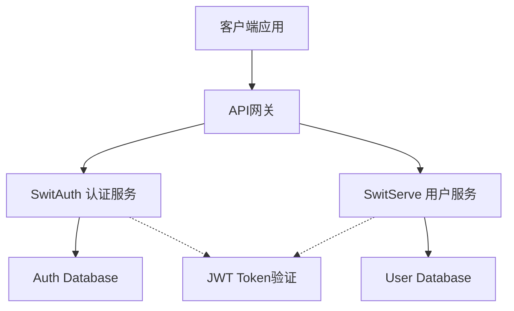

# SWIT 服务API文档导航

本目录包含 SWIT 项目中各个微服务的API文档和使用指南。

## 服务架构



## 可用服务

### 🔐 SwitAuth - 认证授权服务
- **功能**: 用户登录、Token管理、权限验证
- **端口**: 8090
- **文档**: [详细文档](./switauth/README.md)
- **API**: http://localhost:8090/swagger/index.html

**主要端点**:
- `POST /auth/login` - 用户登录
- `POST /auth/refresh` - 刷新Token
- `GET /auth/validate` - 验证Token
- `POST /auth/logout` - 用户登出

### 👥 SwitServe - 用户管理服务
- **功能**: 用户CRUD操作、用户信息管理
- **端口**: 9000  
- **文档**: [详细文档](./switserve/README.md)
- **API**: http://localhost:9000/swagger/index.html

**主要端点**:
- `POST /users/create` - 创建用户
- `GET /users/username/{username}` - 获取用户信息
- `GET /users/email/{email}` - 通过邮箱获取用户
- `DELETE /users/{id}` - 删除用户

## 跨服务通信

### 认证流程
1. 客户端调用 SwitAuth 进行登录认证
2. SwitAuth 返回 JWT Token
3. 客户端使用 Token 调用 SwitServe API
4. SwitServe 调用 SwitAuth 验证 Token

### 内部API
- `POST /internal/validate-user` - SwitServe内部用户验证接口

## 开发工具

### 生成API文档
```bash
# 生成 SwitServe 文档
make swagger-switserve

# 生成 SwitAuth 文档  
make swagger-switauth

# 生成所有服务文档
make swagger
```

### 测试API
```bash
# 健康检查
curl http://localhost:9000/health
curl http://localhost:8090/health

# 查看API版本
curl http://localhost:9000/version
curl http://localhost:8090/version
```

## 环境配置

各服务的配置文件：
- **SwitServe**: `switblog.yaml`
- **SwitAuth**: `switauth.yaml`
- **通用配置**: `swit.yaml` 