# Event-Driven Architecture Design for SWIT Framework

## Executive Summary

The Event-Driven Messaging system extends the SWIT microservice framework to support asynchronous, event-based communication patterns alongside the existing HTTP and gRPC transports. This architecture provides a unified abstraction layer over multiple message brokers (Kafka, RabbitMQ, NATS) while maintaining consistency with SWIT's interface-driven design philosophy and comprehensive lifecycle management.

### Key Goals

1. **Unified Abstraction**: Single interface for multiple message broker implementations
2. **Framework Integration**: Seamless integration with existing SWIT transport coordination
3. **Production Readiness**: Built-in reliability patterns, monitoring, and error handling
4. **Performance**: High-throughput message processing with configurable concurrency
5. **Developer Experience**: Simple API with sensible defaults and progressive disclosure

### Architecture Principles

- **Interface-First Design**: Core functionality defined through interfaces
- **Adapter Pattern**: Broker-specific implementations via adapters
- **Dependency Injection**: Leverages SWIT's existing DI container
- **Lifecycle Management**: Integrated with framework's phased startup/shutdown
- **Observable by Default**: Built-in metrics, tracing, and logging

## Core Architecture Components

### System Overview

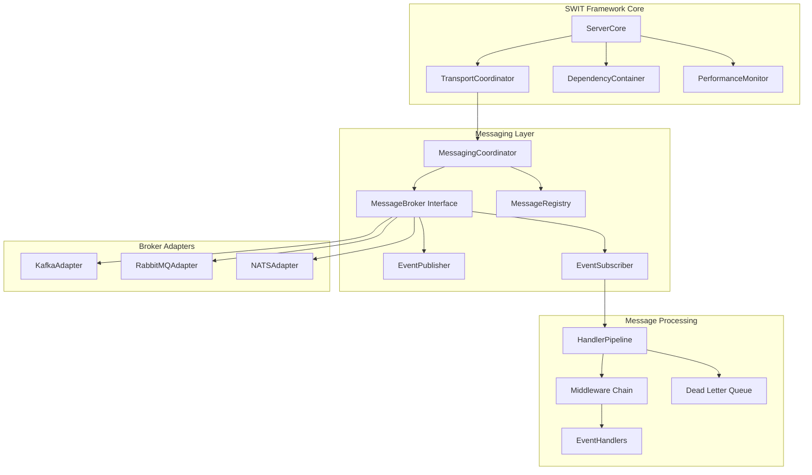

### Component Responsibilities

#### MessagingCoordinator
- Central orchestrator for all messaging operations
- Manages broker lifecycle and connections
- Coordinates with TransportCoordinator for unified transport management
- Handles service registration for event handlers
- Manages health checks for messaging infrastructure

#### MessageBroker Interface
- Abstract interface for broker operations
- Defines common operations across all broker types
- Handles connection management and pooling
- Provides factory methods for publishers and subscribers
- Manages broker-specific configurations

#### EventPublisher
- Asynchronous message publishing interface
- Supports batch publishing for efficiency
- Implements publish confirmation patterns
- Provides transaction support where available
- Includes retry logic with exponential backoff

#### EventSubscriber
- Message consumption interface
- Supports multiple consumption patterns (push/pull)
- Implements consumer group management
- Handles message acknowledgment strategies
- Provides dead letter queue integration

#### MessageRegistry
- Central registry for message types and schemas
- Manages event handler mappings
- Provides message routing logic
- Implements schema evolution support
- Handles serialization/deserialization

### Interface Hierarchy

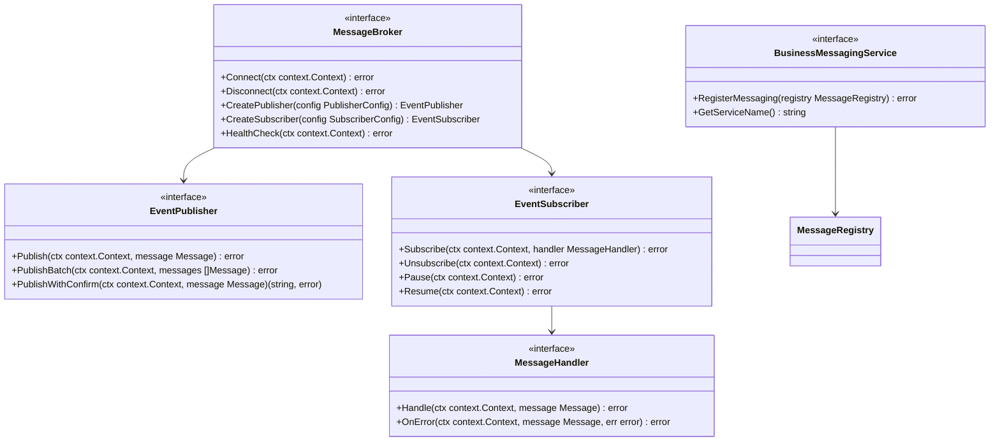

## Message Broker Abstractions

### Broker Adapter Architecture

Each broker implementation follows the adapter pattern to translate broker-specific APIs to the common MessageBroker interface:

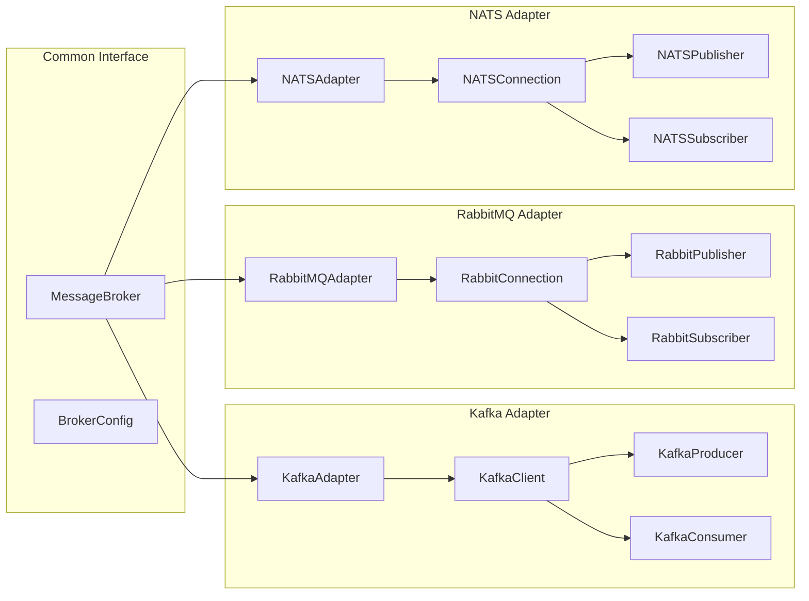

### Message Flow Architecture

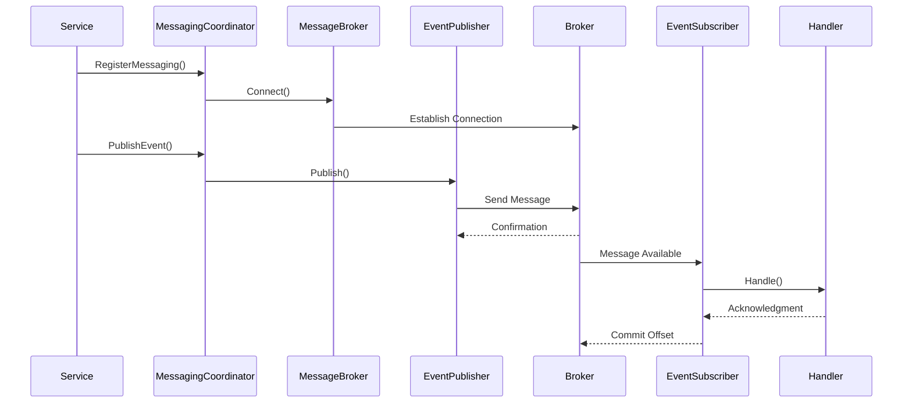

## Integration with Existing SWIT Framework

### Framework Extension Points

The messaging system integrates with SWIT through several extension points:

#### 1. Service Registration Pattern

```go
type MessagingServiceRegistrar interface {
    BusinessServiceRegistrar
    RegisterMessaging(coordinator *MessagingCoordinator) error
}
```

#### 2. Transport Coordination

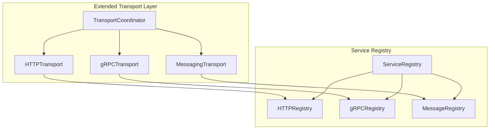

#### 3. Dependency Injection Integration

```go
// Register messaging dependencies in DI container
container.RegisterSingleton("messageBroker", func() interface{} {
    return NewKafkaAdapter(config)
})

container.RegisterTransient("eventPublisher", func() interface{} {
    broker := container.GetService("messageBroker").(MessageBroker)
    return broker.CreatePublisher(publisherConfig)
})
```

### Lifecycle Management Integration

The messaging system integrates with SWIT's phased lifecycle:

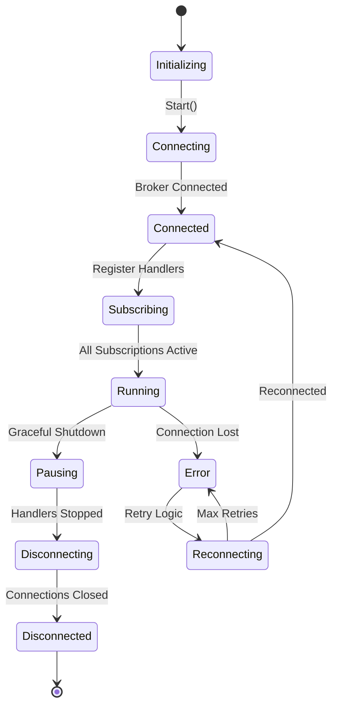

### Configuration Integration

The messaging configuration extends SWIT's ServerConfig:

```yaml
server:
  name: "user-service"
  version: "1.0.0"
  
messaging:
  enabled: true
  broker:
    type: "kafka"
    endpoints:
      - "kafka-1:9092"
      - "kafka-2:9092"
    config:
      client_id: "user-service"
      consumer_group: "user-service-group"
  publishers:
    default:
      retry_attempts: 3
      retry_delay: "1s"
      batch_size: 100
  subscribers:
    default:
      concurrency: 10
      prefetch: 100
      ack_deadline: "30s"
```

## Lifecycle Management

### Startup Sequence

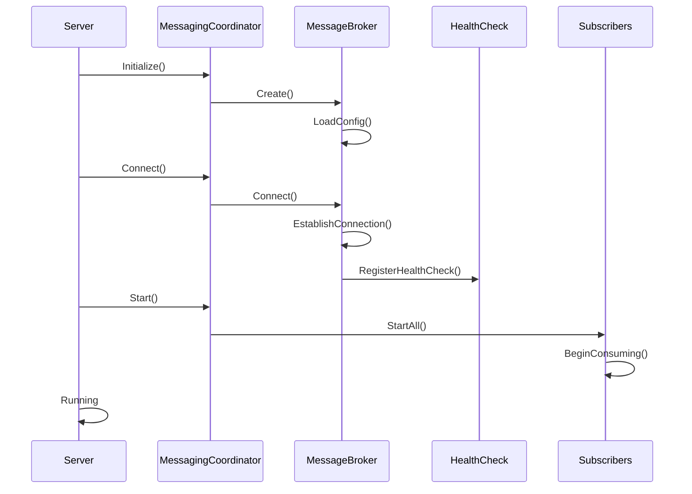

### Shutdown Sequence

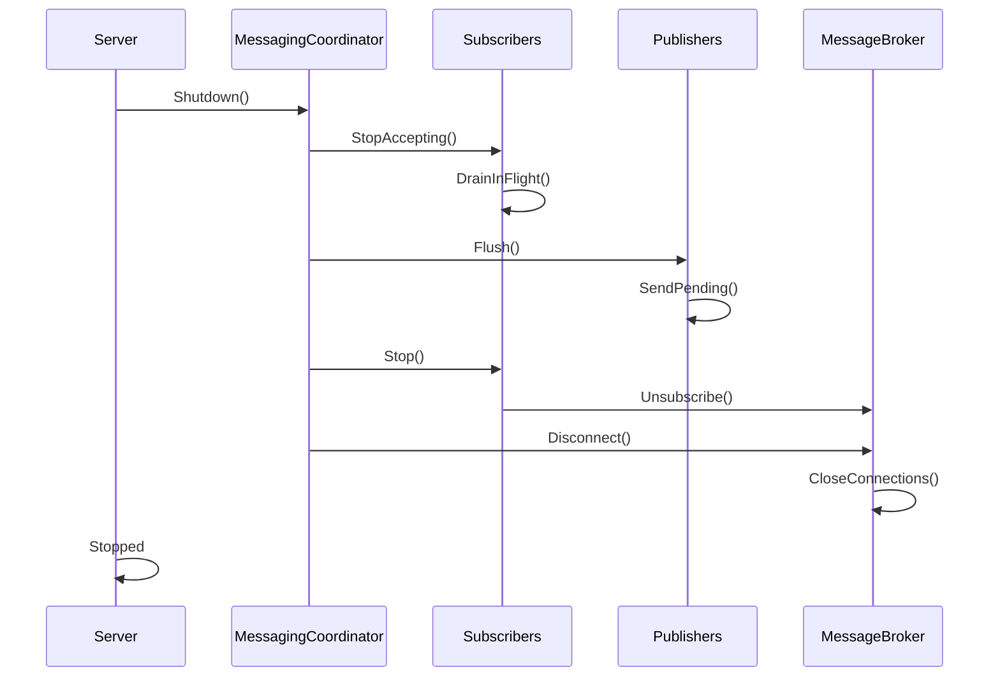

### Connection Management

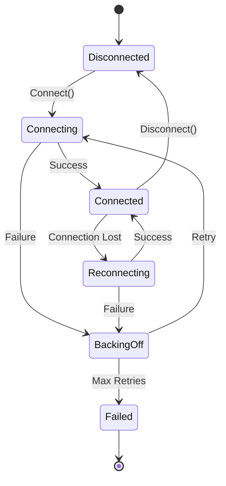

## Performance and Scalability Considerations

### Performance Architecture

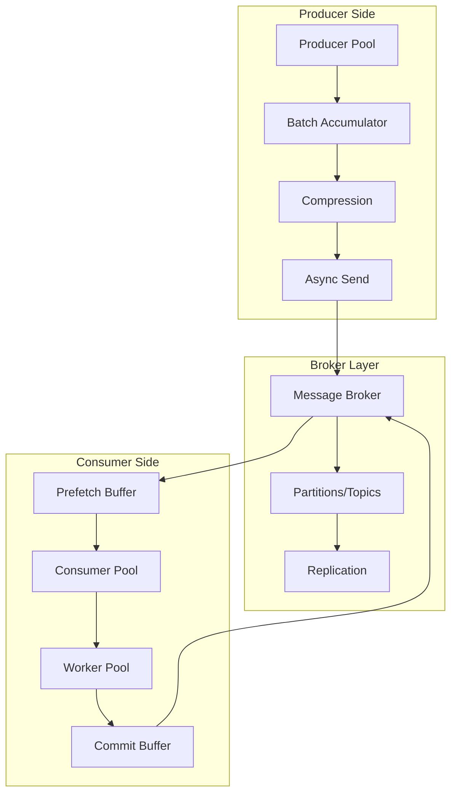

### Performance Metrics

The messaging system integrates with SWIT's performance monitoring:

```go
type MessagingMetrics struct {
    // Publishing metrics
    PublishLatency      *prometheus.HistogramVec
    PublishThroughput   *prometheus.CounterVec
    PublishErrors       *prometheus.CounterVec
    BatchSize          *prometheus.HistogramVec
    
    // Subscription metrics
    ConsumeLatency     *prometheus.HistogramVec
    ConsumeThroughput  *prometheus.CounterVec
    ConsumeErrors      *prometheus.CounterVec
    LagSize           *prometheus.GaugeVec
    
    // Connection metrics
    ConnectionState    *prometheus.GaugeVec
    ReconnectAttempts  *prometheus.CounterVec
    
    // Resource metrics
    ActivePublishers   *prometheus.GaugeVec
    ActiveSubscribers  *prometheus.GaugeVec
    MessageQueueDepth  *prometheus.GaugeVec
}
```

### Scalability Patterns

#### Horizontal Scaling
- Consumer group coordination for Kafka
- Competing consumers for RabbitMQ
- Queue groups for NATS

#### Vertical Scaling
- Configurable worker pools per subscriber
- Batch processing for publishers
- Connection pooling for high throughput

#### Backpressure Management
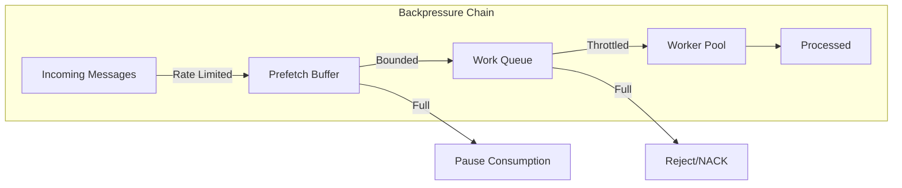

### Resource Management

```yaml
messaging:
  resources:
    connections:
      max_per_broker: 10
      idle_timeout: "5m"
    publishers:
      pool_size: 20
      buffer_size: 1000
      flush_interval: "100ms"
    subscribers:
      worker_pool_size: 50
      prefetch_count: 100
      max_in_flight: 1000
    memory:
      max_message_size: "10MB"
      buffer_pool_size: "100MB"
```

## Security Considerations

### Authentication and Authorization

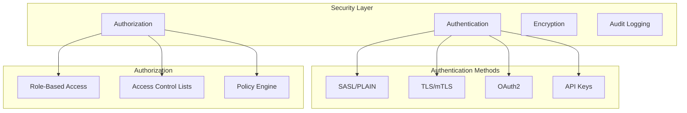

### Message Security

#### Encryption
- TLS for transport encryption
- Message-level encryption for sensitive data
- Key rotation support

#### Message Signing
- HMAC for message integrity
- Digital signatures for non-repudiation
- Certificate management

### Security Configuration

```yaml
messaging:
  security:
    transport:
      tls:
        enabled: true
        cert_file: "/certs/client.crt"
        key_file: "/certs/client.key"
        ca_file: "/certs/ca.crt"
        verify_server: true
    
    authentication:
      type: "sasl"
      mechanism: "SCRAM-SHA-512"
      username: "${KAFKA_USERNAME}"
      password: "${KAFKA_PASSWORD}"
    
    message:
      encryption:
        enabled: true
        algorithm: "AES-256-GCM"
        key_provider: "vault"
      signing:
        enabled: true
        algorithm: "HMAC-SHA256"
    
    audit:
      enabled: true
      log_publishes: true
      log_consumes: true
      sensitive_fields:
        - "password"
        - "ssn"
        - "credit_card"
```

### Compliance and Auditing

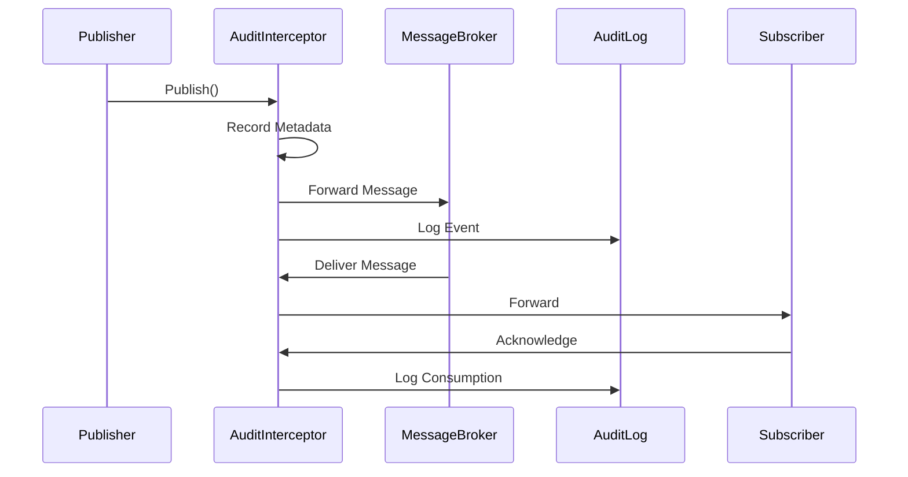

## Error Handling and Resilience

### Error Handling Strategy

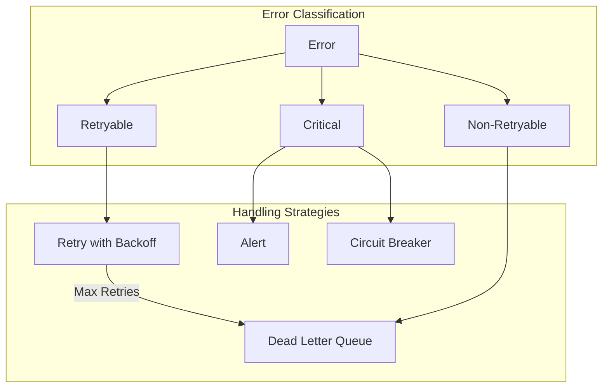

### Resilience Patterns

#### Circuit Breaker
```go
type CircuitBreaker struct {
    failureThreshold   int
    recoveryTimeout    time.Duration
    successThreshold   int
    state             CircuitState
}
```

#### Retry Logic
```go
type RetryPolicy struct {
    MaxAttempts     int
    InitialDelay    time.Duration
    MaxDelay        time.Duration
    Multiplier      float64
    Jitter          float64
    RetryableErrors []error
}
```

#### Dead Letter Queue
```go
type DeadLetterConfig struct {
    Enabled          bool
    MaxRetries       int
    Queue           string
    IncludeMetadata bool
    TTL             time.Duration
}
```

## Monitoring and Observability

### Metrics Collection

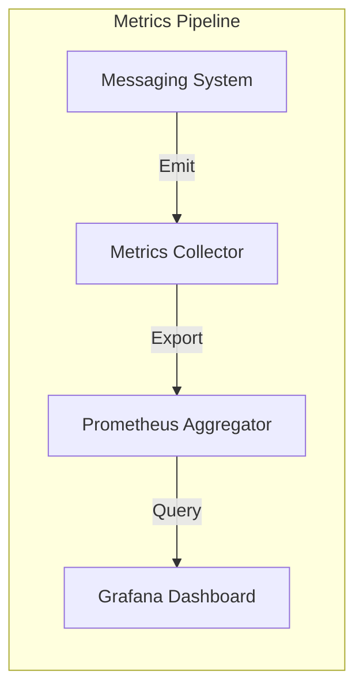

### Distributed Tracing

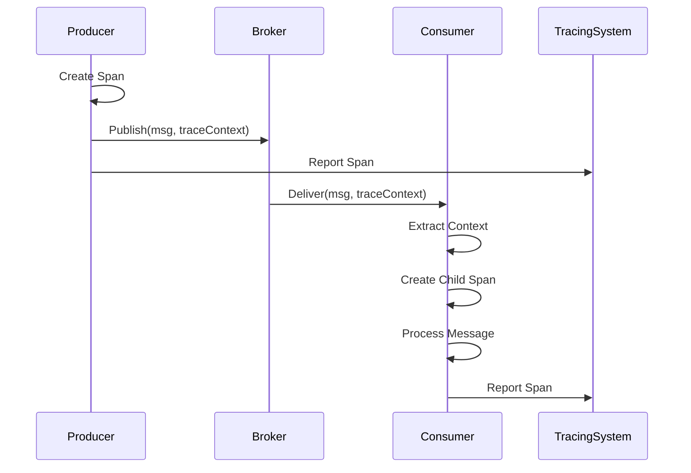

### Health Checks

```go
type MessagingHealthCheck struct {
    BrokerConnectivity   func() error
    PublisherHealth      func() error
    SubscriberHealth     func() error
    QueueDepthCheck      func() error
    LatencyCheck         func() error
}
```

## Migration and Adoption Strategy

### Phased Adoption

1. **Phase 1**: Core messaging infrastructure
   - Basic publish/subscribe functionality
   - Single broker support (Kafka)
   - Manual configuration

2. **Phase 2**: Multi-broker support
   - RabbitMQ and NATS adapters
   - Unified configuration
   - Basic monitoring

3. **Phase 3**: Advanced patterns
   - Saga orchestration
   - Event sourcing support
   - CQRS implementation

4. **Phase 4**: Production features
   - Full observability
   - Security hardening
   - Performance optimization

### Backward Compatibility

The messaging system maintains compatibility with existing SWIT services:
- Optional integration (can be disabled)
- No changes to existing HTTP/gRPC services
- Gradual migration path from synchronous to asynchronous

## Conclusion

The Event-Driven Messaging architecture for SWIT provides a robust, scalable, and maintainable foundation for asynchronous communication in microservices. By following SWIT's established patterns and principles, the messaging system integrates seamlessly while providing powerful new capabilities for event-driven architectures.

Key benefits:
- **Unified abstraction** over multiple message brokers
- **Production-ready** with built-in resilience and monitoring
- **Framework-native** integration with SWIT's lifecycle and DI
- **Developer-friendly** with sensible defaults and clear patterns
- **Performance-optimized** for high-throughput scenarios
- **Security-first** design with comprehensive authentication and encryption

The architecture supports both simple pub/sub patterns and complex event-driven workflows, making it suitable for a wide range of microservice communication needs.
