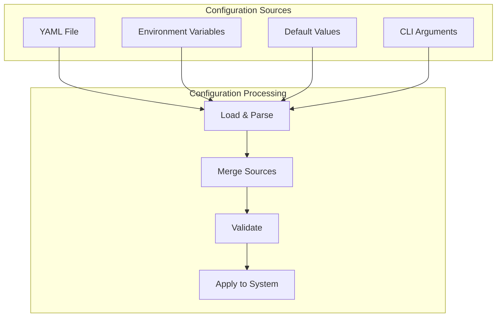

# Event-Driven Messaging Configuration Reference

## Table of Contents

1. [Configuration Overview](#configuration-overview)
2. [YAML Configuration Examples](#yaml-configuration-examples)
3. [Environment Variable Overrides](#environment-variable-overrides)
4. [Broker-Specific Configurations](#broker-specific-configurations)
5. [Performance Tuning Parameters](#performance-tuning-parameters)
6. [Security Configurations](#security-configurations)

## Configuration Overview

The SWIT messaging system uses a hierarchical configuration structure that supports:
- **YAML files** for structured configuration
- **Environment variables** for runtime overrides
- **Defaults** for all optional parameters
- **Validation** to catch configuration errors early

### Configuration Hierarchy



### Configuration Priority

1. **CLI Arguments** (highest priority)
2. **Environment Variables**
3. **YAML Configuration File**
4. **Default Values** (lowest priority)

## YAML Configuration Examples

### Complete Configuration Example

```yaml
# swit-messaging.yaml - Complete messaging configuration
server:
  name: "order-service"
  version: "1.0.0"
  environment: "production"

messaging:
  # Global messaging settings
  enabled: true
  default_timeout: "30s"
  max_message_size: "10MB"
  
  # Broker configuration
  broker:
    type: "kafka" # Options: kafka, rabbitmq, nats
    endpoints:
      - "kafka-1.example.com:9092"
      - "kafka-2.example.com:9092"
      - "kafka-3.example.com:9092"
    
    # Connection settings
    connection:
      timeout: "10s"
      keep_alive: "30s"
      max_attempts: 5
      pool_size: 20
      idle_timeout: "5m"
    
    # Authentication
    authentication:
      type: "sasl" # Options: none, sasl, oauth2, apikey
      mechanism: "SCRAM-SHA-512"
      username: "${KAFKA_USERNAME}"
      password: "${KAFKA_PASSWORD}"
    
    # TLS/SSL configuration
    tls:
      enabled: true
      cert_file: "/certs/client.crt"
      key_file: "/certs/client.key"
      ca_file: "/certs/ca.crt"
      server_name: "kafka.example.com"
      skip_verify: false
    
    # Retry configuration
    retry:
      max_attempts: 3
      initial_delay: "1s"
      max_delay: "30s"
      multiplier: 2.0
      jitter: 0.1
  
  # Publisher configurations
  publishers:
    default:
      async: true
      batching:
        enabled: true
        max_messages: 100
        max_bytes: "1MB"
        flush_interval: "100ms"
      compression: "snappy" # Options: none, gzip, snappy, lz4, zstd
      confirmation:
        required: false
        timeout: "5s"
        retries: 3
      retry:
        max_attempts: 3
        initial_delay: "500ms"
        max_delay: "10s"
      timeout:
        send: "10s"
        flush: "30s"
    
    # Named publisher configurations
    high_throughput:
      async: true
      batching:
        enabled: true
        max_messages: 1000
        max_bytes: "5MB"
        flush_interval: "50ms"
      compression: "lz4"
      confirmation:
        required: false
    
    guaranteed_delivery:
      async: false
      batching:
        enabled: false
      confirmation:
        required: true
        timeout: "10s"
        retries: 5
      transactional: true
  
  # Subscriber configurations
  subscribers:
    default:
      concurrency: 10
      prefetch_count: 100
      processing:
        max_processing_time: "30s"
        ack_mode: "auto" # Options: auto, manual, none
        max_in_flight: 100
        ordered: false
      dead_letter:
        enabled: true
        topic: "${TOPIC_NAME}.dlq"
        max_retries: 3
        ttl: "7d"
      offset:
        initial: "latest" # Options: latest, earliest, timestamp
        auto_commit: true
        interval: "5s"
    
    # Named subscriber configurations
    ordered_processing:
      concurrency: 1
      prefetch_count: 10
      processing:
        ordered: true
        max_processing_time: "1m"
        ack_mode: "manual"
    
    high_concurrency:
      concurrency: 50
      prefetch_count: 500
      processing:
        max_in_flight: 1000
        ack_mode: "auto"
  
  # Topic configurations
  topics:
    - name: "order.events"
      partitions: 10
      replication_factor: 3
      retention: "7d"
      compression: "snappy"
      segment_bytes: "100MB"
      
    - name: "user.events"
      partitions: 5
      replication_factor: 3
      retention: "30d"
      
    - name: "audit.logs"
      partitions: 20
      replication_factor: 3
      retention: "90d"
      compression: "gzip"
  
  # Middleware configuration
  middleware:
    - type: "logging"
      config:
        level: "info"
        include_payload: false
    
    - type: "metrics"
      config:
        namespace: "messaging"
        subsystem: "events"
    
    - type: "tracing"
      config:
        enabled: true
        sample_rate: 0.1
    
    - type: "retry"
      config:
        max_attempts: 3
        backoff: "exponential"
        initial_delay: "1s"
    
    - type: "rate_limit"
      config:
        rate: 1000
        burst: 100
    
    - type: "validation"
      config:
        schema_registry: "http://schema-registry:8081"
        strict: true
  
  # Health check configuration
  health:
    enabled: true
    interval: "10s"
    timeout: "5s"
    failure_threshold: 3
    success_threshold: 1
  
  # Monitoring configuration
  monitoring:
    metrics:
      enabled: true
      endpoint: "/metrics"
      namespace: "swit"
      subsystem: "messaging"
    
    tracing:
      enabled: true
      exporter: "jaeger"
      endpoint: "http://jaeger:14268/api/traces"
      sample_rate: 0.1
    
    logging:
      level: "info"
      format: "json"
      output: "stdout"
```

### Minimal Configuration Example

```yaml
# swit-messaging-minimal.yaml - Minimal required configuration
messaging:
  broker:
    type: "kafka"
    endpoints:
      - "localhost:9092"
  
  publishers:
    default:
      topic: "events"
  
  subscribers:
    default:
      topics:
        - "events"
      consumer_group: "my-service"
```

### Development Configuration Example

```yaml
# swit-messaging-dev.yaml - Development environment configuration
server:
  name: "dev-service"
  environment: "development"

messaging:
  broker:
    type: "nats"
    endpoints:
      - "localhost:4222"
    
    # No authentication in dev
    authentication:
      type: "none"
    
    # No TLS in dev
    tls:
      enabled: false
  
  publishers:
    default:
      async: false # Synchronous for easier debugging
      batching:
        enabled: false
      confirmation:
        required: true # Always confirm in dev
  
  subscribers:
    default:
      concurrency: 1 # Single threaded for debugging
      processing:
        ack_mode: "manual"
      dead_letter:
        enabled: true
        max_retries: 1 # Fail fast in dev
  
  # Verbose logging for development
  monitoring:
    logging:
      level: "debug"
      format: "text"
```

### Production Configuration Example

```yaml
# swit-messaging-prod.yaml - Production environment configuration
server:
  name: "order-service"
  environment: "production"
  datacenter: "us-west-2"

messaging:
  broker:
    type: "kafka"
    endpoints:
      - "kafka-prod-1.internal:9092"
      - "kafka-prod-2.internal:9092"
      - "kafka-prod-3.internal:9092"
    
    connection:
      timeout: "30s"
      pool_size: 50
      keep_alive: "60s"
    
    authentication:
      type: "sasl"
      mechanism: "SCRAM-SHA-512"
      username: "${KAFKA_PROD_USERNAME}"
      password: "${KAFKA_PROD_PASSWORD}"
    
    tls:
      enabled: true
      cert_file: "${KAFKA_CERT_PATH}"
      key_file: "${KAFKA_KEY_PATH}"
      ca_file: "${KAFKA_CA_PATH}"
    
    retry:
      max_attempts: 5
      initial_delay: "2s"
      max_delay: "60s"
  
  publishers:
    default:
      async: true
      batching:
        enabled: true
        max_messages: 500
        max_bytes: "5MB"
        flush_interval: "100ms"
      compression: "snappy"
      confirmation:
        required: true
        timeout: "10s"
  
  subscribers:
    default:
      concurrency: 20
      prefetch_count: 200
      processing:
        max_processing_time: "60s"
        max_in_flight: 500
      dead_letter:
        enabled: true
        max_retries: 5
        ttl: "30d"
  
  health:
    enabled: true
    interval: "5s"
    failure_threshold: 5
  
  monitoring:
    metrics:
      enabled: true
      namespace: "swit_prod"
    tracing:
      enabled: true
      sample_rate: 0.01 # 1% sampling in production
    logging:
      level: "warn"
      format: "json"
```

## Environment Variable Overrides

### Environment Variable Naming Convention

Environment variables follow the pattern: `SWIT_MESSAGING_<SECTION>_<KEY>`

### Common Environment Variables

```bash
# Broker configuration
export SWIT_MESSAGING_BROKER_TYPE="kafka"
export SWIT_MESSAGING_BROKER_ENDPOINTS="kafka-1:9092,kafka-2:9092,kafka-3:9092"

# Authentication
export SWIT_MESSAGING_BROKER_AUTH_TYPE="sasl"
export SWIT_MESSAGING_BROKER_AUTH_USERNAME="my-service"
export SWIT_MESSAGING_BROKER_AUTH_PASSWORD="secret-password"

# TLS/SSL
export SWIT_MESSAGING_BROKER_TLS_ENABLED="true"
export SWIT_MESSAGING_BROKER_TLS_CERT_FILE="/certs/client.crt"
export SWIT_MESSAGING_BROKER_TLS_KEY_FILE="/certs/client.key"
export SWIT_MESSAGING_BROKER_TLS_CA_FILE="/certs/ca.crt"

# Publisher settings
export SWIT_MESSAGING_PUBLISHER_ASYNC="true"
export SWIT_MESSAGING_PUBLISHER_BATCH_ENABLED="true"
export SWIT_MESSAGING_PUBLISHER_BATCH_SIZE="100"
export SWIT_MESSAGING_PUBLISHER_COMPRESSION="snappy"

# Subscriber settings
export SWIT_MESSAGING_SUBSCRIBER_CONCURRENCY="10"
export SWIT_MESSAGING_SUBSCRIBER_PREFETCH="100"
export SWIT_MESSAGING_SUBSCRIBER_GROUP="order-processor"

# Dead letter queue
export SWIT_MESSAGING_DLQ_ENABLED="true"
export SWIT_MESSAGING_DLQ_MAX_RETRIES="3"
export SWIT_MESSAGING_DLQ_TTL="604800" # 7 days in seconds

# Monitoring
export SWIT_MESSAGING_METRICS_ENABLED="true"
export SWIT_MESSAGING_METRICS_ENDPOINT="/metrics"
export SWIT_MESSAGING_TRACING_ENABLED="true"
export SWIT_MESSAGING_TRACING_ENDPOINT="http://jaeger:14268"
export SWIT_MESSAGING_LOG_LEVEL="info"
```

### Docker Compose Example

```yaml
version: '3.8'

services:
  order-service:
    image: swit/order-service:latest
    environment:
      # Service configuration
      - SWIT_SERVER_NAME=order-service
      - SWIT_SERVER_ENVIRONMENT=production
      
      # Messaging broker
      - SWIT_MESSAGING_BROKER_TYPE=kafka
      - SWIT_MESSAGING_BROKER_ENDPOINTS=kafka:9092
      
      # Authentication from secrets
      - SWIT_MESSAGING_BROKER_AUTH_USERNAME_FILE=/run/secrets/kafka_username
      - SWIT_MESSAGING_BROKER_AUTH_PASSWORD_FILE=/run/secrets/kafka_password
      
      # TLS certificates from volumes
      - SWIT_MESSAGING_BROKER_TLS_ENABLED=true
      - SWIT_MESSAGING_BROKER_TLS_CERT_FILE=/certs/client.crt
      - SWIT_MESSAGING_BROKER_TLS_KEY_FILE=/certs/client.key
      - SWIT_MESSAGING_BROKER_TLS_CA_FILE=/certs/ca.crt
      
      # Performance tuning
      - SWIT_MESSAGING_PUBLISHER_BATCH_SIZE=500
      - SWIT_MESSAGING_SUBSCRIBER_CONCURRENCY=20
      
      # Monitoring
      - SWIT_MESSAGING_METRICS_ENABLED=true
      - SWIT_MESSAGING_TRACING_ENABLED=true
      - SWIT_MESSAGING_TRACING_ENDPOINT=http://jaeger:14268
    
    volumes:
      - ./certs:/certs:ro
    
    secrets:
      - kafka_username
      - kafka_password
    
    networks:
      - messaging

secrets:
  kafka_username:
    external: true
  kafka_password:
    external: true

networks:
  messaging:
    driver: bridge
```

### Kubernetes ConfigMap and Secret Example

```yaml
# configmap.yaml
apiVersion: v1
kind: ConfigMap
metadata:
  name: messaging-config
  namespace: swit
data:
  SWIT_MESSAGING_BROKER_TYPE: "kafka"
  SWIT_MESSAGING_BROKER_ENDPOINTS: "kafka-headless.kafka:9092"
  SWIT_MESSAGING_PUBLISHER_ASYNC: "true"
  SWIT_MESSAGING_PUBLISHER_BATCH_ENABLED: "true"
  SWIT_MESSAGING_SUBSCRIBER_CONCURRENCY: "10"
  SWIT_MESSAGING_DLQ_ENABLED: "true"
  SWIT_MESSAGING_METRICS_ENABLED: "true"

---
# secret.yaml
apiVersion: v1
kind: Secret
metadata:
  name: messaging-secrets
  namespace: swit
type: Opaque
stringData:
  SWIT_MESSAGING_BROKER_AUTH_USERNAME: "order-service"
  SWIT_MESSAGING_BROKER_AUTH_PASSWORD: "super-secret-password"

---
# deployment.yaml
apiVersion: apps/v1
kind: Deployment
metadata:
  name: order-service
  namespace: swit
spec:
  replicas: 3
  template:
    spec:
      containers:
      - name: order-service
        image: swit/order-service:latest
        envFrom:
        - configMapRef:
            name: messaging-config
        - secretRef:
            name: messaging-secrets
        volumeMounts:
        - name: tls-certs
          mountPath: /certs
          readOnly: true
      volumes:
      - name: tls-certs
        secret:
          secretName: kafka-tls-certs
```

## Broker-Specific Configurations

### Kafka Configuration

```yaml
# kafka-config.yaml
messaging:
  broker:
    type: "kafka"
    endpoints:
      - "kafka-1:9092"
      - "kafka-2:9092"
      - "kafka-3:9092"
    
    # Kafka-specific configuration
    extra:
      # Client configuration
      client.id: "order-service"
      client.rack: "us-west-2a"
      
      # Connection settings
      connections.max.idle.ms: 540000
      reconnect.backoff.ms: 50
      reconnect.backoff.max.ms: 1000
      request.timeout.ms: 30000
      metadata.max.age.ms: 300000
      
      # Socket settings
      socket.keepalive.enable: true
      socket.send.buffer.bytes: 131072
      socket.receive.buffer.bytes: 65536
      
      # Security
      security.protocol: "SASL_SSL"
      sasl.mechanism: "SCRAM-SHA-512"
      ssl.endpoint.identification.algorithm: "https"
      
      # API version
      api.version.request: true
      api.version.fallback.ms: 0
  
  publishers:
    kafka_producer:
      # Producer-specific settings
      extra:
        # Reliability
        acks: "all"
        retries: 2147483647
        max.in.flight.requests.per.connection: 5
        enable.idempotence: true
        
        # Batching
        linger.ms: 100
        batch.size: 16384
        buffer.memory: 33554432
        
        # Compression
        compression.type: "snappy"
        
        # Partitioning
        partitioner.class: "org.apache.kafka.clients.producer.RoundRobinPartitioner"
  
  subscribers:
    kafka_consumer:
      # Consumer-specific settings
      extra:
        # Consumer group
        group.id: "order-processor"
        group.instance.id: "order-processor-1"
        
        # Offsets
        enable.auto.commit: true
        auto.commit.interval.ms: 5000
        auto.offset.reset: "latest"
        
        # Session
        session.timeout.ms: 10000
        heartbeat.interval.ms: 3000
        
        # Fetching
        fetch.min.bytes: 1
        fetch.max.wait.ms: 500
        max.partition.fetch.bytes: 1048576
        
        # Processing
        max.poll.records: 500
        max.poll.interval.ms: 300000
        
        # Isolation
        isolation.level: "read_committed"
```

### RabbitMQ Configuration

```yaml
# rabbitmq-config.yaml
messaging:
  broker:
    type: "rabbitmq"
    endpoints:
      - "rabbitmq-1:5672"
      - "rabbitmq-2:5672"
      - "rabbitmq-3:5672"
    
    # RabbitMQ-specific configuration
    extra:
      # Virtual host
      vhost: "/production"
      
      # Connection
      connection_timeout: 10000
      handshake_timeout: 10000
      channel_max: 2047
      frame_max: 131072
      heartbeat: 60
      
      # Recovery
      automatic_recovery: true
      topology_recovery: true
      network_recovery_interval: 5000
  
  # Exchange configuration
  exchanges:
    - name: "orders"
      type: "topic"
      durable: true
      auto_delete: false
      arguments:
        alternate-exchange: "orders.alternate"
    
    - name: "orders.dlx"
      type: "direct"
      durable: true
  
  # Queue configuration
  queues:
    - name: "orders.created"
      durable: true
      exclusive: false
      auto_delete: false
      arguments:
        x-message-ttl: 3600000 # 1 hour
        x-expires: 86400000 # 1 day
        x-max-length: 10000
        x-max-length-bytes: 104857600 # 100MB
        x-overflow: "reject-publish"
        x-dead-letter-exchange: "orders.dlx"
        x-dead-letter-routing-key: "failed.orders.created"
        x-max-priority: 10
        x-queue-mode: "lazy"
    
    - name: "orders.dlq"
      durable: true
      arguments:
        x-message-ttl: 604800000 # 7 days
        x-max-length: 100000
  
  # Binding configuration
  bindings:
    - queue: "orders.created"
      exchange: "orders"
      routing_key: "order.created.*"
    
    - queue: "orders.dlq"
      exchange: "orders.dlx"
      routing_key: "failed.orders.*"
  
  publishers:
    rabbitmq_publisher:
      exchange: "orders"
      routing_key: "order.created.${region}"
      
      # Publisher confirms
      confirms:
        enabled: true
        timeout: 5000
      
      # Message properties
      properties:
        delivery_mode: 2 # Persistent
        content_type: "application/json"
        priority: 5
  
  subscribers:
    rabbitmq_consumer:
      queue: "orders.created"
      
      # QoS settings
      qos:
        prefetch_count: 10
        prefetch_size: 0
        global: false
      
      # Consumer settings
      consumer_tag: "order-processor-${instance_id}"
      exclusive: false
      no_local: false
      auto_ack: false
```

### NATS Configuration

```yaml
# nats-config.yaml
messaging:
  broker:
    type: "nats"
    endpoints:
      - "nats://nats-1:4222"
      - "nats://nats-2:4222"
      - "nats://nats-3:4222"
    
    # NATS-specific configuration
    extra:
      # Connection options
      name: "order-service"
      verbose: false
      pedantic: false
      allow_reconnect: true
      max_reconnect: -1
      reconnect_wait: 2000
      reconnect_jitter: 100
      reconnect_jitter_tls: 1000
      timeout: 2000
      ping_interval: 120000
      max_pings_out: 2
      reconnect_buf_size: 8388608 # 8MB
      
      # TLS
      tls_timeout: 2000
      
      # User credentials
      user: "${NATS_USER}"
      password: "${NATS_PASSWORD}"
      token: "${NATS_TOKEN}"
      
      # NKey seed file
      nkey_seed: "/secrets/nkey.seed"
      
      # JWT
      user_jwt: "${NATS_JWT}"
  
  # JetStream configuration
  jetstream:
    enabled: true
    
    # Stream configuration
    streams:
      - name: "ORDERS"
        subjects:
          - "orders.>"
        retention: "limits"
        max_consumers: -1
        max_msgs: -1
        max_bytes: 10737418240 # 10GB
        max_age: 604800000000000 # 7 days in nanoseconds
        max_msg_size: 1048576 # 1MB
        storage: "file"
        replicas: 3
        no_ack: false
        duplicate_window: 120000000000 # 2 minutes in nanoseconds
        placement:
          cluster: "us-west-2"
          tags:
            - "production"
            - "orders"
    
    # Consumer configuration
    consumers:
      - name: "order-processor"
        stream: "ORDERS"
        durable: true
        deliver_policy: "all"
        ack_policy: "explicit"
        ack_wait: 30000000000 # 30 seconds in nanoseconds
        max_deliver: 3
        filter_subject: "orders.created"
        replay_policy: "instant"
        max_ack_pending: 1000
        deliver_group: "order-processors"
  
  publishers:
    nats_publisher:
      subject: "orders.created"
      
      # JetStream publishing
      jetstream:
        enabled: true
        stream: "ORDERS"
        async: true
        max_pending: 256
        
        # Publish options
        timeout: 5000
        expect_stream: "ORDERS"
        expect_last_seq: 0
        expect_last_msg_id: ""
  
  subscribers:
    nats_consumer:
      subjects:
        - "orders.>"
      queue_group: "order-processors"
      
      # JetStream subscription
      jetstream:
        enabled: true
        stream: "ORDERS"
        consumer: "order-processor"
        
        # Pull subscription options
        pull:
          batch_size: 100
          max_wait: 1000
          
        # Push subscription options
        push:
          deliver_subject: "_INBOX.orders"
          max_inflight: 100
```

## Performance Tuning Parameters

### General Performance Tuning

```yaml
# performance-tuning.yaml
messaging:
  # Resource limits
  resources:
    # Connection pooling
    connections:
      max_per_broker: 50
      min_per_broker: 5
      idle_timeout: "5m"
      connection_timeout: "30s"
      
    # Memory management
    memory:
      max_message_size: "10MB"
      buffer_pool_size: "100MB"
      cache_size: "500MB"
      
    # Thread pools
    threads:
      io_threads: 8
      worker_threads: 16
      callback_threads: 4
  
  # Publisher performance
  publishers:
    high_throughput:
      # Batching for throughput
      batching:
        enabled: true
        max_messages: 1000
        max_bytes: "5MB"
        flush_interval: "50ms"
      
      # Compression for bandwidth
      compression: "lz4"
      compression_level: 1
      
      # Async for non-blocking
      async: true
      async_queue_size: 10000
      
      # Connection pooling
      connections: 10
      
      # Buffering
      buffer:
        size: "50MB"
        overflow_strategy: "block" # Options: block, drop_oldest, drop_newest
    
    low_latency:
      # Disable batching for latency
      batching:
        enabled: false
      
      # No compression for speed
      compression: "none"
      
      # Sync for predictable latency
      async: false
      
      # Dedicated connection
      connections: 1
      
      # Small buffer
      buffer:
        size: "1MB"
  
  # Subscriber performance
  subscribers:
    high_throughput:
      # Concurrency for throughput
      concurrency: 50
      
      # Large prefetch for efficiency
      prefetch_count: 1000
      
      # Batch acknowledgments
      ack:
        batch_size: 100
        batch_interval: "1s"
      
      # Processing optimization
      processing:
        max_in_flight: 5000
        parallel_processing: true
    
    low_latency:
      # Limited concurrency for predictability
      concurrency: 2
      
      # Small prefetch for responsiveness
      prefetch_count: 10
      
      # Immediate acknowledgments
      ack:
        immediate: true
      
      # Processing optimization
      processing:
        max_in_flight: 20
        parallel_processing: false
```

### Kafka Performance Tuning

```yaml
# kafka-performance.yaml
messaging:
  broker:
    type: "kafka"
    extra:
      # JVM settings (passed to Kafka clients)
      jvm:
        heap_size: "2G"
        direct_memory: "1G"
        gc_type: "G1GC"
  
  publishers:
    kafka_optimized:
      extra:
        # Throughput optimization
        linger.ms: 100
        batch.size: 32768
        buffer.memory: 134217728 # 128MB
        compression.type: "lz4"
        
        # Reliability vs performance trade-off
        acks: "1" # Only leader acknowledgment
        retries: 3
        max.in.flight.requests.per.connection: 5
        
        # Partitioning
        partitioner.class: "org.apache.kafka.clients.producer.RoundRobinPartitioner"
        partitioner.adaptive.partitioning.enable: true
        partitioner.availability.timeout.ms: 0
  
  subscribers:
    kafka_optimized:
      extra:
        # Throughput optimization
        fetch.min.bytes: 50000
        fetch.max.wait.ms: 500
        max.partition.fetch.bytes: 10485760 # 10MB
        
        # Processing optimization
        max.poll.records: 1000
        max.poll.interval.ms: 600000 # 10 minutes
        
        # Memory optimization
        receive.buffer.bytes: 131072
        send.buffer.bytes: 131072
```

### RabbitMQ Performance Tuning

```yaml
# rabbitmq-performance.yaml
messaging:
  broker:
    type: "rabbitmq"
    extra:
      # Connection tuning
      channel_max: 2047
      frame_max: 131072
      heartbeat: 60
      
      # TCP tuning
      tcp_nodelay: true
      tcp_keepalive: true
      tcp_keepalive_time: 60
      tcp_keepalive_intvl: 10
      tcp_keepalive_cnt: 9
  
  publishers:
    rabbitmq_optimized:
      # Batching with publisher confirms
      batch_publish: true
      batch_size: 100
      
      # Confirms optimization
      confirms:
        enabled: true
        multiple: true
        timeout: 5000
  
  subscribers:
    rabbitmq_optimized:
      # QoS for throughput
      qos:
        prefetch_count: 100
        prefetch_size: 0
        global: false
      
      # Consumer optimization
      exclusive: false
      auto_ack: false
      batch_ack: true
      batch_size: 50
```

### NATS Performance Tuning

```yaml
# nats-performance.yaml
messaging:
  broker:
    type: "nats"
    extra:
      # Buffer tuning
      reconnect_buf_size: 8388608 # 8MB
      pending_buffer_size: 67108864 # 64MB
      
      # Connection tuning
      no_echo: true
      flush_timeout: 10
  
  jetstream:
    # Stream optimization
    streams:
      - name: "HIGH_THROUGHPUT"
        storage: "memory" # Use memory for speed
        replicas: 1 # Reduce replicas for performance
        discard: "old"
        max_msgs_per_subject: 1000000
        
    # Consumer optimization
    consumers:
      - name: "fast-consumer"
        ack_policy: "none" # No acknowledgments for speed
        deliver_policy: "new"
        rate_limit: 0 # No rate limiting
  
  publishers:
    nats_optimized:
      jetstream:
        async: true
        max_pending: 1000
        
  subscribers:
    nats_optimized:
      # Pull subscription for control
      jetstream:
        pull:
          batch_size: 500
          max_wait: 100
```

## Security Configurations

### TLS/SSL Configuration

```yaml
# tls-security.yaml
messaging:
  broker:
    tls:
      enabled: true
      
      # Certificate files
      cert_file: "/certs/client.crt"
      key_file: "/certs/client.key"
      ca_file: "/certs/ca.crt"
      
      # TLS settings
      min_version: "TLS1.2"
      max_version: "TLS1.3"
      
      # Cipher suites (TLS 1.2)
      cipher_suites:
        - "TLS_ECDHE_ECDSA_WITH_AES_256_GCM_SHA384"
        - "TLS_ECDHE_RSA_WITH_AES_256_GCM_SHA384"
        - "TLS_ECDHE_ECDSA_WITH_AES_128_GCM_SHA256"
        - "TLS_ECDHE_RSA_WITH_AES_128_GCM_SHA256"
      
      # Verification
      verify_server: true
      verify_hostname: true
      server_name: "broker.example.com"
      
      # Client authentication
      client_auth_required: true
      
      # Certificate rotation
      reload_interval: "24h"
      
      # OCSP stapling
      ocsp_stapling: true
```

### Authentication Configuration

```yaml
# auth-security.yaml
messaging:
  broker:
    authentication:
      # SASL authentication
      sasl:
        type: "sasl"
        mechanism: "SCRAM-SHA-512"
        username: "${MESSAGING_USERNAME}"
        password: "${MESSAGING_PASSWORD}"
        
        # Token refresh for OAuth
        token_refresh_threshold: 0.8
        token_endpoint: "https://auth.example.com/token"
      
      # OAuth2 authentication
      oauth2:
        type: "oauth2"
        client_id: "${OAUTH_CLIENT_ID}"
        client_secret: "${OAUTH_CLIENT_SECRET}"
        token_url: "https://auth.example.com/oauth2/token"
        audience: "messaging.example.com"
        scopes:
          - "messaging:publish"
          - "messaging:subscribe"
        grant_type: "client_credentials"
      
      # mTLS authentication
      mtls:
        type: "mtls"
        cert_file: "/certs/client.crt"
        key_file: "/certs/client.key"
        ca_file: "/certs/ca.crt"
        verify_peer: true
      
      # API Key authentication
      api_key:
        type: "apikey"
        key: "${API_KEY}"
        header: "X-API-Key"
```

### Message-Level Security

```yaml
# message-security.yaml
messaging:
  security:
    # Message encryption
    encryption:
      enabled: true
      algorithm: "AES-256-GCM"
      
      # Key management
      key_provider: "vault"
      key_rotation_interval: "30d"
      
      # Vault configuration
      vault:
        address: "https://vault.example.com"
        namespace: "messaging"
        auth_method: "kubernetes"
        role: "messaging-service"
        
        # Key paths
        encryption_key_path: "secret/messaging/encryption-key"
        signing_key_path: "secret/messaging/signing-key"
    
    # Message signing
    signing:
      enabled: true
      algorithm: "HMAC-SHA256"
      
      # Include fields in signature
      include_fields:
        - "id"
        - "timestamp"
        - "payload"
      
      # Signature verification
      verify_signature: true
      max_clock_skew: "5m"
    
    # Field-level encryption
    field_encryption:
      enabled: true
      fields:
        - path: "$.user.ssn"
          algorithm: "AES-256-GCM"
        - path: "$.payment.card_number"
          algorithm: "AES-256-GCM"
        - path: "$.health.diagnosis"
          algorithm: "AES-256-GCM"
```

### Access Control Configuration

```yaml
# access-control.yaml
messaging:
  security:
    # Role-based access control
    rbac:
      enabled: true
      
      # Roles definition
      roles:
        - name: "publisher"
          permissions:
            - "publish:*"
          topics:
            - "events.*"
        
        - name: "subscriber"
          permissions:
            - "subscribe:*"
          topics:
            - "events.*"
        
        - name: "admin"
          permissions:
            - "publish:*"
            - "subscribe:*"
            - "manage:*"
          topics:
            - "*"
      
      # User-role mapping
      users:
        - username: "order-service"
          roles:
            - "publisher"
            - "subscriber"
        
        - username: "admin"
          roles:
            - "admin"
    
    # Topic-level permissions
    topic_permissions:
      - topic: "orders.*"
        publish:
          - "order-service"
          - "admin"
        subscribe:
          - "order-processor"
          - "analytics-service"
          - "admin"
      
      - topic: "payments.*"
        publish:
          - "payment-service"
        subscribe:
          - "order-service"
          - "notification-service"
```

### Audit Configuration

```yaml
# audit-config.yaml
messaging:
  security:
    audit:
      enabled: true
      
      # Audit events
      events:
        - "connection.established"
        - "connection.failed"
        - "authentication.success"
        - "authentication.failed"
        - "message.published"
        - "message.consumed"
        - "message.failed"
        - "permission.denied"
      
      # Audit log destination
      destination:
        type: "kafka" # Options: file, syslog, kafka, elasticsearch
        
        # Kafka audit logs
        kafka:
          topic: "audit.logs"
          bootstrap_servers:
            - "kafka:9092"
        
        # File audit logs
        file:
          path: "/var/log/messaging/audit.log"
          max_size: "100MB"
          max_age: "30d"
          max_backups: 10
          compress: true
      
      # Sensitive data handling
      sensitive_data:
        mask: true
        fields:
          - "password"
          - "token"
          - "api_key"
          - "ssn"
          - "card_number"
      
      # Include metadata
      metadata:
        include_headers: true
        include_payload: false # Don't log full payload
        include_user: true
        include_ip: true
        include_timestamp: true
```

## Configuration Validation

### Validation Rules

```yaml
# validation-rules.yaml
messaging:
  validation:
    # Schema validation
    schema:
      enabled: true
      strict: true
      registry: "http://schema-registry:8081"
    
    # Configuration validation rules
    rules:
      # Broker validation
      - field: "broker.type"
        required: true
        values: ["kafka", "rabbitmq", "nats"]
      
      - field: "broker.endpoints"
        required: true
        min_items: 1
        max_items: 10
        pattern: "^[a-z0-9.-]+:[0-9]+$"
      
      # Publisher validation
      - field: "publishers.*.batching.max_messages"
        min: 1
        max: 10000
      
      - field: "publishers.*.batching.max_bytes"
        min: "1KB"
        max: "100MB"
      
      # Subscriber validation
      - field: "subscribers.*.concurrency"
        min: 1
        max: 100
      
      - field: "subscribers.*.prefetch_count"
        min: 1
        max: 10000
      
      # Security validation
      - field: "broker.tls.min_version"
        values: ["TLS1.2", "TLS1.3"]
      
      - field: "security.encryption.algorithm"
        values: ["AES-128-GCM", "AES-256-GCM", "ChaCha20-Poly1305"]
```

### Validation Error Messages

```yaml
# Example validation errors
validation_errors:
  - field: "broker.endpoints"
    error: "must contain at least one endpoint"
    value: []
  
  - field: "publishers.default.batching.max_bytes"
    error: "exceeds maximum allowed size of 100MB"
    value: "200MB"
  
  - field: "broker.authentication.type"
    error: "unsupported authentication type"
    value: "custom"
    allowed: ["none", "sasl", "oauth2", "apikey", "mtls"]
```

## Configuration Best Practices

### 1. Environment-Specific Configuration

```yaml
# Use environment variables for environment-specific values
messaging:
  broker:
    endpoints: "${BROKER_ENDPOINTS}"
    authentication:
      username: "${BROKER_USERNAME}"
      password: "${BROKER_PASSWORD}"
```

### 2. Secret Management

```yaml
# Reference secrets from external sources
messaging:
  broker:
    authentication:
      password: "${file:/run/secrets/broker_password}"
    tls:
      cert_file: "${file:/run/secrets/client.crt}"
      key_file: "${file:/run/secrets/client.key}"
```

### 3. Configuration Inheritance

```yaml
# base-config.yaml
messaging:
  broker:
    type: "kafka"
    connection:
      timeout: "30s"
  monitoring:
    metrics:
      enabled: true

---
# prod-config.yaml
# Inherits from base-config.yaml
extends: base-config.yaml

messaging:
  broker:
    endpoints:
      - "kafka-prod-1:9092"
      - "kafka-prod-2:9092"
    authentication:
      type: "sasl"
```

### 4. Configuration Validation Script

```bash
#!/bin/bash
# validate-config.sh

# Validate configuration file
swit-messaging validate --config messaging.yaml

# Check required environment variables
required_vars=(
  "BROKER_ENDPOINTS"
  "BROKER_USERNAME"
  "BROKER_PASSWORD"
)

for var in "${required_vars[@]}"; do
  if [ -z "${!var}" ]; then
    echo "Error: Required environment variable $var is not set"
    exit 1
  fi
done

# Test broker connectivity
swit-messaging test-connection --config messaging.yaml

echo "Configuration validation successful"
```

## Summary

This configuration reference provides comprehensive guidance for configuring the SWIT event-driven messaging system:

1. **YAML Configuration**: Complete examples for different environments
2. **Environment Variables**: Override patterns and Docker/Kubernetes integration
3. **Broker-Specific**: Detailed configurations for Kafka, RabbitMQ, and NATS
4. **Performance Tuning**: Optimization parameters for throughput and latency
5. **Security**: TLS, authentication, encryption, and access control configurations
6. **Validation**: Rules and best practices for configuration management

The configuration system follows SWIT framework conventions with:
- Hierarchical structure with sensible defaults
- Environment variable overrides for deployment flexibility
- Comprehensive validation to catch errors early
- Security-first design with encryption and authentication
- Performance optimization options for different use cases
