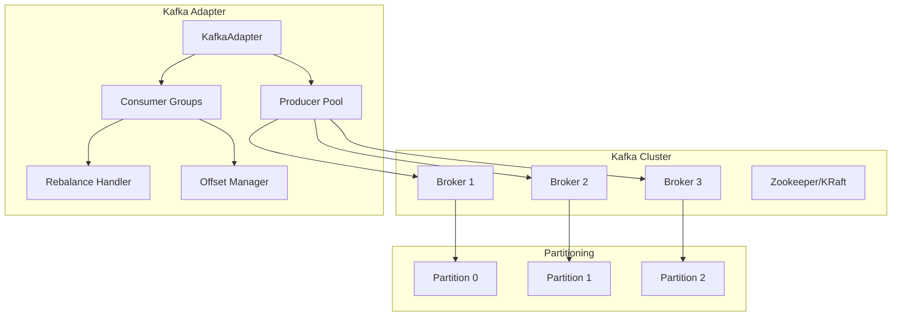
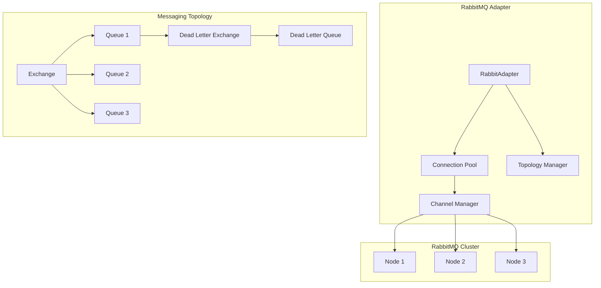

# Event-Driven Messaging Implementation Guide

## Table of Contents

1. [Kafka Implementation](#kafka-implementation)
2. [RabbitMQ Implementation](#rabbitmq-implementation)
3. [NATS Implementation](#nats-implementation)
4. [Common Patterns](#common-patterns)
5. [Testing Strategies](#testing-strategies)

## Kafka Implementation

### Overview

Apache Kafka is a distributed streaming platform designed for high-throughput, fault-tolerant messaging. The SWIT Kafka adapter leverages Kafka's strengths while abstracting its complexity.

### Architecture



### Core Implementation

```go
package kafka

import (
    "context"
    "fmt"
    "sync"
    "time"
    
    "github.com/segmentio/kafka-go"
    "github.com/swit/pkg/messaging"
    "go.uber.org/zap"
)

// KafkaAdapter implements MessageBroker for Kafka
type KafkaAdapter struct {
    config     *messaging.BrokerConfig
    dialer     *kafka.Dialer
    logger     *zap.Logger
    
    producers  sync.Map // map[string]*KafkaProducer
    consumers  sync.Map // map[string]*KafkaConsumer
    
    connected  bool
    mu         sync.RWMutex
}

func NewKafkaAdapter(config *messaging.BrokerConfig, logger *zap.Logger) *KafkaAdapter {
    return &KafkaAdapter{
        config: config,
        logger: logger,
        dialer: &kafka.Dialer{
            Timeout:   config.Connection.Timeout,
            DualStack: true,
            TLS:       createTLSConfig(config.TLS),
            SASLMechanism: createSASLMechanism(config.Authentication),
        },
    }
}

func (ka *KafkaAdapter) Connect(ctx context.Context) error {
    ka.mu.Lock()
    defer ka.mu.Unlock()
    
    if ka.connected {
        return nil
    }
    
    // Test connection by fetching metadata
    conn, err := ka.dialer.DialContext(ctx, "tcp", ka.config.Endpoints[0])
    if err != nil {
        return messaging.NewConnectionError("failed to connect to Kafka", err)
    }
    defer conn.Close()
    
    // Fetch cluster metadata
    partitions, err := conn.ReadPartitions()
    if err != nil {
        return messaging.NewConnectionError("failed to read partitions", err)
    }
    
    ka.logger.Info("Connected to Kafka cluster",
        zap.Int("brokers", len(ka.config.Endpoints)),
        zap.Int("partitions", len(partitions)),
    )
    
    ka.connected = true
    return nil
}

func (ka *KafkaAdapter) CreatePublisher(config messaging.PublisherConfig) (messaging.EventPublisher, error) {
    if !ka.IsConnected() {
        return nil, messaging.NewConnectionError("not connected to Kafka", nil)
    }
    
    producer := &KafkaProducer{
        adapter: ka,
        config:  config,
        writer: &kafka.Writer{
            Addr:     kafka.TCP(ka.config.Endpoints...),
            Topic:    config.Topic,
            Balancer: ka.getBalancer(config),
            
            // Batching configuration
            BatchSize:    config.Batching.MaxMessages,
            BatchBytes:   int64(config.Batching.MaxBytes),
            BatchTimeout: config.Batching.FlushInterval,
            
            // Compression
            Compression: ka.getCompression(config.Compression),
            
            // Reliability
            RequiredAcks: ka.getRequiredAcks(config),
            MaxAttempts:  config.Retry.MaxAttempts,
            
            // Async mode
            Async: config.Async,
        },
        logger: ka.logger.With(zap.String("topic", config.Topic)),
    }
    
    // Store producer reference
    ka.producers.Store(config.Topic, producer)
    
    return producer, nil
}

func (ka *KafkaAdapter) CreateSubscriber(config messaging.SubscriberConfig) (messaging.EventSubscriber, error) {
    if !ka.IsConnected() {
        return nil, messaging.NewConnectionError("not connected to Kafka", nil)
    }
    
    consumer := &KafkaConsumer{
        adapter: ka,
        config:  config,
        readers: make([]*kafka.Reader, 0, len(config.Topics)),
        logger:  ka.logger.With(zap.String("group", config.ConsumerGroup)),
    }
    
    // Create reader for each topic
    for _, topic := range config.Topics {
        reader := kafka.NewReader(kafka.ReaderConfig{
            Brokers:        ka.config.Endpoints,
            Topic:          topic,
            GroupID:        config.ConsumerGroup,
            Dialer:         ka.dialer,
            
            // Consumer configuration
            MinBytes:       1,
            MaxBytes:       10e6, // 10MB
            MaxWait:        500 * time.Millisecond,
            CommitInterval: config.Offset.Interval,
            
            // Offset management
            StartOffset: ka.getStartOffset(config.Offset.Initial),
            
            // Session configuration
            SessionTimeout:   30 * time.Second,
            RebalanceTimeout: 30 * time.Second,
        })
        
        consumer.readers = append(consumer.readers, reader)
    }
    
    // Store consumer reference
    ka.consumers.Store(config.ConsumerGroup, consumer)
    
    return consumer, nil
}
```

### Kafka Producer Implementation

```go
// KafkaProducer implements EventPublisher for Kafka
type KafkaProducer struct {
    adapter *KafkaAdapter
    config  messaging.PublisherConfig
    writer  *kafka.Writer
    logger  *zap.Logger
    
    metrics *ProducerMetrics
    mu      sync.RWMutex
}

func (kp *KafkaProducer) Publish(ctx context.Context, message *messaging.Message) error {
    kafkaMsg := kp.toKafkaMessage(message)
    
    start := time.Now()
    err := kp.writer.WriteMessages(ctx, kafkaMsg)
    kp.metrics.RecordPublish(time.Since(start), err)
    
    if err != nil {
        return messaging.NewPublishError(
            fmt.Sprintf("failed to publish to %s", kp.config.Topic),
            err,
        )
    }
    
    return nil
}

func (kp *KafkaProducer) PublishBatch(ctx context.Context, messages []*messaging.Message) error {
    kafkaMessages := make([]kafka.Message, 0, len(messages))
    for _, msg := range messages {
        kafkaMessages = append(kafkaMessages, kp.toKafkaMessage(msg))
    }
    
    start := time.Now()
    err := kp.writer.WriteMessages(ctx, kafkaMessages...)
    kp.metrics.RecordBatch(len(messages), time.Since(start), err)
    
    if err != nil {
        return messaging.NewPublishError(
            fmt.Sprintf("failed to publish batch to %s", kp.config.Topic),
            err,
        )
    }
    
    return nil
}

func (kp *KafkaProducer) PublishWithConfirm(ctx context.Context, message *messaging.Message) (*messaging.PublishConfirmation, error) {
    // Temporarily switch to sync mode for confirmation
    kp.mu.Lock()
    wasAsync := kp.writer.Async
    kp.writer.Async = false
    kp.mu.Unlock()
    
    defer func() {
        kp.mu.Lock()
        kp.writer.Async = wasAsync
        kp.mu.Unlock()
    }()
    
    kafkaMsg := kp.toKafkaMessage(message)
    
    start := time.Now()
    err := kp.writer.WriteMessages(ctx, kafkaMsg)
    duration := time.Since(start)
    
    if err != nil {
        kp.metrics.RecordPublish(duration, err)
        return nil, messaging.NewPublishError(
            fmt.Sprintf("failed to publish with confirmation to %s", kp.config.Topic),
            err,
        )
    }
    
    kp.metrics.RecordPublish(duration, nil)
    
    // Create confirmation
    confirmation := &messaging.PublishConfirmation{
        MessageID: message.ID,
        Timestamp: time.Now(),
        Metadata: map[string]string{
            "topic": kp.config.Topic,
        },
    }
    
    return confirmation, nil
}

func (kp *KafkaProducer) toKafkaMessage(msg *messaging.Message) kafka.Message {
    headers := make([]kafka.Header, 0, len(msg.Headers))
    for k, v := range msg.Headers {
        headers = append(headers, kafka.Header{
            Key:   k,
            Value: []byte(v),
        })
    }
    
    return kafka.Message{
        Key:     msg.Key,
        Value:   msg.Payload,
        Headers: headers,
        Time:    msg.Timestamp,
    }
}
```

### Kafka Consumer Implementation

```go
// KafkaConsumer implements EventSubscriber for Kafka
type KafkaConsumer struct {
    adapter  *KafkaAdapter
    config   messaging.SubscriberConfig
    readers  []*kafka.Reader
    logger   *zap.Logger
    
    handler  messaging.MessageHandler
    workers  *WorkerPool
    
    ctx      context.Context
    cancel   context.CancelFunc
    wg       sync.WaitGroup
    
    metrics  *ConsumerMetrics
}

func (kc *KafkaConsumer) Subscribe(ctx context.Context, handler messaging.MessageHandler) error {
    return kc.SubscribeWithMiddleware(ctx, handler)
}

func (kc *KafkaConsumer) SubscribeWithMiddleware(
    ctx context.Context,
    handler messaging.MessageHandler,
    middleware ...messaging.Middleware,
) error {
    // Apply middleware
    finalHandler := handler
    for i := len(middleware) - 1; i >= 0; i-- {
        finalHandler = middleware[i].Wrap(finalHandler)
    }
    
    kc.handler = finalHandler
    kc.ctx, kc.cancel = context.WithCancel(ctx)
    
    // Create worker pool
    kc.workers = NewWorkerPool(kc.config.Concurrency)
    
    // Start consumer for each reader
    for _, reader := range kc.readers {
        kc.wg.Add(1)
        go kc.consume(reader)
    }
    
    return nil
}

func (kc *KafkaConsumer) consume(reader *kafka.Reader) {
    defer kc.wg.Done()
    
    for {
        select {
        case <-kc.ctx.Done():
            return
        default:
        }
        
        // Fetch message
        kafkaMsg, err := reader.FetchMessage(kc.ctx)
        if err != nil {
            if err == context.Canceled {
                return
            }
            
            kc.logger.Error("Failed to fetch message",
                zap.Error(err),
                zap.String("topic", reader.Config().Topic),
            )
            
            time.Sleep(time.Second)
            continue
        }
        
        // Convert to messaging.Message
        msg := kc.fromKafkaMessage(&kafkaMsg)
        
        // Process message in worker pool
        kc.workers.Submit(func() {
            start := time.Now()
            
            // Handle message
            err := kc.handler.Handle(kc.ctx, msg)
            
            kc.metrics.RecordProcessing(time.Since(start), err)
            
            if err != nil {
                // Handle error
                action := kc.handler.OnError(kc.ctx, msg, err)
                kc.handleErrorAction(msg, err, action)
            } else {
                // Commit offset
                if !kc.config.Offset.AutoCommit {
                    if err := reader.CommitMessages(kc.ctx, kafkaMsg); err != nil {
                        kc.logger.Error("Failed to commit message",
                            zap.Error(err),
                            zap.String("message_id", msg.ID),
                        )
                    }
                }
            }
        })
    }
}

func (kc *KafkaConsumer) fromKafkaMessage(kafkaMsg *kafka.Message) *messaging.Message {
    headers := make(map[string]string)
    for _, h := range kafkaMsg.Headers {
        headers[h.Key] = string(h.Value)
    }
    
    return &messaging.Message{
        ID:              fmt.Sprintf("%s-%d-%d", kafkaMsg.Topic, kafkaMsg.Partition, kafkaMsg.Offset),
        Topic:           kafkaMsg.Topic,
        Key:             kafkaMsg.Key,
        Payload:         kafkaMsg.Value,
        Headers:         headers,
        Timestamp:       kafkaMsg.Time,
        DeliveryAttempt: 1,
        BrokerMetadata: map[string]interface{}{
            "partition": kafkaMsg.Partition,
            "offset":    kafkaMsg.Offset,
        },
    }
}

func (kc *KafkaConsumer) Pause(ctx context.Context) error {
    // Kafka doesn't support pause directly, we stop fetching
    kc.workers.Pause()
    return nil
}

func (kc *KafkaConsumer) Resume(ctx context.Context) error {
    kc.workers.Resume()
    return nil
}
```

### Partitioning and Ordering

```go
// PartitionKeyStrategy defines how to determine partition keys
type PartitionKeyStrategy interface {
    GetKey(message *messaging.Message) []byte
}

// HashPartitioner uses consistent hashing for partitioning
type HashPartitioner struct {
    field string
}

func (hp *HashPartitioner) GetKey(message *messaging.Message) []byte {
    // Extract field from message for partitioning
    var data map[string]interface{}
    json.Unmarshal(message.Payload, &data)
    
    if value, ok := data[hp.field]; ok {
        return []byte(fmt.Sprintf("%v", value))
    }
    
    return message.Key
}

// OrderedProcessor ensures ordered processing within partitions
type OrderedProcessor struct {
    partitions map[int32]*PartitionProcessor
    mu         sync.RWMutex
}

type PartitionProcessor struct {
    partition int32
    queue     chan *messaging.Message
    handler   messaging.MessageHandler
}

func (op *OrderedProcessor) Process(msg *messaging.Message) error {
    metadata := msg.BrokerMetadata.(map[string]interface{})
    partition := metadata["partition"].(int32)
    
    op.mu.RLock()
    processor, exists := op.partitions[partition]
    op.mu.RUnlock()
    
    if !exists {
        op.mu.Lock()
        processor = &PartitionProcessor{
            partition: partition,
            queue:     make(chan *messaging.Message, 100),
            handler:   op.handler,
        }
        op.partitions[partition] = processor
        go processor.Run()
        op.mu.Unlock()
    }
    
    processor.queue <- msg
    return nil
}

func (pp *PartitionProcessor) Run() {
    for msg := range pp.queue {
        if err := pp.handler.Handle(context.Background(), msg); err != nil {
            // Handle error
            log.Error("Failed to process message",
                zap.Int32("partition", pp.partition),
                zap.Error(err),
            )
        }
    }
}
```

### Consumer Group Management

```go
// ConsumerGroupCoordinator manages consumer group coordination
type ConsumerGroupCoordinator struct {
    groupID   string
    members   map[string]*ConsumerMember
    leader    string
    
    rebalanceChan chan RebalanceEvent
    mu            sync.RWMutex
}

type ConsumerMember struct {
    ID         string
    Topics     []string
    Partitions []int32
}

type RebalanceEvent struct {
    Type       string // "joined", "left", "rebalanced"
    Partitions []int32
}

func (cgc *ConsumerGroupCoordinator) HandleRebalance(event kafka.RebalanceEvent) {
    cgc.mu.Lock()
    defer cgc.mu.Unlock()
    
    rebalanceEvent := RebalanceEvent{
        Type:       "rebalanced",
        Partitions: event.Partitions,
    }
    
    select {
    case cgc.rebalanceChan <- rebalanceEvent:
    default:
        // Channel full, log warning
        log.Warn("Rebalance channel full")
    }
}

// Example: Handling consumer group rebalancing
func ExampleConsumerGroupRebalancing() {
    coordinator := &ConsumerGroupCoordinator{
        groupID:       "order-processors",
        members:       make(map[string]*ConsumerMember),
        rebalanceChan: make(chan RebalanceEvent, 10),
    }
    
    // Monitor rebalance events
    go func() {
        for event := range coordinator.rebalanceChan {
            log.Info("Consumer group rebalanced",
                zap.String("type", event.Type),
                zap.Int("partitions", len(event.Partitions)),
            )
            
            // Adjust processing based on new partition assignment
            switch event.Type {
            case "rebalanced":
                // Restart processors for new partitions
                restartProcessorsForPartitions(event.Partitions)
            }
        }
    }()
}
```

### Exactly-Once Semantics

```go
// TransactionalProducer implements exactly-once semantics
type TransactionalProducer struct {
    producer       *KafkaProducer
    transactionID  string
    inTransaction  bool
    mu            sync.Mutex
}

func (tp *TransactionalProducer) BeginTransaction(ctx context.Context) (messaging.Transaction, error) {
    tp.mu.Lock()
    defer tp.mu.Unlock()
    
    if tp.inTransaction {
        return nil, errors.New("transaction already in progress")
    }
    
    tp.inTransaction = true
    
    return &KafkaTransaction{
        producer: tp,
        messages: make([]*messaging.Message, 0),
    }, nil
}

type KafkaTransaction struct {
    producer *TransactionalProducer
    messages []*messaging.Message
    mu       sync.Mutex
}

func (kt *KafkaTransaction) Publish(ctx context.Context, message *messaging.Message) error {
    kt.mu.Lock()
    defer kt.mu.Unlock()
    
    kt.messages = append(kt.messages, message)
    return nil
}

func (kt *KafkaTransaction) Commit(ctx context.Context) error {
    kt.mu.Lock()
    defer kt.mu.Unlock()
    
    // Publish all messages atomically
    for _, msg := range kt.messages {
        if err := kt.producer.producer.Publish(ctx, msg); err != nil {
            // Rollback on error
            kt.Rollback(ctx)
            return err
        }
    }
    
    kt.producer.mu.Lock()
    kt.producer.inTransaction = false
    kt.producer.mu.Unlock()
    
    return nil
}

func (kt *KafkaTransaction) Rollback(ctx context.Context) error {
    kt.mu.Lock()
    defer kt.mu.Unlock()
    
    // Clear pending messages
    kt.messages = nil
    
    kt.producer.mu.Lock()
    kt.producer.inTransaction = false
    kt.producer.mu.Unlock()
    
    return nil
}
```

## RabbitMQ Implementation

### Overview

RabbitMQ is a message broker that implements AMQP (Advanced Message Queuing Protocol). It excels at complex routing, reliability, and flexible messaging patterns.

### Architecture



### Core Implementation

```go
package rabbitmq

import (
    "context"
    "fmt"
    "sync"
    "time"
    
    "github.com/streadway/amqp"
    "github.com/swit/pkg/messaging"
    "go.uber.org/zap"
)

// RabbitAdapter implements MessageBroker for RabbitMQ
type RabbitAdapter struct {
    config      *messaging.BrokerConfig
    logger      *zap.Logger
    
    connPool    *ConnectionPool
    topology    *TopologyManager
    
    publishers  sync.Map
    consumers   sync.Map
    
    connected   bool
    mu          sync.RWMutex
}

func NewRabbitAdapter(config *messaging.BrokerConfig, logger *zap.Logger) *RabbitAdapter {
    return &RabbitAdapter{
        config:   config,
        logger:   logger,
        connPool: NewConnectionPool(config, logger),
        topology: NewTopologyManager(logger),
    }
}

func (ra *RabbitAdapter) Connect(ctx context.Context) error {
    ra.mu.Lock()
    defer ra.mu.Unlock()
    
    if ra.connected {
        return nil
    }
    
    // Initialize connection pool
    if err := ra.connPool.Initialize(ctx); err != nil {
        return messaging.NewConnectionError("failed to initialize connection pool", err)
    }
    
    // Setup topology (exchanges, queues, bindings)
    conn, err := ra.connPool.Acquire()
    if err != nil {
        return err
    }
    defer ra.connPool.Release(conn)
    
    if err := ra.topology.Setup(conn); err != nil {
        return messaging.NewConnectionError("failed to setup topology", err)
    }
    
    ra.connected = true
    ra.logger.Info("Connected to RabbitMQ cluster",
        zap.Int("connections", ra.connPool.Size()),
    )
    
    return nil
}

// ConnectionPool manages AMQP connections
type ConnectionPool struct {
    config      *messaging.BrokerConfig
    logger      *zap.Logger
    
    connections []*PooledConnection
    available   chan *PooledConnection
    
    mu          sync.RWMutex
}

type PooledConnection struct {
    conn     *amqp.Connection
    channels sync.Map // map[string]*amqp.Channel
    inUse    bool
    mu       sync.Mutex
}

func (cp *ConnectionPool) Acquire() (*PooledConnection, error) {
    select {
    case conn := <-cp.available:
        conn.mu.Lock()
        conn.inUse = true
        conn.mu.Unlock()
        return conn, nil
        
    case <-time.After(5 * time.Second):
        return nil, errors.New("connection pool exhausted")
    }
}

func (cp *ConnectionPool) Release(conn *PooledConnection) {
    conn.mu.Lock()
    conn.inUse = false
    conn.mu.Unlock()
    
    cp.available <- conn
}
```

### Exchange and Queue Management

```go
// TopologyManager manages RabbitMQ topology
type TopologyManager struct {
    exchanges map[string]ExchangeConfig
    queues    map[string]QueueConfig
    bindings  []BindingConfig
    logger    *zap.Logger
}

type ExchangeConfig struct {
    Name       string
    Type       string // direct, topic, fanout, headers
    Durable    bool
    AutoDelete bool
    Arguments  amqp.Table
}

type QueueConfig struct {
    Name       string
    Durable    bool
    AutoDelete bool
    Exclusive  bool
    Arguments  amqp.Table
}

type BindingConfig struct {
    Queue      string
    Exchange   string
    RoutingKey string
    Arguments  amqp.Table
}

func (tm *TopologyManager) Setup(conn *PooledConnection) error {
    ch, err := conn.conn.Channel()
    if err != nil {
        return err
    }
    defer ch.Close()
    
    // Declare exchanges
    for _, exchange := range tm.exchanges {
        if err := ch.ExchangeDeclare(
            exchange.Name,
            exchange.Type,
            exchange.Durable,
            exchange.AutoDelete,
            false, // internal
            false, // no-wait
            exchange.Arguments,
        ); err != nil {
            return fmt.Errorf("failed to declare exchange %s: %w", exchange.Name, err)
        }
        
        tm.logger.Info("Exchange declared",
            zap.String("name", exchange.Name),
            zap.String("type", exchange.Type),
        )
    }
    
    // Declare queues
    for _, queue := range tm.queues {
        q, err := ch.QueueDeclare(
            queue.Name,
            queue.Durable,
            queue.AutoDelete,
            queue.Exclusive,
            false, // no-wait
            queue.Arguments,
        )
        if err != nil {
            return fmt.Errorf("failed to declare queue %s: %w", queue.Name, err)
        }
        
        tm.logger.Info("Queue declared",
            zap.String("name", q.Name),
            zap.Int("messages", q.Messages),
            zap.Int("consumers", q.Consumers),
        )
    }
    
    // Create bindings
    for _, binding := range tm.bindings {
        if err := ch.QueueBind(
            binding.Queue,
            binding.RoutingKey,
            binding.Exchange,
            false, // no-wait
            binding.Arguments,
        ); err != nil {
            return fmt.Errorf("failed to bind queue %s to exchange %s: %w",
                binding.Queue, binding.Exchange, err)
        }
        
        tm.logger.Info("Queue bound to exchange",
            zap.String("queue", binding.Queue),
            zap.String("exchange", binding.Exchange),
            zap.String("routing_key", binding.RoutingKey),
        )
    }
    
    return nil
}

// Example: Setting up complex routing topology
func ExampleRoutingTopology() {
    topology := &TopologyManager{
        exchanges: map[string]ExchangeConfig{
            "orders": {
                Name:    "orders",
                Type:    "topic",
                Durable: true,
            },
            "orders.dlx": {
                Name:    "orders.dlx",
                Type:    "direct",
                Durable: true,
            },
        },
        queues: map[string]QueueConfig{
            "orders.created": {
                Name:    "orders.created",
                Durable: true,
                Arguments: amqp.Table{
                    "x-dead-letter-exchange":    "orders.dlx",
                    "x-dead-letter-routing-key": "failed.orders.created",
                    "x-message-ttl":            300000, // 5 minutes
                    "x-max-length":             10000,
                },
            },
            "orders.processed": {
                Name:    "orders.processed",
                Durable: true,
            },
            "orders.dlq": {
                Name:    "orders.dlq",
                Durable: true,
                Arguments: amqp.Table{
                    "x-message-ttl": 86400000, // 1 day
                },
            },
        },
        bindings: []BindingConfig{
            {
                Queue:      "orders.created",
                Exchange:   "orders",
                RoutingKey: "order.created.*",
            },
            {
                Queue:      "orders.processed",
                Exchange:   "orders",
                RoutingKey: "order.processed.*",
            },
            {
                Queue:      "orders.dlq",
                Exchange:   "orders.dlx",
                RoutingKey: "failed.orders.*",
            },
        },
    }
    
    // Setup topology
    topology.Setup(conn)
}
```

### RabbitMQ Publisher Implementation

```go
// RabbitPublisher implements EventPublisher for RabbitMQ
type RabbitPublisher struct {
    adapter   *RabbitAdapter
    config    messaging.PublisherConfig
    exchange  string
    channel   *amqp.Channel
    confirms  chan amqp.Confirmation
    logger    *zap.Logger
    
    metrics   *PublisherMetrics
    mu        sync.RWMutex
}

func (rp *RabbitPublisher) Publish(ctx context.Context, message *messaging.Message) error {
    publishing := rp.toAMQPPublishing(message)
    
    routingKey := rp.getRoutingKey(message)
    
    start := time.Now()
    err := rp.channel.Publish(
        rp.exchange,
        routingKey,
        false, // mandatory
        false, // immediate
        publishing,
    )
    
    rp.metrics.RecordPublish(time.Since(start), err)
    
    if err != nil {
        return messaging.NewPublishError(
            fmt.Sprintf("failed to publish to exchange %s", rp.exchange),
            err,
        )
    }
    
    return nil
}

func (rp *RabbitPublisher) PublishWithConfirm(ctx context.Context, message *messaging.Message) (*messaging.PublishConfirmation, error) {
    // Enable publisher confirms
    if err := rp.channel.Confirm(false); err != nil {
        return nil, err
    }
    
    publishing := rp.toAMQPPublishing(message)
    routingKey := rp.getRoutingKey(message)
    
    confirms := rp.channel.NotifyPublish(make(chan amqp.Confirmation, 1))
    
    start := time.Now()
    err := rp.channel.Publish(
        rp.exchange,
        routingKey,
        false,
        false,
        publishing,
    )
    
    if err != nil {
        rp.metrics.RecordPublish(time.Since(start), err)
        return nil, messaging.NewPublishError(
            fmt.Sprintf("failed to publish with confirmation to exchange %s", rp.exchange),
            err,
        )
    }
    
    // Wait for confirmation
    select {
    case confirm := <-confirms:
        if !confirm.Ack {
            return nil, messaging.NewPublishError("message not acknowledged", nil)
        }
        
        rp.metrics.RecordPublish(time.Since(start), nil)
        
        return &messaging.PublishConfirmation{
            MessageID: message.ID,
            Timestamp: time.Now(),
            Metadata: map[string]string{
                "exchange":    rp.exchange,
                "routing_key": routingKey,
                "delivery_tag": fmt.Sprintf("%d", confirm.DeliveryTag),
            },
        }, nil
        
    case <-time.After(rp.config.Confirmation.Timeout):
        return nil, messaging.NewPublishError("confirmation timeout", nil)
        
    case <-ctx.Done():
        return nil, ctx.Err()
    }
}

func (rp *RabbitPublisher) toAMQPPublishing(msg *messaging.Message) amqp.Publishing {
    headers := amqp.Table{}
    for k, v := range msg.Headers {
        headers[k] = v
    }
    
    // Add message metadata
    headers["message_id"] = msg.ID
    headers["timestamp"] = msg.Timestamp.Unix()
    if msg.CorrelationID != "" {
        headers["correlation_id"] = msg.CorrelationID
    }
    
    publishing := amqp.Publishing{
        Headers:         headers,
        ContentType:     "application/json",
        ContentEncoding: "",
        Body:           msg.Payload,
        DeliveryMode:   amqp.Persistent,
        Priority:       uint8(msg.Priority),
        MessageId:      msg.ID,
        Timestamp:      msg.Timestamp,
    }
    
    if msg.TTL > 0 {
        publishing.Expiration = fmt.Sprintf("%d", msg.TTL*1000)
    }
    
    if msg.ReplyTo != "" {
        publishing.ReplyTo = msg.ReplyTo
    }
    
    return publishing
}
```

### RabbitMQ Consumer Implementation

```go
// RabbitConsumer implements EventSubscriber for RabbitMQ
type RabbitConsumer struct {
    adapter   *RabbitAdapter
    config    messaging.SubscriberConfig
    channel   *amqp.Channel
    deliveries <-chan amqp.Delivery
    handler   messaging.MessageHandler
    logger    *zap.Logger
    
    ctx       context.Context
    cancel    context.CancelFunc
    wg        sync.WaitGroup
    
    metrics   *ConsumerMetrics
}

func (rc *RabbitConsumer) Subscribe(ctx context.Context, handler messaging.MessageHandler) error {
    return rc.SubscribeWithMiddleware(ctx, handler)
}

func (rc *RabbitConsumer) SubscribeWithMiddleware(
    ctx context.Context,
    handler messaging.MessageHandler,
    middleware ...messaging.Middleware,
) error {
    // Apply middleware
    finalHandler := handler
    for i := len(middleware) - 1; i >= 0; i-- {
        finalHandler = middleware[i].Wrap(finalHandler)
    }
    
    rc.handler = finalHandler
    rc.ctx, rc.cancel = context.WithCancel(ctx)
    
    // Start consuming from each queue
    for _, queue := range rc.config.Topics {
        if err := rc.startConsumer(queue); err != nil {
            return err
        }
    }
    
    return nil
}

func (rc *RabbitConsumer) startConsumer(queue string) error {
    // Configure QoS
    if err := rc.channel.Qos(
        rc.config.PrefetchCount, // prefetch count
        0,                        // prefetch size
        false,                    // global
    ); err != nil {
        return err
    }
    
    // Start consuming
    deliveries, err := rc.channel.Consume(
        queue,
        rc.config.ConsumerGroup, // consumer tag
        false,                    // auto-ack
        false,                    // exclusive
        false,                    // no-local
        false,                    // no-wait
        nil,                      // args
    )
    if err != nil {
        return err
    }
    
    // Process messages
    for i := 0; i < rc.config.Concurrency; i++ {
        rc.wg.Add(1)
        go rc.processMessages(deliveries)
    }
    
    return nil
}

func (rc *RabbitConsumer) processMessages(deliveries <-chan amqp.Delivery) {
    defer rc.wg.Done()
    
    for {
        select {
        case <-rc.ctx.Done():
            return
            
        case delivery, ok := <-deliveries:
            if !ok {
                return
            }
            
            msg := rc.fromAMQPDelivery(&delivery)
            
            start := time.Now()
            err := rc.handler.Handle(rc.ctx, msg)
            rc.metrics.RecordProcessing(time.Since(start), err)
            
            if err != nil {
                // Handle error
                action := rc.handler.OnError(rc.ctx, msg, err)
                rc.handleErrorAction(&delivery, msg, err, action)
            } else {
                // Acknowledge message
                if err := delivery.Ack(false); err != nil {
                    rc.logger.Error("Failed to ack message",
                        zap.Error(err),
                        zap.String("message_id", msg.ID),
                    )
                }
            }
        }
    }
}

func (rc *RabbitConsumer) handleErrorAction(
    delivery *amqp.Delivery,
    msg *messaging.Message,
    err error,
    action messaging.ErrorAction,
) {
    switch action {
    case messaging.ErrorActionRetry:
        // Requeue message
        if err := delivery.Nack(false, true); err != nil {
            rc.logger.Error("Failed to nack message for retry",
                zap.Error(err),
                zap.String("message_id", msg.ID),
            )
        }
        
    case messaging.ErrorActionDeadLetter:
        // Reject message (will go to DLQ if configured)
        if err := delivery.Nack(false, false); err != nil {
            rc.logger.Error("Failed to nack message for DLQ",
                zap.Error(err),
                zap.String("message_id", msg.ID),
            )
        }
        
    case messaging.ErrorActionDiscard:
        // Acknowledge to discard
        if err := delivery.Ack(false); err != nil {
            rc.logger.Error("Failed to ack message for discard",
                zap.Error(err),
                zap.String("message_id", msg.ID),
            )
        }
    }
}
```

### Dead Letter Queue Implementation

```go
// DeadLetterManager manages dead letter queues
type DeadLetterManager struct {
    channel  *amqp.Channel
    exchange string
    queue    string
    logger   *zap.Logger
}

func (dlm *DeadLetterManager) Setup() error {
    // Declare dead letter exchange
    if err := dlm.channel.ExchangeDeclare(
        dlm.exchange,
        "direct",
        true,  // durable
        false, // auto-delete
        false, // internal
        false, // no-wait
        nil,
    ); err != nil {
        return err
    }
    
    // Declare dead letter queue
    _, err := dlm.channel.QueueDeclare(
        dlm.queue,
        true,  // durable
        false, // auto-delete
        false, // exclusive
        false, // no-wait
        amqp.Table{
            "x-message-ttl": 604800000, // 7 days
            "x-max-length":  100000,     // Max 100k messages
        },
    )
    if err != nil {
        return err
    }
    
    // Bind queue to exchange
    return dlm.channel.QueueBind(
        dlm.queue,
        "failed.*", // routing key pattern
        dlm.exchange,
        false,
        nil,
    )
}

func (dlm *DeadLetterManager) ProcessDeadLetters(handler func(*messaging.Message) error) error {
    deliveries, err := dlm.channel.Consume(
        dlm.queue,
        "dlq-processor",
        false, // auto-ack
        false, // exclusive
        false, // no-local
        false, // no-wait
        nil,
    )
    if err != nil {
        return err
    }
    
    for delivery := range deliveries {
        msg := convertDeliveryToMessage(&delivery)
        
        // Add dead letter metadata
        msg.Headers["x-death-count"] = fmt.Sprintf("%d", getDeathCount(delivery.Headers))
        msg.Headers["x-death-reason"] = getDeathReason(delivery.Headers)
        msg.Headers["x-death-time"] = time.Now().Format(time.RFC3339)
        
        if err := handler(msg); err != nil {
            dlm.logger.Error("Failed to process dead letter",
                zap.Error(err),
                zap.String("message_id", msg.ID),
            )
            
            // Requeue if processing fails
            delivery.Nack(false, true)
        } else {
            // Acknowledge processed dead letter
            delivery.Ack(false)
        }
    }
    
    return nil
}
```

## NATS Implementation

### Overview

NATS is a lightweight, high-performance messaging system designed for cloud-native applications. It supports both Core NATS (at-most-once delivery) and NATS JetStream (at-least-once delivery with persistence).

### Architecture

```mermaid
graph TB
    subgraph "NATS Cluster"
        N1[NATS Server 1]
        N2[NATS Server 2]
        N3[NATS Server 3]
        JS[JetStream]
    end
    
    subgraph "NATS Adapter"
        NA[NATSAdapter]
        NC[NATS Core]
        NJ[JetStream]
        NS[Stan (Legacy)]
    end
    
    subgraph "Messaging Patterns"
        PS[Pub/Sub]
        QG[Queue Groups]
        RR[Request/Reply]
        ST[Streaming]
    end
    
    NA --> NC
    NA --> NJ
    NA --> NS
    
    NC --> N1
    NC --> N2
    NC --> N3
    
    NJ --> JS
    
    NC --> PS
    NC --> QG
    NC --> RR
    NJ --> ST
```

### Core Implementation

```go
package nats

import (
    "context"
    "fmt"
    "sync"
    "time"
    
    "github.com/nats-io/nats.go"
    "github.com/swit/pkg/messaging"
    "go.uber.org/zap"
)

// NATSAdapter implements MessageBroker for NATS
type NATSAdapter struct {
    config    *messaging.BrokerConfig
    logger    *zap.Logger
    
    conn      *nats.Conn
    js        nats.JetStreamContext
    
    publishers sync.Map
    consumers  sync.Map
    
    connected bool
    mu        sync.RWMutex
}

func NewNATSAdapter(config *messaging.BrokerConfig, logger *zap.Logger) *NATSAdapter {
    return &NATSAdapter{
        config: config,
        logger: logger,
    }
}

func (na *NATSAdapter) Connect(ctx context.Context) error {
    na.mu.Lock()
    defer na.mu.Unlock()
    
    if na.connected {
        return nil
    }
    
    // Build connection options
    opts := []nats.Option{
        nats.MaxReconnects(-1),
        nats.ReconnectWait(time.Second),
        nats.ReconnectBufSize(8 * 1024 * 1024),
        nats.Timeout(na.config.Connection.Timeout),
    }
    
    // Add authentication
    if na.config.Authentication != nil {
        opts = append(opts, na.getAuthOptions()...)
    }
    
    // Add TLS
    if na.config.TLS != nil && na.config.TLS.Enabled {
        tlsConfig := createTLSConfig(na.config.TLS)
        opts = append(opts, nats.Secure(tlsConfig))
    }
    
    // Connect to NATS
    conn, err := nats.Connect(
        strings.Join(na.config.Endpoints, ","),
        opts...,
    )
    if err != nil {
        return messaging.NewConnectionError("failed to connect to NATS", err)
    }
    
    na.conn = conn
    
    // Initialize JetStream if available
    js, err := conn.JetStream(
        nats.PublishAsyncMaxPending(256),
        nats.PublishAsyncErrHandler(func(js nats.JetStream, msg *nats.Msg, err error) {
            na.logger.Error("JetStream async publish error",
                zap.Error(err),
                zap.String("subject", msg.Subject),
            )
        }),
    )
    if err == nil {
        na.js = js
        
        // Setup streams
        if err := na.setupStreams(); err != nil {
            return err
        }
    }
    
    na.connected = true
    na.logger.Info("Connected to NATS",
        zap.String("server", conn.ConnectedUrl()),
        zap.Bool("jetstream", na.js != nil),
    )
    
    return nil
}

func (na *NATSAdapter) setupStreams() error {
    // Define stream configuration
    streamConfig := &nats.StreamConfig{
        Name:     "EVENTS",
        Subjects: []string{"events.>"},
        Storage:  nats.FileStorage,
        Retention: nats.LimitsPolicy,
        MaxAge:   7 * 24 * time.Hour,
        MaxBytes: 10 * 1024 * 1024 * 1024, // 10GB
        Replicas: 3,
    }
    
    // Create or update stream
    _, err := na.js.AddStream(streamConfig)
    if err != nil {
        // Try updating if exists
        _, err = na.js.UpdateStream(streamConfig)
        if err != nil {
            return fmt.Errorf("failed to setup stream: %w", err)
        }
    }
    
    return nil
}
```

### NATS Publisher Implementation

```go
// NATSPublisher implements EventPublisher for NATS
type NATSPublisher struct {
    adapter  *NATSAdapter
    config   messaging.PublisherConfig
    subject  string
    useJS    bool
    logger   *zap.Logger
    
    metrics  *PublisherMetrics
}

func (np *NATSPublisher) Publish(ctx context.Context, message *messaging.Message) error {
    data := np.encodeMessage(message)
    subject := np.getSubject(message)
    
    start := time.Now()
    var err error
    
    if np.useJS && np.adapter.js != nil {
        // Use JetStream for persistence
        _, err = np.adapter.js.PublishAsync(subject, data)
    } else {
        // Use Core NATS
        err = np.adapter.conn.Publish(subject, data)
    }
    
    np.metrics.RecordPublish(time.Since(start), err)
    
    if err != nil {
        return messaging.NewPublishError(
            fmt.Sprintf("failed to publish to subject %s", subject),
            err,
        )
    }
    
    return nil
}

func (np *NATSPublisher) PublishWithConfirm(ctx context.Context, message *messaging.Message) (*messaging.PublishConfirmation, error) {
    if !np.useJS || np.adapter.js == nil {
        // Core NATS doesn't support confirmations
        return nil, errors.New("confirmations require JetStream")
    }
    
    data := np.encodeMessage(message)
    subject := np.getSubject(message)
    
    start := time.Now()
    
    // Publish synchronously for confirmation
    pubAck, err := np.adapter.js.Publish(subject, data)
    
    np.metrics.RecordPublish(time.Since(start), err)
    
    if err != nil {
        return nil, messaging.NewPublishError(
            fmt.Sprintf("failed to publish with confirmation to subject %s", subject),
            err,
        )
    }
    
    return &messaging.PublishConfirmation{
        MessageID: message.ID,
        Timestamp: time.Now(),
        Metadata: map[string]string{
            "stream":   pubAck.Stream,
            "sequence": fmt.Sprintf("%d", pubAck.Sequence),
            "domain":   pubAck.Domain,
        },
    }, nil
}

func (np *NATSPublisher) encodeMessage(msg *messaging.Message) []byte {
    // Create NATS message with headers
    natsMsg := &NATSMessage{
        ID:            msg.ID,
        Payload:       msg.Payload,
        Headers:       msg.Headers,
        Timestamp:     msg.Timestamp,
        CorrelationID: msg.CorrelationID,
        ReplyTo:       msg.ReplyTo,
    }
    
    data, _ := json.Marshal(natsMsg)
    return data
}
```

### NATS Consumer Implementation

```go
// NATSConsumer implements EventSubscriber for NATS
type NATSConsumer struct {
    adapter      *NATSAdapter
    config       messaging.SubscriberConfig
    subscriptions []*nats.Subscription
    handler      messaging.MessageHandler
    logger       *zap.Logger
    
    ctx          context.Context
    cancel       context.CancelFunc
    wg           sync.WaitGroup
    
    metrics      *ConsumerMetrics
}

func (nc *NATSConsumer) Subscribe(ctx context.Context, handler messaging.MessageHandler) error {
    return nc.SubscribeWithMiddleware(ctx, handler)
}

func (nc *NATSConsumer) SubscribeWithMiddleware(
    ctx context.Context,
    handler messaging.MessageHandler,
    middleware ...messaging.Middleware,
) error {
    // Apply middleware
    finalHandler := handler
    for i := len(middleware) - 1; i >= 0; i-- {
        finalHandler = middleware[i].Wrap(finalHandler)
    }
    
    nc.handler = finalHandler
    nc.ctx, nc.cancel = context.WithCancel(ctx)
    
    // Subscribe to each subject
    for _, subject := range nc.config.Topics {
        if err := nc.subscribeToSubject(subject); err != nil {
            return err
        }
    }
    
    return nil
}

func (nc *NATSConsumer) subscribeToSubject(subject string) error {
    if nc.adapter.js != nil && nc.config.Processing.Ordered {
        // Use JetStream for ordered, durable subscriptions
        return nc.subscribeJetStream(subject)
    }
    
    // Use Core NATS with queue groups
    return nc.subscribeCoreNATS(subject)
}

func (nc *NATSConsumer) subscribeCoreNATS(subject string) error {
    // Create message channel
    msgChan := make(chan *nats.Msg, nc.config.PrefetchCount)
    
    // Subscribe with queue group for load balancing
    sub, err := nc.adapter.conn.QueueSubscribeSyncWithChan(
        subject,
        nc.config.ConsumerGroup,
        msgChan,
    )
    if err != nil {
        return err
    }
    
    // Set pending limits
    sub.SetPendingLimits(nc.config.PrefetchCount, -1)
    
    nc.subscriptions = append(nc.subscriptions, sub)
    
    // Start workers
    for i := 0; i < nc.config.Concurrency; i++ {
        nc.wg.Add(1)
        go nc.processMessages(msgChan)
    }
    
    return nil
}

func (nc *NATSConsumer) subscribeJetStream(subject string) error {
    // Create or update consumer
    consumerConfig := &nats.ConsumerConfig{
        Durable:       nc.config.ConsumerGroup,
        DeliverPolicy: nats.DeliverAllPolicy,
        AckPolicy:     nats.AckExplicitPolicy,
        AckWait:       nc.config.Processing.MaxProcessingTime,
        MaxDeliver:    nc.config.DeadLetter.MaxRetries,
        MaxAckPending: nc.config.Processing.MaxInFlight,
        FilterSubject: subject,
    }
    
    // Add consumer
    _, err := nc.adapter.js.AddConsumer("EVENTS", consumerConfig)
    if err != nil {
        return err
    }
    
    // Create subscription
    sub, err := nc.adapter.js.PullSubscribe(
        subject,
        nc.config.ConsumerGroup,
        nats.ManualAck(),
        nats.MaxAckPending(nc.config.Processing.MaxInFlight),
    )
    if err != nil {
        return err
    }
    
    nc.subscriptions = append(nc.subscriptions, sub)
    
    // Start workers for pull subscription
    for i := 0; i < nc.config.Concurrency; i++ {
        nc.wg.Add(1)
        go nc.processPullMessages(sub)
    }
    
    return nil
}

func (nc *NATSConsumer) processPullMessages(sub *nats.Subscription) {
    defer nc.wg.Done()
    
    for {
        select {
        case <-nc.ctx.Done():
            return
        default:
        }
        
        // Fetch messages
        msgs, err := sub.Fetch(nc.config.PrefetchCount, nats.MaxWait(time.Second))
        if err != nil {
            if err == nats.ErrTimeout {
                continue
            }
            
            nc.logger.Error("Failed to fetch messages",
                zap.Error(err),
            )
            continue
        }
        
        // Process fetched messages
        for _, natsMsg := range msgs {
            msg := nc.decodeMessage(natsMsg)
            
            start := time.Now()
            err := nc.handler.Handle(nc.ctx, msg)
            nc.metrics.RecordProcessing(time.Since(start), err)
            
            if err != nil {
                // Handle error
                action := nc.handler.OnError(nc.ctx, msg, err)
                nc.handleJetStreamError(natsMsg, action)
            } else {
                // Acknowledge message
                if err := natsMsg.Ack(); err != nil {
                    nc.logger.Error("Failed to ack message",
                        zap.Error(err),
                        zap.String("message_id", msg.ID),
                    )
                }
            }
        }
    }
}
```

### Queue Groups and Load Balancing

```go
// QueueGroupManager manages NATS queue groups for load balancing
type QueueGroupManager struct {
    conn    *nats.Conn
    groups  map[string]*QueueGroup
    logger  *zap.Logger
    mu      sync.RWMutex
}

type QueueGroup struct {
    Name         string
    Subscriptions []*nats.Subscription
    Members      int
}

func (qgm *QueueGroupManager) CreateQueueGroup(name string, subjects []string, handler nats.MsgHandler) error {
    qgm.mu.Lock()
    defer qgm.mu.Unlock()
    
    qg := &QueueGroup{
        Name:          name,
        Subscriptions: make([]*nats.Subscription, 0, len(subjects)),
    }
    
    for _, subject := range subjects {
        sub, err := qgm.conn.QueueSubscribe(subject, name, handler)
        if err != nil {
            return fmt.Errorf("failed to create queue subscription for %s: %w", subject, err)
        }
        
        qg.Subscriptions = append(qg.Subscriptions, sub)
    }
    
    qgm.groups[name] = qg
    
    qgm.logger.Info("Queue group created",
        zap.String("name", name),
        zap.Int("subjects", len(subjects)),
    )
    
    return nil
}

// Example: Implementing competing consumers pattern
func ExampleCompetingConsumers() {
    manager := &QueueGroupManager{
        conn:   conn,
        groups: make(map[string]*QueueGroup),
        logger: logger,
    }
    
    // Create queue group for order processing
    handler := func(msg *nats.Msg) {
        // Process order
        var order Order
        json.Unmarshal(msg.Data, &order)
        
        log.Info("Processing order",
            zap.String("order_id", order.ID),
            zap.String("queue_group", "order-processors"),
        )
        
        // Simulate processing
        processOrder(&order)
        
        // Acknowledge (if using JetStream)
        msg.Ack()
    }
    
    // Create competing consumers
    manager.CreateQueueGroup(
        "order-processors",
        []string{"orders.created", "orders.updated"},
        handler,
    )
}
```

### Request-Reply Pattern

```go
// RequestReplyService implements request-reply pattern in NATS
type RequestReplyService struct {
    conn    *nats.Conn
    logger  *zap.Logger
    timeout time.Duration
}

func (rrs *RequestReplyService) Request(ctx context.Context, subject string, data []byte) ([]byte, error) {
    // Send request and wait for reply
    msg, err := rrs.conn.RequestWithContext(ctx, subject, data)
    if err != nil {
        return nil, fmt.Errorf("request failed: %w", err)
    }
    
    return msg.Data, nil
}

func (rrs *RequestReplyService) Reply(subject string, handler func([]byte) ([]byte, error)) error {
    // Subscribe to handle requests
    sub, err := rrs.conn.Subscribe(subject, func(msg *nats.Msg) {
        // Process request
        response, err := handler(msg.Data)
        if err != nil {
            rrs.logger.Error("Failed to process request",
                zap.Error(err),
                zap.String("subject", subject),
            )
            
            // Send error response
            errorResp := map[string]string{"error": err.Error()}
            data, _ := json.Marshal(errorResp)
            msg.Respond(data)
            return
        }
        
        // Send response
        if err := msg.Respond(response); err != nil {
            rrs.logger.Error("Failed to send response",
                zap.Error(err),
            )
        }
    })
    
    if err != nil {
        return err
    }
    
    rrs.logger.Info("Request-reply service started",
        zap.String("subject", subject),
    )
    
    return nil
}

// Example: Implementing RPC over NATS
func ExampleNATSRPC() {
    service := &RequestReplyService{
        conn:    conn,
        logger:  logger,
        timeout: 5 * time.Second,
    }
    
    // Server side - handle requests
    service.Reply("user.get", func(data []byte) ([]byte, error) {
        var req GetUserRequest
        json.Unmarshal(data, &req)
        
        user, err := getUserByID(req.UserID)
        if err != nil {
            return nil, err
        }
        
        return json.Marshal(user)
    })
    
    // Client side - send request
    req := GetUserRequest{UserID: "123"}
    reqData, _ := json.Marshal(req)
    
    respData, err := service.Request(context.Background(), "user.get", reqData)
    if err != nil {
        log.Error("Request failed:", err)
        return
    }
    
    var user User
    json.Unmarshal(respData, &user)
    fmt.Printf("Got user: %+v\n", user)
}
```

## Common Patterns

### Saga Pattern Implementation

```go
// SagaOrchestrator implements the Saga pattern for distributed transactions
type SagaOrchestrator struct {
    publisher  messaging.EventPublisher
    subscriber messaging.EventSubscriber
    logger     *zap.Logger
    
    steps      []SagaStep
    compensations map[string]CompensationHandler
}

type SagaStep struct {
    Name    string
    Handler StepHandler
    Compensation CompensationHandler
}

type StepHandler func(ctx context.Context, data interface{}) (interface{}, error)
type CompensationHandler func(ctx context.Context, data interface{}) error

func (so *SagaOrchestrator) Execute(ctx context.Context, sagaID string, initialData interface{}) error {
    executedSteps := make([]string, 0)
    currentData := initialData
    
    for _, step := range so.steps {
        so.logger.Info("Executing saga step",
            zap.String("saga_id", sagaID),
            zap.String("step", step.Name),
        )
        
        // Execute step
        result, err := step.Handler(ctx, currentData)
        if err != nil {
            so.logger.Error("Saga step failed",
                zap.String("saga_id", sagaID),
                zap.String("step", step.Name),
                zap.Error(err),
            )
            
            // Compensate in reverse order
            if err := so.compensate(ctx, sagaID, executedSteps, currentData); err != nil {
                return fmt.Errorf("compensation failed: %w", err)
            }
            
            return fmt.Errorf("saga failed at step %s: %w", step.Name, err)
        }
        
        executedSteps = append(executedSteps, step.Name)
        currentData = result
        
        // Publish step completed event
        event := SagaStepCompletedEvent{
            SagaID:    sagaID,
            StepName:  step.Name,
            Timestamp: time.Now(),
        }
        
        if err := so.publishEvent(ctx, event); err != nil {
            so.logger.Error("Failed to publish step completed event",
                zap.Error(err),
            )
        }
    }
    
    // Publish saga completed event
    completedEvent := SagaCompletedEvent{
        SagaID:    sagaID,
        Result:    currentData,
        Timestamp: time.Now(),
    }
    
    return so.publishEvent(ctx, completedEvent)
}

func (so *SagaOrchestrator) compensate(ctx context.Context, sagaID string, executedSteps []string, data interface{}) error {
    // Compensate in reverse order
    for i := len(executedSteps) - 1; i >= 0; i-- {
        stepName := executedSteps[i]
        
        if compensation, exists := so.compensations[stepName]; exists {
            so.logger.Info("Compensating saga step",
                zap.String("saga_id", sagaID),
                zap.String("step", stepName),
            )
            
            if err := compensation(ctx, data); err != nil {
                so.logger.Error("Compensation failed",
                    zap.String("saga_id", sagaID),
                    zap.String("step", stepName),
                    zap.Error(err),
                )
                
                // Continue compensating other steps
            }
        }
    }
    
    return nil
}

// Example: Order processing saga
func ExampleOrderSaga() {
    orchestrator := &SagaOrchestrator{
        publisher: publisher,
        logger:    logger,
        steps: []SagaStep{
            {
                Name: "reserve-inventory",
                Handler: func(ctx context.Context, data interface{}) (interface{}, error) {
                    order := data.(*Order)
                    reservation, err := inventoryService.Reserve(ctx, order.Items)
                    if err != nil {
                        return nil, err
                    }
                    order.ReservationID = reservation.ID
                    return order, nil
                },
                Compensation: func(ctx context.Context, data interface{}) error {
                    order := data.(*Order)
                    return inventoryService.CancelReservation(ctx, order.ReservationID)
                },
            },
            {
                Name: "process-payment",
                Handler: func(ctx context.Context, data interface{}) (interface{}, error) {
                    order := data.(*Order)
                    payment, err := paymentService.Charge(ctx, order.UserID, order.Amount)
                    if err != nil {
                        return nil, err
                    }
                    order.PaymentID = payment.ID
                    return order, nil
                },
                Compensation: func(ctx context.Context, data interface{}) error {
                    order := data.(*Order)
                    return paymentService.Refund(ctx, order.PaymentID)
                },
            },
            {
                Name: "create-shipment",
                Handler: func(ctx context.Context, data interface{}) (interface{}, error) {
                    order := data.(*Order)
                    shipment, err := shippingService.CreateShipment(ctx, order)
                    if err != nil {
                        return nil, err
                    }
                    order.ShipmentID = shipment.ID
                    return order, nil
                },
                Compensation: func(ctx context.Context, data interface{}) error {
                    order := data.(*Order)
                    return shippingService.CancelShipment(ctx, order.ShipmentID)
                },
            },
        },
    }
    
    // Execute saga
    sagaID := uuid.New().String()
    order := &Order{
        ID:     "order-123",
        UserID: "user-456",
        Items:  []Item{{SKU: "ABC123", Quantity: 2}},
        Amount: 99.99,
    }
    
    if err := orchestrator.Execute(context.Background(), sagaID, order); err != nil {
        log.Error("Saga failed:", err)
    }
}
```

### Outbox Pattern Implementation

```go
// OutboxProcessor implements the transactional outbox pattern
type OutboxProcessor struct {
    db        *sql.DB
    publisher messaging.EventPublisher
    logger    *zap.Logger
    
    pollInterval time.Duration
    batchSize    int
}

type OutboxEntry struct {
    ID           string
    AggregateID  string
    EventType    string
    EventData    []byte
    CreatedAt    time.Time
    ProcessedAt  *time.Time
}

func (op *OutboxProcessor) SaveWithOutbox(ctx context.Context, entity interface{}, event interface{}) error {
    // Start database transaction
    tx, err := op.db.BeginTx(ctx, nil)
    if err != nil {
        return err
    }
    defer tx.Rollback()
    
    // Save entity
    if err := op.saveEntity(tx, entity); err != nil {
        return err
    }
    
    // Save event to outbox
    eventData, err := json.Marshal(event)
    if err != nil {
        return err
    }
    
    outboxEntry := OutboxEntry{
        ID:          uuid.New().String(),
        AggregateID: getAggregateID(entity),
        EventType:   fmt.Sprintf("%T", event),
        EventData:   eventData,
        CreatedAt:   time.Now(),
    }
    
    if err := op.saveToOutbox(tx, outboxEntry); err != nil {
        return err
    }
    
    // Commit transaction
    return tx.Commit()
}

func (op *OutboxProcessor) ProcessOutbox(ctx context.Context) {
    ticker := time.NewTicker(op.pollInterval)
    defer ticker.Stop()
    
    for {
        select {
        case <-ctx.Done():
            return
        case <-ticker.C:
            op.processOutboxBatch(ctx)
        }
    }
}

func (op *OutboxProcessor) processOutboxBatch(ctx context.Context) {
    // Fetch unprocessed entries
    entries, err := op.fetchUnprocessedEntries(op.batchSize)
    if err != nil {
        op.logger.Error("Failed to fetch outbox entries",
            zap.Error(err),
        )
        return
    }
    
    for _, entry := range entries {
        // Publish event
        msg := &messaging.Message{
            ID:      entry.ID,
            Topic:   op.getTopicForEventType(entry.EventType),
            Payload: entry.EventData,
            Headers: map[string]string{
                "aggregate_id": entry.AggregateID,
                "event_type":  entry.EventType,
                "created_at":  entry.CreatedAt.Format(time.RFC3339),
            },
        }
        
        if err := op.publisher.Publish(ctx, msg); err != nil {
            op.logger.Error("Failed to publish outbox entry",
                zap.String("entry_id", entry.ID),
                zap.Error(err),
            )
            continue
        }
        
        // Mark as processed
        if err := op.markAsProcessed(entry.ID); err != nil {
            op.logger.Error("Failed to mark entry as processed",
                zap.String("entry_id", entry.ID),
                zap.Error(err),
            )
        }
    }
}

// Example: Using outbox pattern for reliable event publishing
func ExampleOutboxPattern() {
    processor := &OutboxProcessor{
        db:           db,
        publisher:    publisher,
        logger:       logger,
        pollInterval: 5 * time.Second,
        batchSize:    100,
    }
    
    // Start outbox processor
    go processor.ProcessOutbox(context.Background())
    
    // Save order with event
    order := &Order{
        ID:     "order-789",
        Status: "created",
    }
    
    event := OrderCreatedEvent{
        OrderID:   order.ID,
        Timestamp: time.Now(),
    }
    
    // Atomically save order and event
    if err := processor.SaveWithOutbox(ctx, order, event); err != nil {
        log.Error("Failed to save with outbox:", err)
    }
}
```

### CQRS Pattern Implementation

```go
// CQRSHandler implements Command Query Responsibility Segregation
type CQRSHandler struct {
    commandBus messaging.EventPublisher
    queryBus   messaging.EventPublisher
    eventStore EventStore
    readModel  ReadModelUpdater
    logger     *zap.Logger
}

// Command side
type Command interface {
    GetAggregateID() string
    Validate() error
}

type CommandHandler interface {
    Handle(ctx context.Context, cmd Command) ([]Event, error)
}

// Query side
type Query interface {
    GetID() string
}

type QueryHandler interface {
    Handle(ctx context.Context, query Query) (interface{}, error)
}

// Event
type Event interface {
    GetAggregateID() string
    GetEventType() string
    GetTimestamp() time.Time
}

func (ch *CQRSHandler) HandleCommand(ctx context.Context, cmd Command, handler CommandHandler) error {
    // Validate command
    if err := cmd.Validate(); err != nil {
        return fmt.Errorf("invalid command: %w", err)
    }
    
    // Execute command
    events, err := handler.Handle(ctx, cmd)
    if err != nil {
        return fmt.Errorf("command handler failed: %w", err)
    }
    
    // Store events
    for _, event := range events {
        if err := ch.eventStore.Append(ctx, event); err != nil {
            return fmt.Errorf("failed to store event: %w", err)
        }
        
        // Publish event for read model update
        if err := ch.publishEvent(ctx, event); err != nil {
            ch.logger.Error("Failed to publish event",
                zap.Error(err),
            )
        }
    }
    
    return nil
}

func (ch *CQRSHandler) HandleQuery(ctx context.Context, query Query, handler QueryHandler) (interface{}, error) {
    return handler.Handle(ctx, query)
}

// Example: CQRS for order management
func ExampleCQRS() {
    cqrsHandler := &CQRSHandler{
        commandBus: commandPublisher,
        queryBus:   queryPublisher,
        eventStore: eventStore,
        readModel:  readModelUpdater,
        logger:     logger,
    }
    
    // Command side - Create order
    createOrderCmd := &CreateOrderCommand{
        OrderID:    uuid.New().String(),
        CustomerID: "customer-123",
        Items: []OrderItem{
            {ProductID: "product-1", Quantity: 2},
        },
    }
    
    createOrderHandler := &CreateOrderCommandHandler{
        repository: orderRepository,
    }
    
    if err := cqrsHandler.HandleCommand(ctx, createOrderCmd, createOrderHandler); err != nil {
        log.Error("Failed to create order:", err)
    }
    
    // Query side - Get order summary
    getOrderQuery := &GetOrderSummaryQuery{
        OrderID: createOrderCmd.OrderID,
    }
    
    getOrderHandler := &GetOrderSummaryQueryHandler{
        readModel: orderReadModel,
    }
    
    summary, err := cqrsHandler.HandleQuery(ctx, getOrderQuery, getOrderHandler)
    if err != nil {
        log.Error("Failed to get order summary:", err)
    }
    
    fmt.Printf("Order summary: %+v\n", summary)
}
```

## Testing Strategies

### Unit Testing

```go
// MockMessageBroker for unit testing
type MockMessageBroker struct {
    mock.Mock
    
    publishedMessages []*messaging.Message
    subscribers       map[string]messaging.MessageHandler
    mu               sync.RWMutex
}

func (m *MockMessageBroker) Connect(ctx context.Context) error {
    args := m.Called(ctx)
    return args.Error(0)
}

func (m *MockMessageBroker) CreatePublisher(config messaging.PublisherConfig) (messaging.EventPublisher, error) {
    args := m.Called(config)
    return &MockPublisher{broker: m, config: config}, args.Error(1)
}

func (m *MockMessageBroker) GetPublishedMessages() []*messaging.Message {
    m.mu.RLock()
    defer m.mu.RUnlock()
    
    return append([]*messaging.Message{}, m.publishedMessages...)
}

// Example: Unit testing a message handler
func TestOrderHandler(t *testing.T) {
    // Setup
    mockBroker := new(MockMessageBroker)
    mockRepo := new(MockOrderRepository)
    
    handler := &OrderHandler{
        broker:     mockBroker,
        repository: mockRepo,
    }
    
    // Test message
    message := &messaging.Message{
        ID:    "test-msg",
        Topic: "orders",
        Payload: []byte(`{"order_id": "123", "status": "created"}`),
    }
    
    // Setup expectations
    mockRepo.On("SaveOrder", mock.Anything, mock.Anything).Return(nil)
    mockBroker.On("CreatePublisher", mock.Anything).Return(&MockPublisher{}, nil)
    
    // Execute
    err := handler.Handle(context.Background(), message)
    
    // Assert
    assert.NoError(t, err)
    mockRepo.AssertExpectations(t)
    
    // Verify published messages
    published := mockBroker.GetPublishedMessages()
    assert.Len(t, published, 1)
    assert.Equal(t, "order.processed", published[0].Topic)
}
```

### Integration Testing

```go
// IntegrationTestSuite for messaging integration tests
type IntegrationTestSuite struct {
    suite.Suite
    
    broker     messaging.MessageBroker
    publisher  messaging.EventPublisher
    subscriber messaging.EventSubscriber
    
    testcontainer testcontainers.Container
}

func (s *IntegrationTestSuite) SetupSuite() {
    // Start test container (Kafka/RabbitMQ/NATS)
    ctx := context.Background()
    
    req := testcontainers.ContainerRequest{
        Image:        "confluentinc/cp-kafka:latest",
        ExposedPorts: []string{"9092/tcp"},
        WaitingFor:   wait.ForLog("Kafka Server started"),
    }
    
    container, err := testcontainers.GenericContainer(ctx, testcontainers.GenericContainerRequest{
        ContainerRequest: req,
        Started:         true,
    })
    s.Require().NoError(err)
    
    s.testcontainer = container
    
    // Get broker endpoint
    endpoint, err := container.Endpoint(ctx, "")
    s.Require().NoError(err)
    
    // Create broker
    config := &messaging.BrokerConfig{
        Type:      messaging.BrokerTypeKafka,
        Endpoints: []string{endpoint},
    }
    
    s.broker, err = messaging.NewMessageBroker(config)
    s.Require().NoError(err)
    
    // Connect
    s.Require().NoError(s.broker.Connect(ctx))
    
    // Create publisher and subscriber
    s.publisher, _ = s.broker.CreatePublisher(messaging.PublisherConfig{
        Topic: "test-topic",
    })
    
    s.subscriber, _ = s.broker.CreateSubscriber(messaging.SubscriberConfig{
        Topics:        []string{"test-topic"},
        ConsumerGroup: "test-group",
    })
}

func (s *IntegrationTestSuite) TearDownSuite() {
    ctx := context.Background()
    
    s.broker.Disconnect(ctx)
    s.testcontainer.Terminate(ctx)
}

func (s *IntegrationTestSuite) TestPublishSubscribe() {
    ctx := context.Background()
    received := make(chan *messaging.Message, 1)
    
    // Setup subscriber
    handler := messaging.MessageHandlerFunc(func(ctx context.Context, msg *messaging.Message) error {
        received <- msg
        return nil
    })
    
    s.Require().NoError(s.subscriber.Subscribe(ctx, handler))
    
    // Publish message
    message := &messaging.Message{
        ID:      "test-123",
        Topic:   "test-topic",
        Payload: []byte("test payload"),
    }
    
    s.Require().NoError(s.publisher.Publish(ctx, message))
    
    // Wait for message
    select {
    case msg := <-received:
        s.Equal("test-123", msg.ID)
        s.Equal([]byte("test payload"), msg.Payload)
        
    case <-time.After(5 * time.Second):
        s.Fail("Timeout waiting for message")
    }
}
```

### Performance Testing

```go
// PerformanceBenchmark for messaging throughput
func BenchmarkMessageThroughput(b *testing.B) {
    broker, _ := setupBroker()
    publisher, _ := broker.CreatePublisher(messaging.PublisherConfig{
        Topic:     "bench-topic",
        Async:     true,
        BatchSize: 100,
    })
    
    message := &messaging.Message{
        ID:      "bench-msg",
        Topic:   "bench-topic",
        Payload: make([]byte, 1024), // 1KB message
    }
    
    b.ResetTimer()
    b.RunParallel(func(pb *testing.PB) {
        for pb.Next() {
            if err := publisher.Publish(context.Background(), message); err != nil {
                b.Fatal(err)
            }
        }
    })
    
    b.ReportMetric(float64(b.N)/b.Elapsed().Seconds(), "msgs/sec")
}

// LoadTest simulates production load
func LoadTest(t *testing.T) {
    const (
        numPublishers = 10
        numMessages   = 10000
        messageSize   = 1024
    )
    
    broker, _ := setupBroker()
    
    // Create publishers
    publishers := make([]messaging.EventPublisher, numPublishers)
    for i := 0; i < numPublishers; i++ {
        publishers[i], _ = broker.CreatePublisher(messaging.PublisherConfig{
            Topic: fmt.Sprintf("load-test-%d", i),
        })
    }
    
    // Publish messages concurrently
    var wg sync.WaitGroup
    start := time.Now()
    
    for i, publisher := range publishers {
        wg.Add(1)
        go func(idx int, pub messaging.EventPublisher) {
            defer wg.Done()
            
            for j := 0; j < numMessages/numPublishers; j++ {
                msg := &messaging.Message{
                    ID:      fmt.Sprintf("msg-%d-%d", idx, j),
                    Topic:   fmt.Sprintf("load-test-%d", idx),
                    Payload: make([]byte, messageSize),
                }
                
                if err := pub.Publish(context.Background(), msg); err != nil {
                    t.Errorf("Failed to publish: %v", err)
                }
            }
        }(i, publisher)
    }
    
    wg.Wait()
    elapsed := time.Since(start)
    
    throughput := float64(numMessages) / elapsed.Seconds()
    t.Logf("Published %d messages in %v (%.2f msgs/sec)", numMessages, elapsed, throughput)
    
    assert.Greater(t, throughput, 1000.0, "Throughput should exceed 1000 msgs/sec")
}
```

### Chaos Testing

```go
// ChaosTest simulates failure scenarios
type ChaosTest struct {
    broker     messaging.MessageBroker
    chaos      *ChaosMonkey
    logger     *zap.Logger
}

type ChaosMonkey struct {
    failures   chan FailureType
    recovering chan bool
}

type FailureType string

const (
    NetworkPartition FailureType = "network_partition"
    BrokerCrash     FailureType = "broker_crash"
    SlowNetwork     FailureType = "slow_network"
)

func (ct *ChaosTest) RunChaosScenario(t *testing.T) {
    ctx := context.Background()
    
    // Start normal operations
    go ct.normalOperations(ctx)
    
    // Inject failures
    scenarios := []struct {
        name    string
        failure FailureType
        duration time.Duration
    }{
        {"Network Partition", NetworkPartition, 10 * time.Second},
        {"Broker Crash", BrokerCrash, 5 * time.Second},
        {"Slow Network", SlowNetwork, 15 * time.Second},
    }
    
    for _, scenario := range scenarios {
        t.Run(scenario.name, func(t *testing.T) {
            // Inject failure
            ct.chaos.failures <- scenario.failure
            
            time.Sleep(scenario.duration)
            
            // Recover
            ct.chaos.recovering <- true
            
            // Verify system recovered
            assert.Eventually(t, func() bool {
                return ct.isHealthy()
            }, 30*time.Second, time.Second)
        })
    }
}

func (ct *ChaosTest) isHealthy() bool {
    ctx, cancel := context.WithTimeout(context.Background(), 5*time.Second)
    defer cancel()
    
    health, err := ct.broker.HealthCheck(ctx)
    return err == nil && health.Status == "healthy"
}
```

## Summary

This implementation guide provides comprehensive details for implementing event-driven messaging across three major message brokers:

1. **Kafka**: High-throughput, distributed streaming with partitioning and exactly-once semantics
2. **RabbitMQ**: Flexible routing with exchanges, queues, and dead letter handling
3. **NATS**: Lightweight, cloud-native messaging with Core NATS and JetStream

Key implementation patterns covered:
- **Saga Pattern**: Distributed transaction coordination with compensation
- **Outbox Pattern**: Reliable event publishing with transactional guarantees
- **CQRS Pattern**: Command and query separation for scalability

Testing strategies include:
- Unit testing with mocks
- Integration testing with test containers
- Performance benchmarking
- Chaos engineering for resilience testing

The implementations follow SWIT framework conventions and provide production-ready features including connection pooling, error handling, metrics collection, and graceful shutdown.
