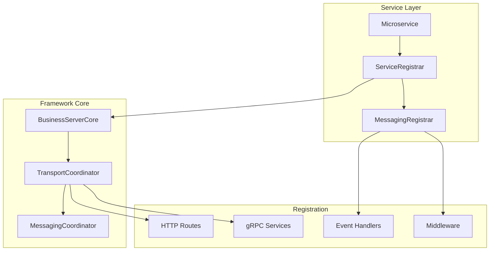
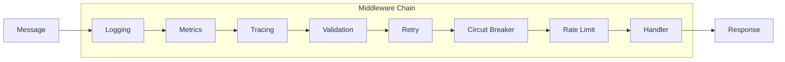
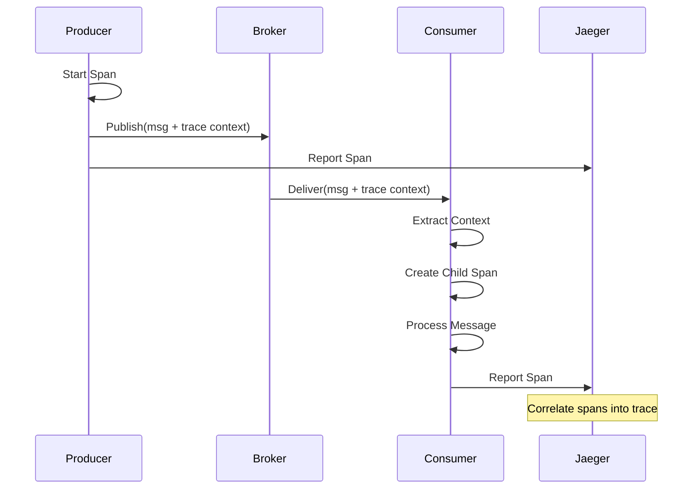
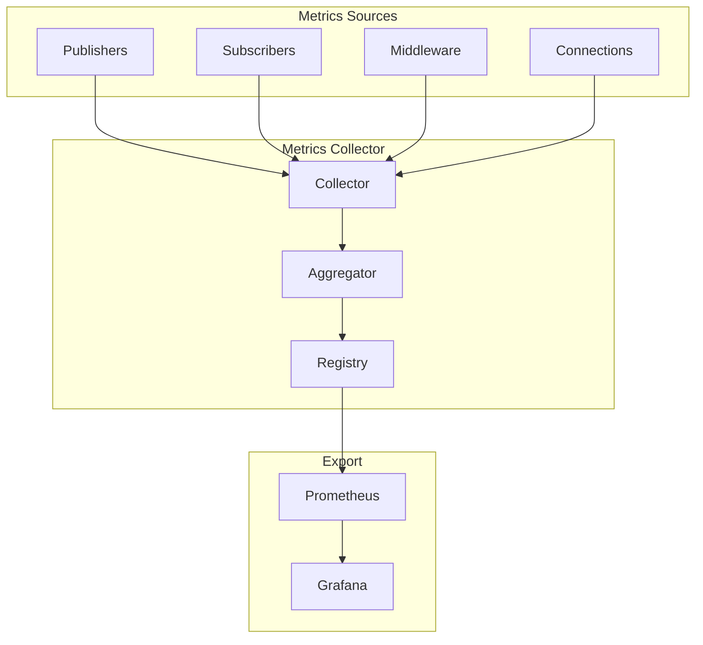

# Event-Driven Messaging Integration Patterns

## Table of Contents

1. [Service Registration Patterns](#service-registration-patterns)
2. [Event Handler Registration](#event-handler-registration)
3. [Middleware Chain Configuration](#middleware-chain-configuration)
4. [Distributed Tracing Integration](#distributed-tracing-integration)
5. [Metrics Collection](#metrics-collection)
6. [Error Handling Patterns](#error-handling-patterns)
7. [Transaction Patterns](#transaction-patterns)

## Service Registration Patterns

### Overview

The SWIT messaging system integrates with the framework's service registration pattern, extending the `BusinessServiceRegistrar` interface to support messaging operations alongside HTTP and gRPC.

### Architecture



### Extended Service Registration Interface

```go
package messaging

import (
    "github.com/swit/pkg/server"
)

// BusinessMessagingService extends the base service interface for messaging
type BusinessMessagingService interface {
    server.BusinessServiceRegistrar
    
    // RegisterMessaging registers messaging handlers and subscribers
    RegisterMessaging(coordinator *MessagingCoordinator) error
    
    // GetMessagingConfig returns service-specific messaging configuration
    GetMessagingConfig() *MessagingServiceConfig
}

// MessagingServiceConfig defines service-level messaging configuration
type MessagingServiceConfig struct {
    // Service identification
    ServiceName    string
    ServiceVersion string
    
    // Publishing configuration
    Publishers []PublisherRegistration
    
    // Subscription configuration
    Subscribers []SubscriberRegistration
    
    // Middleware configuration
    Middleware []MiddlewareConfig
    
    // Error handling
    ErrorHandler ErrorHandler
}

// PublisherRegistration defines a publisher to register
type PublisherRegistration struct {
    Name   string
    Topic  string
    Config PublisherConfig
}

// SubscriberRegistration defines a subscriber to register
type SubscriberRegistration struct {
    Name     string
    Topics   []string
    Handler  MessageHandler
    Config   SubscriberConfig
}
```

### Complete Service Registration Example

```go
package orderservice

import (
    "context"
    "encoding/json"
    "fmt"
    
    "github.com/swit/pkg/messaging"
    "github.com/swit/pkg/server"
    "github.com/swit/pkg/transport"
    "go.uber.org/zap"
)

// OrderService implements a complete event-driven microservice
type OrderService struct {
    logger         *zap.Logger
    repository     OrderRepository
    eventPublisher messaging.EventPublisher
    
    // Service dependencies
    inventoryClient InventoryClient
    paymentClient   PaymentClient
    shippingClient  ShippingClient
}

// Implement BusinessServiceRegistrar interface
func (s *OrderService) RegisterServices(registry server.BusinessServiceRegistry) error {
    // Register HTTP handlers
    if err := registry.RegisterBusinessHTTPHandler(s); err != nil {
        return fmt.Errorf("failed to register HTTP handlers: %w", err)
    }
    
    // Register gRPC services
    if err := registry.RegisterBusinessGRPCService(s); err != nil {
        return fmt.Errorf("failed to register gRPC services: %w", err)
    }
    
    // Register health checks
    if err := registry.RegisterBusinessHealthCheck(s); err != nil {
        return fmt.Errorf("failed to register health checks: %w", err)
    }
    
    // Register messaging if coordinator is available
    if coordinator := registry.GetMessagingCoordinator(); coordinator != nil {
        if err := s.RegisterMessaging(coordinator); err != nil {
            return fmt.Errorf("failed to register messaging: %w", err)
        }
    }
    
    return nil
}

// RegisterMessaging registers all messaging components
func (s *OrderService) RegisterMessaging(coordinator *messaging.MessagingCoordinator) error {
    // Register event publishers
    if err := s.registerPublishers(coordinator); err != nil {
        return err
    }
    
    // Register event subscribers
    if err := s.registerSubscribers(coordinator); err != nil {
        return err
    }
    
    // Register middleware
    if err := s.registerMiddleware(coordinator); err != nil {
        return err
    }
    
    return nil
}

func (s *OrderService) registerPublishers(coordinator *messaging.MessagingCoordinator) error {
    // Register order events publisher
    orderPublisher, err := coordinator.CreatePublisher(messaging.PublisherConfig{
        Topic: "order.events",
        Batching: messaging.BatchingConfig{
            Enabled:       true,
            MaxMessages:   100,
            FlushInterval: 100 * time.Millisecond,
        },
        Compression: messaging.CompressionSnappy,
        Async:       true,
    })
    if err != nil {
        return fmt.Errorf("failed to create order publisher: %w", err)
    }
    
    s.eventPublisher = orderPublisher
    
    // Register named publishers for different event types
    publishers := map[string]messaging.PublisherConfig{
        "order-created": {
            Topic: "order.created",
            Confirmation: messaging.ConfirmationConfig{
                Required: true,
                Timeout:  5 * time.Second,
            },
        },
        "order-updated": {
            Topic: "order.updated",
            Async: true,
        },
        "order-cancelled": {
            Topic:         "order.cancelled",
            Transactional: true,
        },
    }
    
    for name, config := range publishers {
        if err := coordinator.RegisterPublisher(name, config); err != nil {
            return fmt.Errorf("failed to register publisher %s: %w", name, err)
        }
    }
    
    return nil
}

func (s *OrderService) registerSubscribers(coordinator *messaging.MessagingCoordinator) error {
    // Register payment events subscriber
    paymentHandler := &PaymentEventHandler{
        service: s,
        logger:  s.logger.With(zap.String("handler", "payment")),
    }
    
    paymentSubscriber := messaging.SubscriberRegistration{
        Name:   "payment-events",
        Topics: []string{"payment.completed", "payment.failed"},
        Handler: paymentHandler,
        Config: messaging.SubscriberConfig{
            ConsumerGroup: "order-service",
            Concurrency:   10,
            PrefetchCount: 50,
            Processing: messaging.ProcessingConfig{
                MaxProcessingTime: 30 * time.Second,
                AckMode:          messaging.AckModeManual,
                Ordered:          false,
            },
            DeadLetter: messaging.DeadLetterConfig{
                Enabled:    true,
                Topic:      "payment.events.dlq",
                MaxRetries: 3,
            },
        },
    }
    
    if err := coordinator.RegisterSubscriber(paymentSubscriber); err != nil {
        return fmt.Errorf("failed to register payment subscriber: %w", err)
    }
    
    // Register inventory events subscriber
    inventoryHandler := &InventoryEventHandler{
        service: s,
        logger:  s.logger.With(zap.String("handler", "inventory")),
    }
    
    inventorySubscriber := messaging.SubscriberRegistration{
        Name:   "inventory-events",
        Topics: []string{"inventory.reserved", "inventory.released"},
        Handler: inventoryHandler,
        Config: messaging.SubscriberConfig{
            ConsumerGroup: "order-service",
            Concurrency:   5,
            Processing: messaging.ProcessingConfig{
                Ordered: true, // Process inventory events in order
            },
        },
    }
    
    if err := coordinator.RegisterSubscriber(inventorySubscriber); err != nil {
        return fmt.Errorf("failed to register inventory subscriber: %w", err)
    }
    
    return nil
}

func (s *OrderService) registerMiddleware(coordinator *messaging.MessagingCoordinator) error {
    // Register global middleware
    globalMiddleware := []messaging.Middleware{
        messaging.LoggingMiddleware(s.logger),
        messaging.MetricsMiddleware(coordinator.GetMetricsCollector()),
        messaging.TracingMiddleware(coordinator.GetTracer()),
        messaging.RecoveryMiddleware(s.logger),
    }
    
    for _, mw := range globalMiddleware {
        coordinator.RegisterGlobalMiddleware(mw)
    }
    
    // Register subscriber-specific middleware
    coordinator.RegisterSubscriberMiddleware("payment-events",
        messaging.RetryMiddleware(3, time.Second),
        messaging.CircuitBreakerMiddleware(10, 5*time.Second),
    )
    
    coordinator.RegisterSubscriberMiddleware("inventory-events",
        messaging.RateLimitMiddleware(100, 10), // 100 req/s with burst of 10
        messaging.TimeoutMiddleware(10*time.Second),
    )
    
    return nil
}

// GetServiceName implements BusinessServiceRegistrar
func (s *OrderService) GetServiceName() string {
    return "order-service"
}

// GetServiceVersion implements BusinessServiceRegistrar
func (s *OrderService) GetServiceVersion() string {
    return "1.0.0"
}
```

### Dynamic Registration Pattern

```go
// DynamicRegistration allows runtime registration of handlers
type DynamicRegistration struct {
    coordinator *messaging.MessagingCoordinator
    registry    map[string]MessageHandler
    mu          sync.RWMutex
}

func (dr *DynamicRegistration) RegisterHandler(eventType string, handler MessageHandler) error {
    dr.mu.Lock()
    defer dr.mu.Unlock()
    
    // Check if already registered
    if _, exists := dr.registry[eventType]; exists {
        return fmt.Errorf("handler already registered for event type: %s", eventType)
    }
    
    // Create subscriber for this event type
    subscriber := messaging.SubscriberRegistration{
        Name:    fmt.Sprintf("%s-handler", eventType),
        Topics:  []string{eventType},
        Handler: handler,
        Config: messaging.SubscriberConfig{
            ConsumerGroup: fmt.Sprintf("%s-group", eventType),
        },
    }
    
    if err := dr.coordinator.RegisterSubscriber(subscriber); err != nil {
        return err
    }
    
    dr.registry[eventType] = handler
    
    return nil
}

func (dr *DynamicRegistration) UnregisterHandler(eventType string) error {
    dr.mu.Lock()
    defer dr.mu.Unlock()
    
    if _, exists := dr.registry[eventType]; !exists {
        return fmt.Errorf("no handler registered for event type: %s", eventType)
    }
    
    // Unregister subscriber
    if err := dr.coordinator.UnregisterSubscriber(fmt.Sprintf("%s-handler", eventType)); err != nil {
        return err
    }
    
    delete(dr.registry, eventType)
    
    return nil
}

// Example: Using dynamic registration
func ExampleDynamicRegistration() {
    dynamicReg := &DynamicRegistration{
        coordinator: coordinator,
        registry:    make(map[string]MessageHandler),
    }
    
    // Register handler at runtime
    orderCreatedHandler := messaging.MessageHandlerFunc(func(ctx context.Context, msg *messaging.Message) error {
        // Handle order created event
        return processOrderCreated(msg)
    })
    
    dynamicReg.RegisterHandler("order.created", orderCreatedHandler)
    
    // Later, unregister if needed
    dynamicReg.UnregisterHandler("order.created")
}
```

## Event Handler Registration

### Handler Interface and Implementation

```go
// EventHandler defines the interface for handling specific event types
type EventHandler interface {
    // EventType returns the event type this handler processes
    EventType() string
    
    // Handle processes the event
    Handle(ctx context.Context, event Event) error
    
    // OnError handles processing errors
    OnError(ctx context.Context, event Event, err error) error
}

// EventHandlerRegistry manages event handlers
type EventHandlerRegistry struct {
    handlers map[string][]EventHandler
    mu       sync.RWMutex
    logger   *zap.Logger
}

func NewEventHandlerRegistry(logger *zap.Logger) *EventHandlerRegistry {
    return &EventHandlerRegistry{
        handlers: make(map[string][]EventHandler),
        logger:   logger,
    }
}

func (r *EventHandlerRegistry) Register(handler EventHandler) error {
    r.mu.Lock()
    defer r.mu.Unlock()
    
    eventType := handler.EventType()
    r.handlers[eventType] = append(r.handlers[eventType], handler)
    
    r.logger.Info("Registered event handler",
        zap.String("event_type", eventType),
        zap.Int("total_handlers", len(r.handlers[eventType])),
    )
    
    return nil
}

func (r *EventHandlerRegistry) GetHandlers(eventType string) []EventHandler {
    r.mu.RLock()
    defer r.mu.RUnlock()
    
    return r.handlers[eventType]
}

// Example: Concrete event handler implementation
type OrderCreatedHandler struct {
    orderRepo      OrderRepository
    inventoryClient InventoryClient
    notificationSvc NotificationService
    logger         *zap.Logger
}

func (h *OrderCreatedHandler) EventType() string {
    return "order.created"
}

func (h *OrderCreatedHandler) Handle(ctx context.Context, event Event) error {
    // Parse event
    var orderCreated OrderCreatedEvent
    if err := json.Unmarshal(event.Data, &orderCreated); err != nil {
        return fmt.Errorf("failed to parse order created event: %w", err)
    }
    
    // Reserve inventory
    reservation, err := h.inventoryClient.Reserve(ctx, orderCreated.Items)
    if err != nil {
        return fmt.Errorf("failed to reserve inventory: %w", err)
    }
    
    // Update order with reservation
    order, err := h.orderRepo.Get(ctx, orderCreated.OrderID)
    if err != nil {
        return fmt.Errorf("failed to get order: %w", err)
    }
    
    order.ReservationID = reservation.ID
    order.Status = OrderStatusInventoryReserved
    
    if err := h.orderRepo.Update(ctx, order); err != nil {
        // Rollback inventory reservation
        h.inventoryClient.CancelReservation(ctx, reservation.ID)
        return fmt.Errorf("failed to update order: %w", err)
    }
    
    // Send notification
    notification := Notification{
        Type:      "order.confirmed",
        UserID:    orderCreated.UserID,
        OrderID:   orderCreated.OrderID,
        Message:   "Your order has been confirmed",
        Timestamp: time.Now(),
    }
    
    if err := h.notificationSvc.Send(ctx, notification); err != nil {
        // Non-critical error, just log
        h.logger.Warn("Failed to send notification",
            zap.Error(err),
            zap.String("order_id", orderCreated.OrderID),
        )
    }
    
    h.logger.Info("Order created event processed",
        zap.String("order_id", orderCreated.OrderID),
        zap.String("reservation_id", reservation.ID),
    )
    
    return nil
}

func (h *OrderCreatedHandler) OnError(ctx context.Context, event Event, err error) error {
    h.logger.Error("Failed to process order created event",
        zap.Error(err),
        zap.String("event_id", event.ID),
    )
    
    // Determine if error is retryable
    if isTransientError(err) {
        return err // Return error to trigger retry
    }
    
    // Non-retryable error, send to dead letter queue
    return nil
}
```

### Composite Handler Pattern

```go
// CompositeHandler chains multiple handlers for an event
type CompositeHandler struct {
    handlers []EventHandler
    strategy ExecutionStrategy
    logger   *zap.Logger
}

type ExecutionStrategy int

const (
    // Execute all handlers sequentially
    SequentialStrategy ExecutionStrategy = iota
    
    // Execute all handlers in parallel
    ParallelStrategy
    
    // Stop on first error
    FailFastStrategy
    
    // Continue even if some handlers fail
    BestEffortStrategy
)

func (ch *CompositeHandler) Handle(ctx context.Context, event Event) error {
    switch ch.strategy {
    case SequentialStrategy:
        return ch.handleSequential(ctx, event)
    case ParallelStrategy:
        return ch.handleParallel(ctx, event)
    case FailFastStrategy:
        return ch.handleFailFast(ctx, event)
    case BestEffortStrategy:
        return ch.handleBestEffort(ctx, event)
    default:
        return ch.handleSequential(ctx, event)
    }
}

func (ch *CompositeHandler) handleSequential(ctx context.Context, event Event) error {
    for _, handler := range ch.handlers {
        if err := handler.Handle(ctx, event); err != nil {
            return fmt.Errorf("handler %s failed: %w", handler.EventType(), err)
        }
    }
    return nil
}

func (ch *CompositeHandler) handleParallel(ctx context.Context, event Event) error {
    var wg sync.WaitGroup
    errChan := make(chan error, len(ch.handlers))
    
    for _, handler := range ch.handlers {
        wg.Add(1)
        go func(h EventHandler) {
            defer wg.Done()
            if err := h.Handle(ctx, event); err != nil {
                errChan <- fmt.Errorf("handler %s failed: %w", h.EventType(), err)
            }
        }(handler)
    }
    
    wg.Wait()
    close(errChan)
    
    // Collect errors
    var errors []error
    for err := range errChan {
        errors = append(errors, err)
    }
    
    if len(errors) > 0 {
        return fmt.Errorf("parallel execution failed: %v", errors)
    }
    
    return nil
}

// Example: Using composite handler
func ExampleCompositeHandler() {
    composite := &CompositeHandler{
        handlers: []EventHandler{
            &OrderValidationHandler{},
            &InventoryCheckHandler{},
            &PriceCalculationHandler{},
            &NotificationHandler{},
        },
        strategy: ParallelStrategy,
        logger:   logger,
    }
    
    registry.Register(composite)
}
```

## Middleware Chain Configuration

### Middleware Architecture



### Middleware Implementation

```go
// MiddlewareBuilder provides fluent API for building middleware chains
type MiddlewareBuilder struct {
    middlewares []messaging.Middleware
}

func NewMiddlewareBuilder() *MiddlewareBuilder {
    return &MiddlewareBuilder{
        middlewares: make([]messaging.Middleware, 0),
    }
}

func (mb *MiddlewareBuilder) WithLogging(logger *zap.Logger) *MiddlewareBuilder {
    mb.middlewares = append(mb.middlewares, &LoggingMiddleware{
        logger: logger,
    })
    return mb
}

func (mb *MiddlewareBuilder) WithMetrics(collector MetricsCollector) *MiddlewareBuilder {
    mb.middlewares = append(mb.middlewares, &MetricsMiddleware{
        collector: collector,
    })
    return mb
}

func (mb *MiddlewareBuilder) WithTracing(tracer opentracing.Tracer) *MiddlewareBuilder {
    mb.middlewares = append(mb.middlewares, &TracingMiddleware{
        tracer: tracer,
    })
    return mb
}

func (mb *MiddlewareBuilder) WithRetry(maxAttempts int, delay time.Duration) *MiddlewareBuilder {
    mb.middlewares = append(mb.middlewares, &RetryMiddleware{
        maxAttempts: maxAttempts,
        delay:       delay,
        backoff:     ExponentialBackoff,
    })
    return mb
}

func (mb *MiddlewareBuilder) WithCircuitBreaker(threshold int, timeout time.Duration) *MiddlewareBuilder {
    mb.middlewares = append(mb.middlewares, &CircuitBreakerMiddleware{
        failureThreshold: threshold,
        recoveryTimeout:  timeout,
        halfOpenRequests: 3,
    })
    return mb
}

func (mb *MiddlewareBuilder) WithRateLimit(rate int, burst int) *MiddlewareBuilder {
    mb.middlewares = append(mb.middlewares, &RateLimitMiddleware{
        limiter: rate.NewLimiter(rate.Limit(rate), burst),
    })
    return mb
}

func (mb *MiddlewareBuilder) WithTimeout(timeout time.Duration) *MiddlewareBuilder {
    mb.middlewares = append(mb.middlewares, &TimeoutMiddleware{
        timeout: timeout,
    })
    return mb
}

func (mb *MiddlewareBuilder) WithValidation(validator MessageValidator) *MiddlewareBuilder {
    mb.middlewares = append(mb.middlewares, &ValidationMiddleware{
        validator: validator,
    })
    return mb
}

func (mb *MiddlewareBuilder) Build() []messaging.Middleware {
    return mb.middlewares
}

// Example: Building a middleware chain
func ExampleMiddlewareChain() {
    // Build middleware chain
    middlewares := NewMiddlewareBuilder().
        WithLogging(logger).
        WithMetrics(metricsCollector).
        WithTracing(tracer).
        WithValidation(schemaValidator).
        WithRetry(3, time.Second).
        WithCircuitBreaker(10, 5*time.Second).
        WithRateLimit(100, 10).
        WithTimeout(30*time.Second).
        Build()
    
    // Register subscriber with middleware chain
    subscriber := messaging.SubscriberRegistration{
        Name:       "order-processor",
        Topics:     []string{"order.events"},
        Handler:    orderHandler,
        Middleware: middlewares,
    }
    
    coordinator.RegisterSubscriber(subscriber)
}
```

### Custom Middleware Implementation

```go
// AuthenticationMiddleware validates message authentication
type AuthenticationMiddleware struct {
    tokenValidator TokenValidator
    logger         *zap.Logger
}

func (am *AuthenticationMiddleware) Name() string {
    return "authentication"
}

func (am *AuthenticationMiddleware) Wrap(next messaging.MessageHandler) messaging.MessageHandler {
    return messaging.MessageHandlerFunc(func(ctx context.Context, msg *messaging.Message) error {
        // Extract authentication token from headers
        token, ok := msg.Headers["Authorization"]
        if !ok {
            am.logger.Warn("Missing authorization header",
                zap.String("message_id", msg.ID),
            )
            return ErrUnauthorized
        }
        
        // Validate token
        claims, err := am.tokenValidator.Validate(token)
        if err != nil {
            am.logger.Warn("Invalid token",
                zap.Error(err),
                zap.String("message_id", msg.ID),
            )
            return ErrUnauthorized
        }
        
        // Add claims to context
        ctx = context.WithValue(ctx, "claims", claims)
        
        // Call next handler
        return next.Handle(ctx, msg)
    })
}

// CachingMiddleware caches message processing results
type CachingMiddleware struct {
    cache  Cache
    ttl    time.Duration
    logger *zap.Logger
}

func (cm *CachingMiddleware) Wrap(next messaging.MessageHandler) messaging.MessageHandler {
    return messaging.MessageHandlerFunc(func(ctx context.Context, msg *messaging.Message) error {
        // Generate cache key
        cacheKey := cm.generateCacheKey(msg)
        
        // Check cache
        if cached, err := cm.cache.Get(ctx, cacheKey); err == nil {
            cm.logger.Debug("Cache hit",
                zap.String("message_id", msg.ID),
                zap.String("cache_key", cacheKey),
            )
            return nil // Already processed
        }
        
        // Process message
        err := next.Handle(ctx, msg)
        if err != nil {
            return err
        }
        
        // Cache result
        if err := cm.cache.Set(ctx, cacheKey, true, cm.ttl); err != nil {
            cm.logger.Warn("Failed to cache result",
                zap.Error(err),
                zap.String("cache_key", cacheKey),
            )
        }
        
        return nil
    })
}

func (cm *CachingMiddleware) generateCacheKey(msg *messaging.Message) string {
    h := sha256.New()
    h.Write([]byte(msg.ID))
    h.Write(msg.Payload)
    return fmt.Sprintf("msg:%x", h.Sum(nil))
}
```

## Distributed Tracing Integration

### Tracing Architecture



### Tracing Implementation

```go
// TracingManager manages distributed tracing for messaging
type TracingManager struct {
    tracer     opentracing.Tracer
    propagator TracePropagator
    logger     *zap.Logger
}

// TracePropagator handles trace context propagation
type TracePropagator interface {
    Inject(span opentracing.Span, headers map[string]string) error
    Extract(headers map[string]string) (opentracing.SpanContext, error)
}

// OpenTracingPropagator implements W3C Trace Context propagation
type OpenTracingPropagator struct {
    tracer opentracing.Tracer
}

func (otp *OpenTracingPropagator) Inject(span opentracing.Span, headers map[string]string) error {
    carrier := opentracing.TextMapCarrier(headers)
    return otp.tracer.Inject(
        span.Context(),
        opentracing.TextMap,
        carrier,
    )
}

func (otp *OpenTracingPropagator) Extract(headers map[string]string) (opentracing.SpanContext, error) {
    carrier := opentracing.TextMapCarrier(headers)
    return otp.tracer.Extract(
        opentracing.TextMap,
        carrier,
    )
}

// TracingPublisher wraps publisher with tracing
type TracingPublisher struct {
    publisher messaging.EventPublisher
    manager   *TracingManager
}

func (tp *TracingPublisher) Publish(ctx context.Context, message *messaging.Message) error {
    // Start span
    span, ctx := opentracing.StartSpanFromContext(ctx, 
        fmt.Sprintf("publish:%s", message.Topic),
        opentracing.Tag{Key: "message.id", Value: message.ID},
        opentracing.Tag{Key: "message.topic", Value: message.Topic},
        opentracing.Tag{Key: "message.size", Value: len(message.Payload)},
    )
    defer span.Finish()
    
    // Inject trace context into message headers
    if message.Headers == nil {
        message.Headers = make(map[string]string)
    }
    
    if err := tp.manager.propagator.Inject(span, message.Headers); err != nil {
        tp.manager.logger.Warn("Failed to inject trace context",
            zap.Error(err),
        )
    }
    
    // Publish with tracing
    start := time.Now()
    err := tp.publisher.Publish(ctx, message)
    duration := time.Since(start)
    
    // Record metrics in span
    span.SetTag("publish.duration_ms", duration.Milliseconds())
    if err != nil {
        span.SetTag("error", true)
        span.LogKV("error", err.Error())
    }
    
    return err
}

// TracingMiddleware adds tracing to message processing
type TracingMiddleware struct {
    manager *TracingManager
}

func (tm *TracingMiddleware) Wrap(next messaging.MessageHandler) messaging.MessageHandler {
    return messaging.MessageHandlerFunc(func(ctx context.Context, msg *messaging.Message) error {
        // Extract parent span context
        parentSpanCtx, err := tm.manager.propagator.Extract(msg.Headers)
        if err != nil && err != opentracing.ErrSpanContextNotFound {
            tm.manager.logger.Debug("Failed to extract trace context",
                zap.Error(err),
            )
        }
        
        // Start span
        var span opentracing.Span
        if parentSpanCtx != nil {
            span = tm.manager.tracer.StartSpan(
                fmt.Sprintf("consume:%s", msg.Topic),
                opentracing.ChildOf(parentSpanCtx),
            )
        } else {
            span = tm.manager.tracer.StartSpan(
                fmt.Sprintf("consume:%s", msg.Topic),
            )
        }
        defer span.Finish()
        
        // Add span to context
        ctx = opentracing.ContextWithSpan(ctx, span)
        
        // Set span tags
        span.SetTag("message.id", msg.ID)
        span.SetTag("message.topic", msg.Topic)
        span.SetTag("message.timestamp", msg.Timestamp)
        
        // Process message
        start := time.Now()
        err := next.Handle(ctx, msg)
        duration := time.Since(start)
        
        // Record metrics
        span.SetTag("processing.duration_ms", duration.Milliseconds())
        if err != nil {
            span.SetTag("error", true)
            span.LogKV(
                "error", err.Error(),
                "message_id", msg.ID,
            )
        }
        
        return err
    })
}

// Example: Setting up distributed tracing
func ExampleDistributedTracing() {
    // Initialize Jaeger tracer
    cfg := &jaegerconfig.Configuration{
        ServiceName: "order-service",
        Sampler: &jaegerconfig.SamplerConfig{
            Type:  "probabilistic",
            Param: 0.1, // 10% sampling
        },
        Reporter: &jaegerconfig.ReporterConfig{
            LogSpans:           true,
            LocalAgentHostPort: "jaeger:6831",
        },
    }
    
    tracer, closer, err := cfg.NewTracer()
    if err != nil {
        log.Fatal(err)
    }
    defer closer.Close()
    
    opentracing.SetGlobalTracer(tracer)
    
    // Create tracing manager
    tracingManager := &TracingManager{
        tracer:     tracer,
        propagator: &OpenTracingPropagator{tracer: tracer},
        logger:     logger,
    }
    
    // Wrap publisher with tracing
    tracedPublisher := &TracingPublisher{
        publisher: originalPublisher,
        manager:   tracingManager,
    }
    
    // Add tracing middleware to subscribers
    tracingMiddleware := &TracingMiddleware{
        manager: tracingManager,
    }
    
    coordinator.RegisterGlobalMiddleware(tracingMiddleware)
}
```

## Metrics Collection

### Metrics Architecture



### Metrics Implementation

```go
// MetricsCollector collects messaging metrics
type MetricsCollector struct {
    // Publishing metrics
    publishCounter        *prometheus.CounterVec
    publishDuration       *prometheus.HistogramVec
    publishErrors         *prometheus.CounterVec
    publishBatchSize      *prometheus.HistogramVec
    
    // Subscription metrics
    consumeCounter        *prometheus.CounterVec
    consumeDuration       *prometheus.HistogramVec
    consumeErrors         *prometheus.CounterVec
    consumerLag          *prometheus.GaugeVec
    
    // Connection metrics
    connectionStatus      *prometheus.GaugeVec
    reconnectCounter     *prometheus.CounterVec
    
    // Message metrics
    messageSize          *prometheus.HistogramVec
    messageAge           *prometheus.HistogramVec
    
    // Dead letter metrics
    deadLetterCounter    *prometheus.CounterVec
    
    // Resource metrics
    activePublishers     *prometheus.GaugeVec
    activeSubscribers    *prometheus.GaugeVec
    messageQueueDepth    *prometheus.GaugeVec
}

func NewMetricsCollector(namespace, subsystem string) *MetricsCollector {
    return &MetricsCollector{
        publishCounter: prometheus.NewCounterVec(
            prometheus.CounterOpts{
                Namespace: namespace,
                Subsystem: subsystem,
                Name:      "messages_published_total",
                Help:      "Total number of messages published",
            },
            []string{"topic", "status"},
        ),
        publishDuration: prometheus.NewHistogramVec(
            prometheus.HistogramOpts{
                Namespace: namespace,
                Subsystem: subsystem,
                Name:      "publish_duration_seconds",
                Help:      "Time taken to publish messages",
                Buckets:   prometheus.ExponentialBuckets(0.001, 2, 10),
            },
            []string{"topic"},
        ),
        consumeCounter: prometheus.NewCounterVec(
            prometheus.CounterOpts{
                Namespace: namespace,
                Subsystem: subsystem,
                Name:      "messages_consumed_total",
                Help:      "Total number of messages consumed",
            },
            []string{"topic", "consumer_group", "status"},
        ),
        consumeDuration: prometheus.NewHistogramVec(
            prometheus.HistogramOpts{
                Namespace: namespace,
                Subsystem: subsystem,
                Name:      "consume_duration_seconds",
                Help:      "Time taken to process messages",
                Buckets:   prometheus.ExponentialBuckets(0.01, 2, 10),
            },
            []string{"topic", "consumer_group"},
        ),
        consumerLag: prometheus.NewGaugeVec(
            prometheus.GaugeOpts{
                Namespace: namespace,
                Subsystem: subsystem,
                Name:      "consumer_lag",
                Help:      "Number of messages behind the latest offset",
            },
            []string{"topic", "consumer_group", "partition"},
        ),
        deadLetterCounter: prometheus.NewCounterVec(
            prometheus.CounterOpts{
                Namespace: namespace,
                Subsystem: subsystem,
                Name:      "dead_letter_messages_total",
                Help:      "Total number of messages sent to dead letter queue",
            },
            []string{"topic", "reason"},
        ),
    }
}

// RecordPublish records publish metrics
func (mc *MetricsCollector) RecordPublish(topic string, duration time.Duration, err error) {
    status := "success"
    if err != nil {
        status = "error"
        mc.publishErrors.WithLabelValues(topic, err.Error()).Inc()
    }
    
    mc.publishCounter.WithLabelValues(topic, status).Inc()
    mc.publishDuration.WithLabelValues(topic).Observe(duration.Seconds())
}

// RecordConsume records consumption metrics
func (mc *MetricsCollector) RecordConsume(topic, group string, duration time.Duration, err error) {
    status := "success"
    if err != nil {
        status = "error"
        mc.consumeErrors.WithLabelValues(topic, group, err.Error()).Inc()
    }
    
    mc.consumeCounter.WithLabelValues(topic, group, status).Inc()
    mc.consumeDuration.WithLabelValues(topic, group).Observe(duration.Seconds())
}

// MetricsMiddleware collects metrics for message processing
type MetricsMiddleware struct {
    collector *MetricsCollector
}

func (mm *MetricsMiddleware) Wrap(next messaging.MessageHandler) messaging.MessageHandler {
    return messaging.MessageHandlerFunc(func(ctx context.Context, msg *messaging.Message) error {
        start := time.Now()
        
        // Record message size
        mm.collector.messageSize.WithLabelValues(msg.Topic).Observe(float64(len(msg.Payload)))
        
        // Record message age
        age := time.Since(msg.Timestamp)
        mm.collector.messageAge.WithLabelValues(msg.Topic).Observe(age.Seconds())
        
        // Process message
        err := next.Handle(ctx, msg)
        
        // Record processing metrics
        duration := time.Since(start)
        group := extractConsumerGroup(ctx)
        mm.collector.RecordConsume(msg.Topic, group, duration, err)
        
        return err
    })
}

// Example: Exposing metrics endpoint
func ExampleMetricsEndpoint() {
    // Create metrics collector
    collector := NewMetricsCollector("swit", "messaging")
    
    // Register with Prometheus
    prometheus.MustRegister(collector.publishCounter)
    prometheus.MustRegister(collector.publishDuration)
    prometheus.MustRegister(collector.consumeCounter)
    prometheus.MustRegister(collector.consumeDuration)
    // ... register other metrics
    
    // Expose metrics endpoint
    http.Handle("/metrics", promhttp.Handler())
    
    // Start metrics server
    go func() {
        log.Info("Starting metrics server on :2112")
        if err := http.ListenAndServe(":2112", nil); err != nil {
            log.Error("Metrics server failed:", err)
        }
    }()
}
```

### Custom Metrics

```go
// BusinessMetrics tracks business-level metrics
type BusinessMetrics struct {
    ordersProcessed   *prometheus.CounterVec
    orderValue        *prometheus.HistogramVec
    processingStage   *prometheus.GaugeVec
    businessErrors    *prometheus.CounterVec
}

func NewBusinessMetrics() *BusinessMetrics {
    return &BusinessMetrics{
        ordersProcessed: prometheus.NewCounterVec(
            prometheus.CounterOpts{
                Name: "orders_processed_total",
                Help: "Total number of orders processed",
            },
            []string{"type", "status", "region"},
        ),
        orderValue: prometheus.NewHistogramVec(
            prometheus.HistogramOpts{
                Name:    "order_value_dollars",
                Help:    "Order value in dollars",
                Buckets: prometheus.ExponentialBuckets(1, 2, 15), // $1 to $16k
            },
            []string{"type", "region"},
        ),
        processingStage: prometheus.NewGaugeVec(
            prometheus.GaugeOpts{
                Name: "order_processing_stage",
                Help: "Current stage of order processing",
            },
            []string{"order_id", "stage"},
        ),
    }
}

// BusinessMetricsHandler wraps handler with business metrics
type BusinessMetricsHandler struct {
    next    messaging.MessageHandler
    metrics *BusinessMetrics
}

func (bmh *BusinessMetricsHandler) Handle(ctx context.Context, msg *messaging.Message) error {
    // Parse order event
    var order OrderEvent
    json.Unmarshal(msg.Payload, &order)
    
    // Record business metrics
    bmh.metrics.ordersProcessed.WithLabelValues(
        order.Type,
        order.Status,
        order.Region,
    ).Inc()
    
    bmh.metrics.orderValue.WithLabelValues(
        order.Type,
        order.Region,
    ).Observe(order.Value)
    
    bmh.metrics.processingStage.WithLabelValues(
        order.ID,
        "processing",
    ).Set(1)
    
    // Process message
    err := bmh.next.Handle(ctx, msg)
    
    // Update processing stage
    if err != nil {
        bmh.metrics.processingStage.WithLabelValues(
            order.ID,
            "failed",
        ).Set(1)
        
        bmh.metrics.businessErrors.WithLabelValues(
            order.Type,
            classifyError(err),
        ).Inc()
    } else {
        bmh.metrics.processingStage.WithLabelValues(
            order.ID,
            "completed",
        ).Set(1)
    }
    
    return err
}
```

## Error Handling Patterns

### Error Classification and Handling

```go
// ErrorClassifier classifies errors for appropriate handling
type ErrorClassifier struct {
    rules []ClassificationRule
}

type ClassificationRule struct {
    Predicate   func(error) bool
    Category    ErrorCategory
    Retryable   bool
    MaxRetries  int
    BackoffType BackoffType
}

type ErrorCategory string

const (
    ErrorCategoryTransient     ErrorCategory = "transient"
    ErrorCategoryPermanent     ErrorCategory = "permanent"
    ErrorCategoryThrottle      ErrorCategory = "throttle"
    ErrorCategoryInvalidInput  ErrorCategory = "invalid_input"
    ErrorCategorySystemFailure ErrorCategory = "system_failure"
)

func NewErrorClassifier() *ErrorClassifier {
    return &ErrorClassifier{
        rules: []ClassificationRule{
            {
                Predicate:   isNetworkError,
                Category:    ErrorCategoryTransient,
                Retryable:   true,
                MaxRetries:  5,
                BackoffType: ExponentialBackoff,
            },
            {
                Predicate:   isRateLimitError,
                Category:    ErrorCategoryThrottle,
                Retryable:   true,
                MaxRetries:  3,
                BackoffType: LinearBackoff,
            },
            {
                Predicate:   isValidationError,
                Category:    ErrorCategoryInvalidInput,
                Retryable:   false,
                MaxRetries:  0,
                BackoffType: NoBackoff,
            },
            {
                Predicate:   isDatabaseError,
                Category:    ErrorCategorySystemFailure,
                Retryable:   true,
                MaxRetries:  3,
                BackoffType: ExponentialBackoff,
            },
        },
    }
}

func (ec *ErrorClassifier) Classify(err error) ClassificationResult {
    for _, rule := range ec.rules {
        if rule.Predicate(err) {
            return ClassificationResult{
                Category:    rule.Category,
                Retryable:   rule.Retryable,
                MaxRetries:  rule.MaxRetries,
                BackoffType: rule.BackoffType,
            }
        }
    }
    
    // Default classification
    return ClassificationResult{
        Category:    ErrorCategoryPermanent,
        Retryable:   false,
        MaxRetries:  0,
        BackoffType: NoBackoff,
    }
}

// ErrorHandler implements comprehensive error handling
type ErrorHandler struct {
    classifier    *ErrorClassifier
    retryManager  *RetryManager
    dlqPublisher  messaging.EventPublisher
    alertManager  *AlertManager
    logger        *zap.Logger
}

func (eh *ErrorHandler) Handle(ctx context.Context, msg *messaging.Message, err error) error {
    // Classify error
    classification := eh.classifier.Classify(err)
    
    eh.logger.Error("Message processing failed",
        zap.Error(err),
        zap.String("message_id", msg.ID),
        zap.String("category", string(classification.Category)),
        zap.Bool("retryable", classification.Retryable),
    )
    
    // Handle based on classification
    switch classification.Category {
    case ErrorCategoryTransient:
        return eh.handleTransientError(ctx, msg, err, classification)
    
    case ErrorCategoryThrottle:
        return eh.handleThrottleError(ctx, msg, err, classification)
    
    case ErrorCategoryInvalidInput:
        return eh.handleInvalidInput(ctx, msg, err)
    
    case ErrorCategorySystemFailure:
        return eh.handleSystemFailure(ctx, msg, err, classification)
    
    default:
        return eh.handlePermanentError(ctx, msg, err)
    }
}

func (eh *ErrorHandler) handleTransientError(
    ctx context.Context,
    msg *messaging.Message,
    err error,
    classification ClassificationResult,
) error {
    // Check retry count
    retryCount := eh.getRetryCount(msg)
    if retryCount >= classification.MaxRetries {
        eh.logger.Warn("Max retries exceeded for transient error",
            zap.String("message_id", msg.ID),
            zap.Int("retries", retryCount),
        )
        return eh.sendToDeadLetter(ctx, msg, err, "max_retries_exceeded")
    }
    
    // Calculate backoff
    backoff := eh.retryManager.CalculateBackoff(
        retryCount,
        classification.BackoffType,
    )
    
    // Schedule retry
    return eh.retryManager.ScheduleRetry(ctx, msg, backoff)
}

func (eh *ErrorHandler) sendToDeadLetter(
    ctx context.Context,
    msg *messaging.Message,
    err error,
    reason string,
) error {
    // Enrich message with error details
    dlqMessage := &messaging.Message{
        ID:      msg.ID,
        Topic:   fmt.Sprintf("%s.dlq", msg.Topic),
        Payload: msg.Payload,
        Headers: msg.Headers,
    }
    
    // Add error metadata
    if dlqMessage.Headers == nil {
        dlqMessage.Headers = make(map[string]string)
    }
    
    dlqMessage.Headers["x-dead-letter-reason"] = reason
    dlqMessage.Headers["x-dead-letter-error"] = err.Error()
    dlqMessage.Headers["x-dead-letter-time"] = time.Now().Format(time.RFC3339)
    dlqMessage.Headers["x-original-topic"] = msg.Topic
    
    // Publish to DLQ
    if err := eh.dlqPublisher.Publish(ctx, dlqMessage); err != nil {
        eh.logger.Error("Failed to send message to DLQ",
            zap.Error(err),
            zap.String("message_id", msg.ID),
        )
        
        // Alert on DLQ failure
        eh.alertManager.SendAlert(Alert{
            Level:   AlertCritical,
            Title:   "DLQ Publish Failed",
            Message: fmt.Sprintf("Failed to send message %s to DLQ: %v", msg.ID, err),
        })
        
        return err
    }
    
    return nil
}
```

### Circuit Breaker Pattern

```go
// CircuitBreaker implements the circuit breaker pattern
type CircuitBreaker struct {
    name             string
    maxFailures      int
    resetTimeout     time.Duration
    halfOpenRequests int
    
    state            CircuitState
    failures         int
    lastFailureTime  time.Time
    successCount     int
    
    mu               sync.RWMutex
    logger           *zap.Logger
}

type CircuitState int

const (
    StateClosed CircuitState = iota
    StateOpen
    StateHalfOpen
)

func (cb *CircuitBreaker) Call(fn func() error) error {
    cb.mu.Lock()
    defer cb.mu.Unlock()
    
    // Check state
    switch cb.state {
    case StateOpen:
        if time.Since(cb.lastFailureTime) > cb.resetTimeout {
            cb.logger.Info("Circuit breaker entering half-open state",
                zap.String("name", cb.name),
            )
            cb.state = StateHalfOpen
            cb.successCount = 0
        } else {
            return ErrCircuitOpen
        }
    
    case StateHalfOpen:
        if cb.successCount >= cb.halfOpenRequests {
            cb.logger.Info("Circuit breaker closing",
                zap.String("name", cb.name),
            )
            cb.state = StateClosed
            cb.failures = 0
        }
    }
    
    // Execute function
    err := fn()
    
    // Update state based on result
    if err != nil {
        cb.failures++
        cb.lastFailureTime = time.Now()
        
        if cb.failures >= cb.maxFailures {
            cb.logger.Warn("Circuit breaker opening",
                zap.String("name", cb.name),
                zap.Int("failures", cb.failures),
            )
            cb.state = StateOpen
        }
        
        return err
    }
    
    // Success
    if cb.state == StateHalfOpen {
        cb.successCount++
    }
    
    if cb.state == StateClosed {
        cb.failures = 0
    }
    
    return nil
}

// CircuitBreakerMiddleware wraps handler with circuit breaker
type CircuitBreakerMiddleware struct {
    breakers map[string]*CircuitBreaker
    mu       sync.RWMutex
}

func (cbm *CircuitBreakerMiddleware) Wrap(next messaging.MessageHandler) messaging.MessageHandler {
    return messaging.MessageHandlerFunc(func(ctx context.Context, msg *messaging.Message) error {
        // Get or create circuit breaker for topic
        breaker := cbm.getBreaker(msg.Topic)
        
        // Execute with circuit breaker
        return breaker.Call(func() error {
            return next.Handle(ctx, msg)
        })
    })
}

func (cbm *CircuitBreakerMiddleware) getBreaker(topic string) *CircuitBreaker {
    cbm.mu.RLock()
    breaker, exists := cbm.breakers[topic]
    cbm.mu.RUnlock()
    
    if exists {
        return breaker
    }
    
    cbm.mu.Lock()
    defer cbm.mu.Unlock()
    
    // Double check
    if breaker, exists := cbm.breakers[topic]; exists {
        return breaker
    }
    
    // Create new breaker
    breaker = &CircuitBreaker{
        name:             topic,
        maxFailures:      5,
        resetTimeout:     30 * time.Second,
        halfOpenRequests: 3,
        state:           StateClosed,
        logger:          zap.L(),
    }
    
    cbm.breakers[topic] = breaker
    
    return breaker
}
```

## Transaction Patterns

### Distributed Transaction Coordinator

```go
// TransactionCoordinator coordinates distributed transactions
type TransactionCoordinator struct {
    id           string
    participants []TransactionParticipant
    state        TransactionState
    logger       *zap.Logger
    
    timeout      time.Duration
    mu           sync.RWMutex
}

type TransactionParticipant interface {
    // Prepare prepares the participant for commit
    Prepare(ctx context.Context, txID string) error
    
    // Commit commits the transaction
    Commit(ctx context.Context, txID string) error
    
    // Rollback rolls back the transaction
    Rollback(ctx context.Context, txID string) error
    
    // GetName returns the participant name
    GetName() string
}

type TransactionState int

const (
    StateInitial TransactionState = iota
    StatePreparing
    StatePrepared
    StateCommitting
    StateCommitted
    StateRollingBack
    StateRolledBack
    StateFailed
)

func (tc *TransactionCoordinator) Execute(ctx context.Context, fn func() error) error {
    tc.mu.Lock()
    tc.state = StatePreparing
    tc.mu.Unlock()
    
    // Phase 1: Prepare
    if err := tc.prepare(ctx); err != nil {
        tc.logger.Error("Prepare phase failed",
            zap.String("tx_id", tc.id),
            zap.Error(err),
        )
        
        // Rollback on prepare failure
        tc.rollback(ctx)
        return err
    }
    
    tc.mu.Lock()
    tc.state = StatePrepared
    tc.mu.Unlock()
    
    // Execute business logic
    if err := fn(); err != nil {
        tc.logger.Error("Business logic failed",
            zap.String("tx_id", tc.id),
            zap.Error(err),
        )
        
        // Rollback on business logic failure
        tc.rollback(ctx)
        return err
    }
    
    // Phase 2: Commit
    tc.mu.Lock()
    tc.state = StateCommitting
    tc.mu.Unlock()
    
    if err := tc.commit(ctx); err != nil {
        tc.logger.Error("Commit phase failed",
            zap.String("tx_id", tc.id),
            zap.Error(err),
        )
        
        // Attempt rollback
        tc.rollback(ctx)
        return err
    }
    
    tc.mu.Lock()
    tc.state = StateCommitted
    tc.mu.Unlock()
    
    return nil
}

func (tc *TransactionCoordinator) prepare(ctx context.Context) error {
    for _, participant := range tc.participants {
        if err := participant.Prepare(ctx, tc.id); err != nil {
            return fmt.Errorf("participant %s prepare failed: %w", 
                participant.GetName(), err)
        }
        
        tc.logger.Debug("Participant prepared",
            zap.String("tx_id", tc.id),
            zap.String("participant", participant.GetName()),
        )
    }
    
    return nil
}

func (tc *TransactionCoordinator) commit(ctx context.Context) error {
    for _, participant := range tc.participants {
        if err := participant.Commit(ctx, tc.id); err != nil {
            return fmt.Errorf("participant %s commit failed: %w", 
                participant.GetName(), err)
        }
        
        tc.logger.Debug("Participant committed",
            zap.String("tx_id", tc.id),
            zap.String("participant", participant.GetName()),
        )
    }
    
    return nil
}

func (tc *TransactionCoordinator) rollback(ctx context.Context) {
    tc.mu.Lock()
    tc.state = StateRollingBack
    tc.mu.Unlock()
    
    for _, participant := range tc.participants {
        if err := participant.Rollback(ctx, tc.id); err != nil {
            tc.logger.Error("Participant rollback failed",
                zap.String("tx_id", tc.id),
                zap.String("participant", participant.GetName()),
                zap.Error(err),
            )
        }
    }
    
    tc.mu.Lock()
    tc.state = StateRolledBack
    tc.mu.Unlock()
}

// Example: Using distributed transactions
func ExampleDistributedTransaction() {
    // Create transaction coordinator
    coordinator := &TransactionCoordinator{
        id:      uuid.New().String(),
        timeout: 30 * time.Second,
        logger:  logger,
        participants: []TransactionParticipant{
            &DatabaseParticipant{db: orderDB},
            &MessagingParticipant{publisher: eventPublisher},
            &CacheParticipant{cache: cache},
        },
    }
    
    // Execute transaction
    err := coordinator.Execute(context.Background(), func() error {
        // Business logic that needs to be transactional
        order := &Order{
            ID:     "order-123",
            Status: "completed",
        }
        
        // These operations will be committed or rolled back together
        if err := saveOrder(order); err != nil {
            return err
        }
        
        if err := publishOrderEvent(order); err != nil {
            return err
        }
        
        if err := updateCache(order); err != nil {
            return err
        }
        
        return nil
    })
    
    if err != nil {
        log.Error("Transaction failed:", err)
    }
}
```

### Inbox Pattern for Idempotency

```go
// InboxProcessor implements the inbox pattern for idempotent message processing
type InboxProcessor struct {
    storage InboxStorage
    handler messaging.MessageHandler
    logger  *zap.Logger
}

type InboxStorage interface {
    // RecordMessage records a message as processed
    RecordMessage(ctx context.Context, messageID string, result interface{}) error
    
    // IsProcessed checks if a message has been processed
    IsProcessed(ctx context.Context, messageID string) (bool, interface{}, error)
    
    // Cleanup removes old processed messages
    Cleanup(ctx context.Context, before time.Time) error
}

func (ip *InboxProcessor) Process(ctx context.Context, msg *messaging.Message) error {
    // Check if already processed
    processed, result, err := ip.storage.IsProcessed(ctx, msg.ID)
    if err != nil {
        return fmt.Errorf("failed to check inbox: %w", err)
    }
    
    if processed {
        ip.logger.Info("Message already processed",
            zap.String("message_id", msg.ID),
            zap.Any("result", result),
        )
        return nil // Idempotent - already processed
    }
    
    // Process message
    err = ip.handler.Handle(ctx, msg)
    if err != nil {
        return err
    }
    
    // Record as processed
    if err := ip.storage.RecordMessage(ctx, msg.ID, nil); err != nil {
        ip.logger.Error("Failed to record message in inbox",
            zap.Error(err),
            zap.String("message_id", msg.ID),
        )
        // Don't fail - message was processed successfully
    }
    
    return nil
}

// SqlInboxStorage implements inbox storage using SQL database
type SqlInboxStorage struct {
    db *sql.DB
}

func (sis *SqlInboxStorage) RecordMessage(ctx context.Context, messageID string, result interface{}) error {
    resultJSON, _ := json.Marshal(result)
    
    query := `
        INSERT INTO message_inbox (message_id, processed_at, result)
        VALUES ($1, $2, $3)
        ON CONFLICT (message_id) DO NOTHING
    `
    
    _, err := sis.db.ExecContext(ctx, query, 
        messageID, 
        time.Now(), 
        resultJSON,
    )
    
    return err
}

func (sis *SqlInboxStorage) IsProcessed(ctx context.Context, messageID string) (bool, interface{}, error) {
    var result sql.NullString
    
    query := `
        SELECT result FROM message_inbox
        WHERE message_id = $1
    `
    
    err := sis.db.QueryRowContext(ctx, query, messageID).Scan(&result)
    if err == sql.ErrNoRows {
        return false, nil, nil
    }
    
    if err != nil {
        return false, nil, err
    }
    
    var resultData interface{}
    if result.Valid {
        json.Unmarshal([]byte(result.String), &resultData)
    }
    
    return true, resultData, nil
}

func (sis *SqlInboxStorage) Cleanup(ctx context.Context, before time.Time) error {
    query := `
        DELETE FROM message_inbox
        WHERE processed_at < $1
    `
    
    _, err := sis.db.ExecContext(ctx, query, before)
    return err
}

// Example: Using inbox pattern for idempotent processing
func ExampleInboxPattern() {
    // Create inbox storage
    inboxStorage := &SqlInboxStorage{
        db: db,
    }
    
    // Create inbox processor
    processor := &InboxProcessor{
        storage: inboxStorage,
        handler: originalHandler,
        logger:  logger,
    }
    
    // Register with messaging coordinator
    subscriber := messaging.SubscriberRegistration{
        Name:    "idempotent-processor",
        Topics:  []string{"payment.events"},
        Handler: processor,
    }
    
    coordinator.RegisterSubscriber(subscriber)
    
    // Periodic cleanup
    go func() {
        ticker := time.NewTicker(24 * time.Hour)
        defer ticker.Stop()
        
        for range ticker.C {
            // Clean up messages older than 7 days
            before := time.Now().Add(-7 * 24 * time.Hour)
            if err := inboxStorage.Cleanup(context.Background(), before); err != nil {
                logger.Error("Inbox cleanup failed", zap.Error(err))
            }
        }
    }()
}
```

## Summary

This integration patterns guide provides comprehensive patterns for integrating event-driven messaging with the SWIT framework:

1. **Service Registration**: Seamless integration with SWIT's service registration pattern
2. **Event Handler Registration**: Flexible handler registration with composite patterns
3. **Middleware Chain**: Configurable middleware for cross-cutting concerns
4. **Distributed Tracing**: Complete tracing integration with Jaeger/OpenTracing
5. **Metrics Collection**: Prometheus metrics for monitoring and alerting
6. **Error Handling**: Sophisticated error classification and recovery patterns
7. **Transaction Patterns**: Distributed transactions, saga, and inbox patterns

The patterns follow SWIT framework conventions and provide:
- **Framework Integration**: Native integration with SWIT's lifecycle and DI
- **Production Ready**: Battle-tested patterns for reliability and scalability
- **Observable**: Built-in monitoring, tracing, and metrics
- **Flexible**: Composable patterns that can be mixed and matched
- **Maintainable**: Clear separation of concerns and clean abstractions

These patterns enable building robust, scalable event-driven microservices that integrate seamlessly with the SWIT framework ecosystem.
