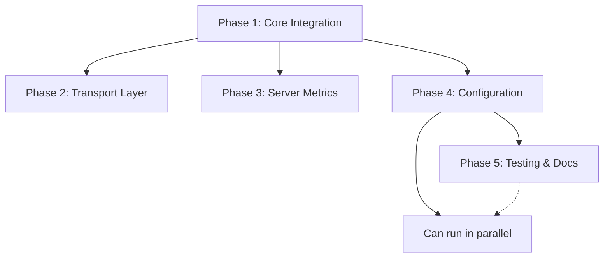

# Prometheus Metrics Integration - Project Overview

## 📋 Project Status
**Status**: Planning Complete ✅  
**Epic Issue**: [#125](https://github.com/innovationmech/swit/issues/125)  
**Total Estimated Time**: 87 hours  
**Target Completion**: 10-12 weeks with 1 FTE developer

## 🎯 Project Objective
Implement comprehensive Prometheus metrics integration for the Swit microservice framework to provide production-ready observability capabilities with minimal configuration and performance overhead.

## 📊 Success Metrics
- All standard framework operations covered by metrics
- Zero reported compatibility issues
- <5% performance overhead in production  
- <10MB additional memory usage per service
- P99 latency increase <5ms for HTTP requests

## 📁 Project Structure

```
specs/prometheus-metrics-integration/
├── README.md           # This overview document
├── requirements.md     # Detailed business and technical requirements
├── design.md          # Architecture and component design
└── tasks.md           # Detailed task breakdown and dependencies
```

## 🚀 Implementation Phases

| Phase | GitHub Issue | Time | Status | Description |
|-------|-------------|------|--------|-------------|
| **Phase 1** | [#119](https://github.com/innovationmech/swit/issues/119) | 14h | 🔴 Not Started | Core Prometheus Integration |
| **Phase 2** | [#120](https://github.com/innovationmech/swit/issues/120) | 16h | 🔴 Not Started | Transport Layer Integration |
| **Phase 3** | [#121](https://github.com/innovationmech/swit/issues/121) | 11h | 🔴 Not Started | Server & Framework Metrics |
| **Phase 4** | [#122](https://github.com/innovationmech/swit/issues/122) | 10h | 🔴 Not Started | Configuration & Integration |
| **Phase 5** | [#123](https://github.com/innovationmech/swit/issues/123) | 24h | 🔴 Not Started | Testing & Documentation |
| **Phase 6** | [#124](https://github.com/innovationmech/swit/issues/124) | 12h | 🔴 Not Started | Example Services |

## 🏗️ Key Components to Implement

### Core Infrastructure
- **PrometheusMetricsCollector**: Prometheus-backed `MetricsCollector` implementation
- **MetricsRegistry**: Central registry for predefined and custom metrics
- **Configuration System**: `PrometheusConfig` integration with `ServerConfig`

### Transport Integration
- **HTTP Middleware**: Automatic request metrics collection
- **gRPC Interceptors**: Automatic RPC metrics collection  
- **Metrics Endpoint**: `/metrics` endpoint for Prometheus scraping

### Framework Integration
- **ObservabilityManager**: Prometheus collector integration
- **MiddlewareManager**: Automatic middleware registration
- **TransportCoordinator**: Interceptor integration
- **Performance Export**: Existing performance metrics to Prometheus

## 📈 Key Metrics Categories

### HTTP Metrics
- Request count, duration, size by method/endpoint/status
- Active request gauge
- Response size tracking

### gRPC Metrics
- RPC count, duration by method/status
- Message count and size tracking
- Started vs handled RPC comparison

### Server Metrics
- Uptime, startup/shutdown duration
- Memory usage, goroutine count, GC stats
- Service registration events

### Transport Metrics
- Transport status and health
- Connection counts and lifecycle
- Cross-transport service discovery

## 🔧 Suggested Agent Assignment

| Agent Type | Phases | Rationale |
|------------|--------|-----------|
| **golang-pro** | 1, 4 | Core implementation and configuration system |
| **backend-architect** | 2 | Transport layer design and integration |
| **performance-engineer** | 3 | Performance metrics and optimization |
| **golang-test-engineer** | 5 | Comprehensive testing suite |
| **general-purpose** | 5, 6 | Documentation and examples |

## 🔄 Dependencies Graph



## ⚠️ Risk Mitigation

### High Priority Risks
- **Performance Impact**: Early benchmarking and optimization
- **Backward Compatibility**: Maintain existing interfaces
- **Memory Usage**: Cardinality limiting and cleanup
- **Thread Safety**: Comprehensive concurrent testing

### Medium Priority Risks  
- **Configuration Complexity**: Provide sensible defaults
- **Integration Complexity**: Phased implementation approach
- **Testing Coverage**: Automated coverage reporting

## 📋 Definition of Done

### Phase Completion Criteria
- [ ] All acceptance criteria met
- [ ] Code review completed
- [ ] Unit tests passing with required coverage
- [ ] Integration tests validated
- [ ] Performance benchmarks within requirements
- [ ] Documentation updated

### Epic Completion Criteria
- [ ] All 6 phases completed successfully
- [ ] Performance requirements validated (<5% overhead)
- [ ] Backward compatibility maintained  
- [ ] Documentation complete and reviewed
- [ ] Example services demonstrate full integration
- [ ] All tests passing with >80% coverage

## 🔗 External Resources

### Documentation References
- [Prometheus Client Library](https://github.com/prometheus/client_golang)
- [Prometheus Metrics Types](https://prometheus.io/docs/concepts/metric_types/)
- [Prometheus Best Practices](https://prometheus.io/docs/practices/naming/)

### Framework Integration Points
- [Existing Observability System](../../pkg/server/observability.go)
- [Performance Monitoring](../../pkg/server/performance.go)  
- [Middleware Management](../../pkg/server/middleware.go)
- [Transport Coordination](../../pkg/transport/)

## 📞 Next Steps

1. **Review and approve this specification**
2. **Assign Phase 1 to golang-pro agent**
3. **Begin implementation starting with core infrastructure**
4. **Set up project tracking and progress monitoring**
5. **Schedule regular review checkpoints**

---

*This specification was created as part of the Prometheus metrics integration planning process. For questions or updates, please reference the GitHub issues listed above.*