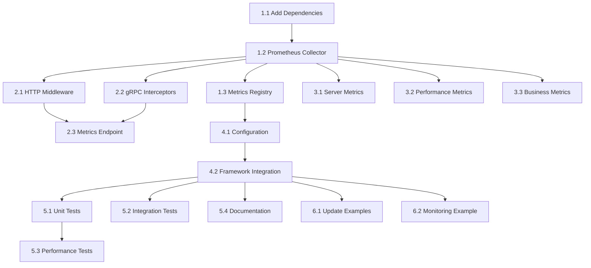

# Prometheus Metrics Integration - Task Breakdown

## Phase 1: Core Prometheus Integration

### Task 1.1: Add Prometheus Dependencies
**Agent**: golang-pro  
**Estimated Time**: 2 hours  
**Priority**: High

**Description**: Add required Prometheus client libraries to the project

**Acceptance Criteria**:
- [ ] Add `github.com/prometheus/client_golang` to go.mod
- [ ] Add `github.com/prometheus/client_model` to go.mod
- [ ] Update go.sum file
- [ ] Verify dependency compatibility with existing packages
- [ ] Run `go mod tidy` successfully

**Files to Modify**:
- `go.mod`
- `go.sum`

---

### Task 1.2: Implement PrometheusMetricsCollector
**Agent**: golang-pro  
**Estimated Time**: 8 hours  
**Priority**: High

**Description**: Create a Prometheus-backed implementation of the MetricsCollector interface

**Acceptance Criteria**:
- [ ] Create `pkg/server/prometheus_collector.go`
- [ ] Implement `MetricsCollector` interface using Prometheus client
- [ ] Support Counter, Gauge, Histogram, and Summary metric types
- [ ] Thread-safe metric registration and updates
- [ ] Automatic label management and sanitization
- [ ] Custom Prometheus registry for isolation
- [ ] HTTP handler for metrics endpoint
- [ ] Proper error handling and recovery
- [ ] Memory-efficient metric storage

**Files to Create**:
- `pkg/server/prometheus_collector.go`

**Methods to Implement**:
```go
func NewPrometheusMetricsCollector(config *PrometheusConfig) *PrometheusMetricsCollector
func (pmc *PrometheusMetricsCollector) IncrementCounter(name string, labels map[string]string)
func (pmc *PrometheusMetricsCollector) AddToCounter(name string, value float64, labels map[string]string)
func (pmc *PrometheusMetricsCollector) SetGauge(name string, value float64, labels map[string]string)
func (pmc *PrometheusMetricsCollector) IncrementGauge(name string, labels map[string]string)
func (pmc *PrometheusMetricsCollector) DecrementGauge(name string, labels map[string]string)
func (pmc *PrometheusMetricsCollector) ObserveHistogram(name string, value float64, labels map[string]string)
func (pmc *PrometheusMetricsCollector) GetMetrics() []Metric
func (pmc *PrometheusMetricsCollector) GetMetric(name string) (*Metric, bool)
func (pmc *PrometheusMetricsCollector) Reset()
func (pmc *PrometheusMetricsCollector) GetHandler() http.Handler
```

---

### Task 1.3: Create Metrics Registry
**Agent**: golang-pro  
**Estimated Time**: 4 hours  
**Priority**: Medium

**Description**: Create a central registry for managing predefined and custom metrics

**Acceptance Criteria**:
- [ ] Create `pkg/server/metrics_registry.go`
- [ ] Define standard framework metrics with descriptions and labels
- [ ] Support for custom metric registration
- [ ] Validation for metric definitions
- [ ] Thread-safe operations
- [ ] Metric cardinality limiting

**Files to Create**:
- `pkg/server/metrics_registry.go`

**Components to Implement**:
```go
type MetricsRegistry struct{}
type MetricDefinition struct{}
func NewMetricsRegistry() *MetricsRegistry
func (mr *MetricsRegistry) RegisterMetric(definition MetricDefinition) error
func (mr *MetricsRegistry) GetMetricDefinition(name string) (*MetricDefinition, bool)
func (mr *MetricsRegistry) ListMetrics() []MetricDefinition
```

---

## Phase 2: Transport Layer Integration

### Task 2.1: HTTP Middleware for Metrics
**Agent**: backend-architect  
**Estimated Time**: 6 hours  
**Priority**: High

**Description**: Create HTTP middleware to collect request metrics automatically

**Acceptance Criteria**:
- [ ] Create `pkg/middleware/prometheus_http.go`
- [ ] Implement Gin middleware for request metrics
- [ ] Track request duration, count, size, and active requests
- [ ] Support configurable labels and buckets
- [ ] Proper endpoint path normalization
- [ ] Error handling without impacting request flow
- [ ] Performance optimized for high throughput

**Files to Create**:
- `pkg/middleware/prometheus_http.go`

**Metrics to Implement**:
- `http_requests_total{method, endpoint, status}`
- `http_request_duration_seconds{method, endpoint}`
- `http_request_size_bytes{method, endpoint}`
- `http_response_size_bytes{method, endpoint}`
- `http_active_requests{}`

---

### Task 2.2: gRPC Interceptors for Metrics
**Agent**: backend-architect  
**Estimated Time**: 6 hours  
**Priority**: High

**Description**: Create gRPC interceptors to collect RPC metrics automatically

**Acceptance Criteria**:
- [ ] Create `pkg/middleware/prometheus_grpc.go`
- [ ] Implement unary and streaming interceptors
- [ ] Track RPC duration, count, message size, and status
- [ ] Support for both server and client interceptors
- [ ] Proper method name extraction and normalization
- [ ] Error handling without impacting RPC flow
- [ ] Performance optimized for high throughput

**Files to Create**:
- `pkg/middleware/prometheus_grpc.go`

**Metrics to Implement**:
- `grpc_server_started_total{method}`
- `grpc_server_handled_total{method, code}`
- `grpc_server_handling_seconds{method}`
- `grpc_server_msg_received_total{method}`
- `grpc_server_msg_sent_total{method}`

---

### Task 2.3: Metrics Endpoint Integration
**Agent**: backend-architect  
**Estimated Time**: 4 hours  
**Priority**: Medium

**Description**: Integrate metrics endpoint with existing observability endpoints

**Acceptance Criteria**:
- [ ] Extend `ObservabilityManager.RegisterDebugEndpoints()` 
- [ ] Add configurable `/metrics` endpoint
- [ ] Support for authentication/authorization
- [ ] Proper content-type headers
- [ ] Optional endpoint security
- [ ] Integration with existing debug endpoints

**Files to Modify**:
- `pkg/server/observability.go`

---

## Phase 3: Server & Framework Metrics

### Task 3.1: Server Lifecycle Metrics
**Agent**: performance-engineer  
**Estimated Time**: 4 hours  
**Priority**: Medium

**Description**: Export server lifecycle events as Prometheus metrics

**Acceptance Criteria**:
- [ ] Integrate with existing `ServerMetrics`
- [ ] Track server start/stop events
- [ ] Track transport start/stop events
- [ ] Track service registration events
- [ ] Export uptime and lifecycle duration metrics
- [ ] Integration with performance monitoring

**Files to Modify**:
- `pkg/server/observability.go`
- `pkg/server/base.go`

**Metrics to Implement**:
- `server_uptime_seconds{service}`
- `server_startup_duration_seconds{service}`
- `server_shutdown_duration_seconds{service}`
- `transport_status{transport, status}`
- `service_registrations_total{service, type}`

---

### Task 3.2: Performance Metrics Export
**Agent**: performance-engineer  
**Estimated Time**: 4 hours  
**Priority**: Medium

**Description**: Export existing performance metrics to Prometheus

**Acceptance Criteria**:
- [ ] Integrate with existing `PerformanceMetrics`
- [ ] Export memory usage metrics
- [ ] Export goroutine count metrics
- [ ] Export GC statistics
- [ ] Export request/error counters
- [ ] Automatic metric updates

**Files to Modify**:
- `pkg/server/performance.go`

**Metrics to Implement**:
- `server_goroutines{service}`
- `server_memory_bytes{service, type}`
- `server_gc_duration_seconds{service}`
- `server_requests_total{service}`
- `server_errors_total{service, type}`

---

### Task 3.3: Business Metrics Hooks
**Agent**: performance-engineer  
**Estimated Time**: 3 hours  
**Priority**: Low

**Description**: Create interface for services to register custom business metrics

**Acceptance Criteria**:
- [ ] Create business metrics registration interface
- [ ] Helper functions for common metrics patterns
- [ ] Example implementations
- [ ] Thread-safe metric registration
- [ ] Integration with service lifecycle

**Files to Create**:
- `pkg/server/business_metrics.go`

---

## Phase 4: Configuration & Integration

### Task 4.1: Configuration Structure
**Agent**: golang-pro  
**Estimated Time**: 4 hours  
**Priority**: High

**Description**: Add Prometheus configuration to ServerConfig

**Acceptance Criteria**:
- [ ] Add `PrometheusConfig` struct to configuration
- [ ] Support for environment variable overrides
- [ ] Configuration validation
- [ ] Default configuration values
- [ ] YAML and JSON serialization support
- [ ] Backward compatibility with existing config

**Files to Modify**:
- `pkg/server/config.go`
- `pkg/server/config_builder.go`

**Configuration Fields**:
```yaml
prometheus:
  enabled: true
  endpoint: "/metrics"
  namespace: "swit"
  subsystem: "server"
  buckets:
    duration: [0.001, 0.01, 0.1, 0.5, 1, 2.5, 5, 10]
    size: [100, 1000, 10000, 100000, 1000000]
  labels:
    service: "${SERVICE_NAME}"
    environment: "${ENVIRONMENT}"
```

---

### Task 4.2: Framework Integration
**Agent**: golang-pro  
**Estimated Time**: 6 hours  
**Priority**: High

**Description**: Integrate Prometheus metrics throughout the framework

**Acceptance Criteria**:
- [ ] Update `ObservabilityManager` to support Prometheus
- [ ] Update `MiddlewareManager` for automatic middleware registration
- [ ] Update `TransportCoordinator` for interceptor registration
- [ ] Update `BusinessServerImpl` for metrics initialization
- [ ] Maintain backward compatibility
- [ ] Proper error handling and fallbacks

**Files to Modify**:
- `pkg/server/observability.go`
- `pkg/server/middleware.go`
- `pkg/transport/transport.go`
- `pkg/server/base.go`

---

## Phase 5: Testing & Documentation

### Task 5.1: Unit Tests
**Agent**: golang-test-engineer  
**Estimated Time**: 8 hours  
**Priority**: High

**Description**: Create comprehensive unit tests for Prometheus integration

**Acceptance Criteria**:
- [ ] Test `PrometheusMetricsCollector` functionality
- [ ] Test metric registration and updates
- [ ] Test label handling and sanitization
- [ ] Test configuration parsing and validation
- [ ] Test error handling and recovery
- [ ] Test thread safety
- [ ] Achieve >80% code coverage

**Files to Create**:
- `pkg/server/prometheus_collector_test.go`
- `pkg/server/metrics_registry_test.go`
- `pkg/middleware/prometheus_http_test.go`
- `pkg/middleware/prometheus_grpc_test.go`

---

### Task 5.2: Integration Tests
**Agent**: golang-test-engineer  
**Estimated Time**: 6 hours  
**Priority**: High

**Description**: Create integration tests for end-to-end metrics collection

**Acceptance Criteria**:
- [ ] Test HTTP request metrics collection
- [ ] Test gRPC request metrics collection
- [ ] Test metrics endpoint exposure
- [ ] Test configuration integration
- [ ] Test with real HTTP/gRPC requests
- [ ] Test Prometheus scraping

**Files to Create**:
- `pkg/server/prometheus_integration_test.go`

---

### Task 5.3: Performance Tests
**Agent**: golang-test-engineer  
**Estimated Time**: 4 hours  
**Priority**: Medium

**Description**: Create performance tests to validate overhead requirements

**Acceptance Criteria**:
- [ ] Benchmark metrics collection overhead
- [ ] Memory usage profiling
- [ ] High load testing (>10k RPS)
- [ ] Performance comparison with/without metrics
- [ ] Validate <5% performance overhead requirement

**Files to Create**:
- `pkg/server/prometheus_benchmark_test.go`

---

### Task 5.4: Documentation Updates
**Agent**: general-purpose  
**Estimated Time**: 6 hours  
**Priority**: Medium

**Description**: Update documentation with Prometheus integration details

**Acceptance Criteria**:
- [ ] Update monitoring guide with Prometheus section
- [ ] Create metrics reference documentation
- [ ] Add configuration examples
- [ ] Create troubleshooting guide
- [ ] Update example service documentation

**Files to Modify**:
- `docs/pages/en/guide/monitoring.md`
- `docs/pages/zh/guide/monitoring.md`

**Files to Create**:
- `docs/prometheus-metrics-reference.md`
- `docs/prometheus-troubleshooting.md`

---

## Phase 6: Example Services

### Task 6.1: Update Example Services
**Agent**: general-purpose  
**Estimated Time**: 4 hours  
**Priority**: Low

**Description**: Add Prometheus configuration to existing example services

**Acceptance Criteria**:
- [ ] Update `examples/simple-http-service` with Prometheus config
- [ ] Update `examples/grpc-service` with Prometheus config
- [ ] Update `examples/full-featured-service` with metrics examples
- [ ] Add configuration files with Prometheus enabled
- [ ] Update README files with metrics information

**Files to Modify**:
- `examples/simple-http-service/main.go`
- `examples/simple-http-service/swit.yaml`
- `examples/grpc-service/main.go`
- `examples/grpc-service/swit.yaml`
- `examples/full-featured-service/main.go`
- `examples/full-featured-service/swit.yaml`

---

### Task 6.2: Create Monitoring Example
**Agent**: general-purpose  
**Estimated Time**: 8 hours  
**Priority**: Low

**Description**: Create comprehensive monitoring example with Prometheus and Grafana

**Acceptance Criteria**:
- [ ] Create `examples/prometheus-monitoring` directory
- [ ] Implement service with custom metrics
- [ ] Create Docker Compose setup with Prometheus
- [ ] Create Docker Compose setup with Grafana
- [ ] Include dashboard configurations
- [ ] Add alerting rules examples
- [ ] Comprehensive README with setup instructions

**Files to Create**:
- `examples/prometheus-monitoring/main.go`
- `examples/prometheus-monitoring/swit.yaml`
- `examples/prometheus-monitoring/docker-compose.yml`
- `examples/prometheus-monitoring/prometheus/prometheus.yml`
- `examples/prometheus-monitoring/grafana/dashboards/`
- `examples/prometheus-monitoring/README.md`

---

## Task Dependencies



## Time Estimates Summary

| Phase | Tasks | Total Estimated Time |
|-------|-------|---------------------|
| Phase 1: Core Integration | 3 tasks | 14 hours |
| Phase 2: Transport Layer | 3 tasks | 16 hours |
| Phase 3: Server Metrics | 3 tasks | 11 hours |
| Phase 4: Configuration | 2 tasks | 10 hours |
| Phase 5: Testing & Docs | 4 tasks | 24 hours |
| Phase 6: Examples | 2 tasks | 12 hours |
| **Total** | **17 tasks** | **87 hours** |

## Risk Mitigation

### High Priority Risks
1. **Performance Impact**: Implement early performance testing
2. **Backward Compatibility**: Maintain existing interfaces
3. **Memory Usage**: Implement cardinality limiting
4. **Thread Safety**: Comprehensive concurrent testing

### Medium Priority Risks
1. **Configuration Complexity**: Provide sensible defaults
2. **Integration Complexity**: Phased implementation approach
3. **Testing Coverage**: Automated coverage reporting