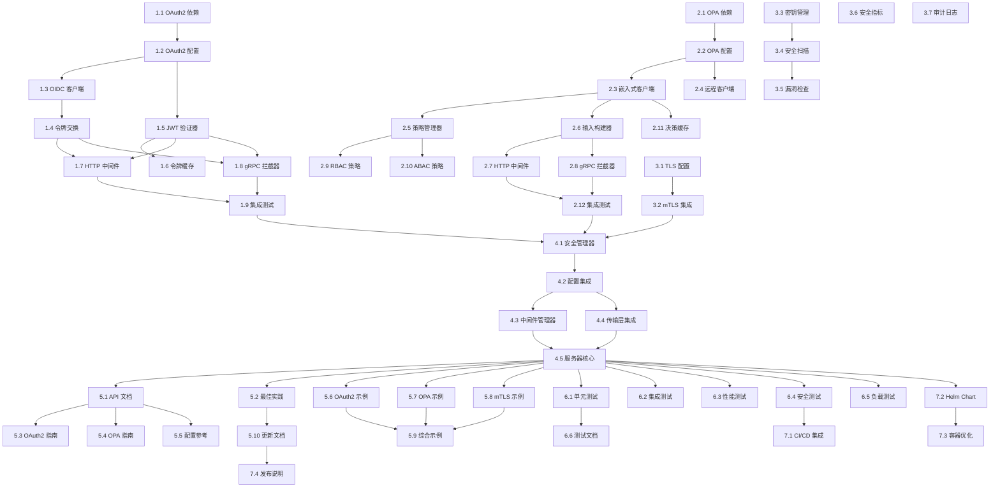

# 安全增强 - 任务分解

## Phase 1：OAuth2/OIDC 核心实现

### Task 1.1：OAuth2 依赖和基础结构

**负责人**：golang-pro  
**预估时间**：3 小时  
**优先级**：高

**描述**：添加 OAuth2/OIDC 相关依赖，创建基础包结构

**验收标准**：
- [ ] 添加 `golang.org/x/oauth2` 到 go.mod
- [ ] 添加 `github.com/coreos/go-oidc/v3` 到 go.mod
- [ ] 添加 `github.com/golang-jwt/jwt/v5` 到 go.mod
- [ ] 创建包结构：`pkg/security/oauth2/`, `pkg/security/jwt/`
- [ ] 运行 `go mod tidy` 成功
- [ ] 更新 DEVELOPMENT.md 依赖说明

**需要创建的目录**：
```
pkg/security/
├── oauth2/
│   ├── config.go
│   ├── client.go
│   ├── token.go
│   └── cache.go
├── jwt/
│   ├── validator.go
│   ├── claims.go
│   └── extractor.go
└── types.go
```

---

### Task 1.2：OAuth2 配置管理

**负责人**：golang-pro  
**预估时间**：6 小时  
**优先级**：高

**描述**：实现 OAuth2/OIDC 配置结构和加载逻辑

**验收标准**：
- [ ] 实现 `OAuth2Config` 结构体
- [ ] 实现 `JWTConfig` 结构体
- [ ] 实现 `TokenCacheConfig` 结构体
- [ ] 支持 YAML/JSON 序列化
- [ ] 配置验证逻辑
- [ ] 环境变量覆盖支持
- [ ] 默认配置值
- [ ] 单元测试覆盖率 > 80%

**需要创建的文件**：
- `pkg/security/oauth2/config.go`
- `pkg/security/oauth2/config_test.go`

**配置示例**：
```go
type OAuth2Config struct {
    Enabled      bool              
    Provider     string            
    ClientID     string            
    ClientSecret string            
    RedirectURL  string            
    Scopes       []string          
    IssuerURL    string            
    AuthURL      string            
    TokenURL     string            
    UserInfoURL  string            
    JWKSURL      string            
    JWTConfig    JWTConfig         
    CacheConfig  TokenCacheConfig  
    TLSConfig    TLSConfig         
}
```

---

### Task 1.3：OIDC 发现和客户端初始化

**负责人**：golang-pro  
**预估时间**：8 小时  
**优先级**：高

**描述**：实现 OIDC Discovery 和 OAuth2 客户端初始化

**验收标准**：
- [ ] 实现 `NewClient` 函数
- [ ] 支持 OIDC Discovery 自动配置
- [ ] 支持手动配置端点
- [ ] 支持多提供商（Keycloak、Auth0、自建）
- [ ] JWKS 获取和缓存
- [ ] 连接池配置
- [ ] 超时和重试配置
- [ ] 集成测试（需要测试 OIDC 服务器）

**需要创建的文件**：
- `pkg/security/oauth2/client.go`
- `pkg/security/oauth2/client_test.go`
- `pkg/security/oauth2/provider.go`

**方法清单**：
```go
func NewClient(config *OAuth2Config) (*Client, error)
func newOIDCClient(config *OAuth2Config) (*Client, error)
func newManualClient(config *OAuth2Config) (*Client, error)
func (c *Client) Initialize(ctx context.Context) error
```

---

### Task 1.4：OAuth2 令牌交换和刷新

**负责人**：backend-architect  
**预估时间**：8 小时  
**优先级**：高

**描述**：实现 OAuth2 授权流程和令牌管理

**验收标准**：
- [ ] 实现授权码 URL 生成（`AuthCodeURL`）
- [ ] 实现授权码交换（`Exchange`）
- [ ] 实现令牌刷新（`RefreshToken`）
- [ ] 实现令牌内省（`IntrospectToken`）
- [ ] 实现令牌撤销（`RevokeToken`）
- [ ] PKCE 支持
- [ ] State 参数验证
- [ ] Nonce 参数验证
- [ ] 单元测试和集成测试

**需要创建的文件**：
- `pkg/security/oauth2/token.go`
- `pkg/security/oauth2/token_test.go`
- `pkg/security/oauth2/flows.go`

**方法清单**：
```go
func (c *Client) AuthCodeURL(state string, opts ...oauth2.AuthCodeOption) string
func (c *Client) Exchange(ctx context.Context, code string) (*Token, error)
func (c *Client) RefreshToken(ctx context.Context, refreshToken string) (*Token, error)
func (c *Client) IntrospectToken(ctx context.Context, token string) (*TokenIntrospection, error)
func (c *Client) RevokeToken(ctx context.Context, token string) error
```

---

### Task 1.5：JWT 令牌验证器

**负责人**：backend-architect  
**预估时间**：10 小时  
**优先级**：高

**描述**：实现高性能 JWT 令牌验证

**验收标准**：
- [ ] 实现 `Validator` 结构体
- [ ] 支持多种签名算法（RS256, ES256, HS256）
- [ ] 标准声明验证（iss, aud, exp, nbf, iat）
- [ ] 自定义声明提取
- [ ] JWKS 缓存和自动刷新
- [ ] 时钟偏移容忍
- [ ] 令牌黑名单支持（可选）
- [ ] 性能基准测试（< 1ms P99）
- [ ] 单元测试覆盖率 > 85%

**需要创建的文件**：
- `pkg/security/jwt/validator.go`
- `pkg/security/jwt/validator_test.go`
- `pkg/security/jwt/claims.go`
- `pkg/security/jwt/jwks_cache.go`

**方法清单**：
```go
func NewValidator(config *JWTConfig) (*Validator, error)
func (v *Validator) ValidateToken(tokenString string) (*Claims, error)
func (v *Validator) ValidateWithContext(ctx context.Context, tokenString string) (*Claims, error)
func (v *Validator) ExtractClaims(tokenString string) (*Claims, error)
```

---

### Task 1.6：令牌缓存实现

**负责人**：performance-engineer  
**预估时间**：6 小时  
**优先级**：中

**描述**：实现令牌缓存以提升性能

**验收标准**：
- [ ] 实现 LRU 缓存
- [ ] TTL 支持
- [ ] 线程安全
- [ ] 自动清理过期条目
- [ ] 缓存统计（命中率、大小）
- [ ] 可配置最大大小
- [ ] 缓存预热支持
- [ ] 性能测试

**需要创建的文件**：
- `pkg/security/oauth2/cache.go`
- `pkg/security/oauth2/cache_test.go`

**接口定义**：
```go
type TokenCache interface {
    Get(key string) (*TokenClaims, bool)
    Set(key string, claims *TokenClaims, ttl time.Duration)
    Delete(key string)
    Clear()
    Stats() CacheStats
}
```

---

### Task 1.7：HTTP 认证中间件

**负责人**：backend-architect  
**预估时间**：10 小时  
**优先级**：高

**描述**：实现 Gin HTTP 认证中间件

**验收标准**：
- [ ] 实现 `OAuth2Middleware`
- [ ] 从 Authorization Header 提取令牌
- [ ] Bearer Token 验证
- [ ] Cookie-based 认证支持（可选）
- [ ] 认证信息注入 Gin Context
- [ ] 可选认证（`OptionalAuth`）
- [ ] 自定义错误响应
- [ ] `RequireRoles` 中间件
- [ ] `RequireScopes` 中间件
- [ ] `RequirePermissions` 中间件
- [ ] 集成测试

**需要创建的文件**：
- `pkg/middleware/auth_oauth2.go`
- `pkg/middleware/auth_oauth2_test.go`
- `pkg/middleware/auth_helpers.go`

**中间件清单**：
```go
func OAuth2Middleware(client *oauth2.Client, options ...Option) gin.HandlerFunc
func OptionalAuth(client *oauth2.Client) gin.HandlerFunc
func RequireRoles(roles ...string) gin.HandlerFunc
func RequireScopes(scopes ...string) gin.HandlerFunc
func RequirePermissions(permissions ...string) gin.HandlerFunc
```

---

### Task 1.8：gRPC 认证拦截器

**负责人**：backend-architect  
**预估时间**：10 小时  
**优先级**：高

**描述**：实现 gRPC 认证拦截器

**验收标准**：
- [ ] 实现一元 RPC 拦截器
- [ ] 实现流式 RPC 拦截器
- [ ] 从 Metadata 提取令牌
- [ ] 认证信息注入 Context
- [ ] gRPC Status Code 映射
- [ ] 角色和权限检查
- [ ] 集成测试

**需要创建的文件**：
- `pkg/middleware/auth_grpc.go`
- `pkg/middleware/auth_grpc_test.go`

**拦截器清单**：
```go
func UnaryAuthInterceptor(client *oauth2.Client) grpc.UnaryServerInterceptor
func StreamAuthInterceptor(client *oauth2.Client) grpc.StreamServerInterceptor
func UnaryRequireRoles(roles ...string) grpc.UnaryServerInterceptor
func StreamRequireRoles(roles ...string) grpc.StreamServerInterceptor
```

---

### Task 1.9：OAuth2 集成测试和示例

**负责人**：golang-test-engineer  
**预估时间**：12 小时  
**优先级**：中

**描述**：创建完整的集成测试和示例代码

**验收标准**：
- [ ] 搭建测试 OIDC 服务器（使用 Keycloak 容器）
- [ ] 完整授权码流程测试
- [ ] 令牌刷新流程测试
- [ ] 中间件集成测试
- [ ] 性能基准测试
- [ ] 创建示例服务
- [ ] 示例文档（中英文）

**需要创建的文件**：
- `pkg/security/oauth2/integration_test.go`
- `examples/oauth2-authentication/main.go`
- `examples/oauth2-authentication/README.md`
- `examples/oauth2-authentication/docker-compose.yml`
- `examples/oauth2-authentication/swit.yaml`

---

## Phase 2：OPA 策略引擎集成

### Task 2.1：OPA 依赖和基础结构

**负责人**：golang-pro  
**预估时间**：2 小时  
**优先级**：高

**描述**：添加 OPA 依赖，创建包结构

**验收标准**：
- [ ] 添加 `github.com/open-policy-agent/opa` 到 go.mod
- [ ] 创建包结构：`pkg/security/opa/`
- [ ] 创建策略目录结构
- [ ] 运行 `go mod tidy` 成功

**需要创建的目录**：
```
pkg/security/opa/
├── config.go
├── client.go
├── manager.go
├── evaluator.go
├── cache.go
└── policies/
    ├── rbac.rego
    ├── abac.rego
    └── examples/
```

---

### Task 2.2：OPA 配置管理

**负责人**：golang-pro  
**预估时间**：4 小时  
**优先级**：高

**描述**：实现 OPA 配置结构和加载

**验收标准**：
- [ ] 实现 `OPAConfig` 结构体
- [ ] 支持嵌入式、远程、Sidecar 模式
- [ ] 配置验证
- [ ] 环境变量覆盖
- [ ] 默认配置
- [ ] 单元测试

**需要创建的文件**：
- `pkg/security/opa/config.go`
- `pkg/security/opa/config_test.go`

---

### Task 2.3：OPA 客户端实现（嵌入式模式）

**负责人**：backend-architect  
**预估时间**：12 小时  
**优先级**：高

**描述**：实现嵌入式 OPA 客户端

**验收标准**：
- [ ] 实现 `Client` 结构体
- [ ] 嵌入式 OPA 初始化
- [ ] 策略加载（从文件、字符串）
- [ ] 数据加载（从文件、JSON）
- [ ] 决策查询（`EvaluatePolicy`）
- [ ] 部分评估支持
- [ ] 策略编译缓存
- [ ] 错误处理和日志
- [ ] 单元测试

**需要创建的文件**：
- `pkg/security/opa/client.go`
- `pkg/security/opa/client_test.go`
- `pkg/security/opa/embedded.go`

**方法清单**：
```go
func NewClient(config *OPAConfig) (*Client, error)
func (c *Client) LoadPolicy(ctx context.Context, name, policy string) error
func (c *Client) LoadPolicyFromFile(ctx context.Context, path string) error
func (c *Client) LoadData(ctx context.Context, path string, data interface{}) error
func (c *Client) EvaluatePolicy(ctx context.Context, input map[string]interface{}) (*Decision, error)
```

---

### Task 2.4：OPA 客户端实现（远程模式）

**负责人**：backend-architect  
**预估时间**：8 小时  
**优先级**：中

**描述**：实现远程 OPA 服务器客户端

**验收标准**：
- [ ] 实现远程 OPA HTTP 客户端
- [ ] 连接池配置
- [ ] 超时和重试
- [ ] 健康检查
- [ ] 负载均衡支持（多服务器）
- [ ] 集成测试（使用 OPA 容器）

**需要创建的文件**：
- `pkg/security/opa/remote.go`
- `pkg/security/opa/remote_test.go`

---

### Task 2.5：策略管理器

**负责人**：backend-architect  
**预估时间**：10 小时  
**优先级**：高

**描述**：实现策略生命周期管理

**验收标准**：
- [ ] 实现 `PolicyManager`
- [ ] 策略注册和注销
- [ ] 策略版本管理
- [ ] 策略验证（语法检查）
- [ ] 策略热更新
- [ ] 文件系统监听（File Watcher）
- [ ] Git 仓库集成（可选）
- [ ] 单元测试

**需要创建的文件**：
- `pkg/security/opa/manager.go`
- `pkg/security/opa/manager_test.go`
- `pkg/security/opa/watcher.go`
- `pkg/security/opa/validator.go`

**方法清单**：
```go
func NewPolicyManager(client *Client) *PolicyManager
func (pm *PolicyManager) RegisterPolicy(name string, policy *Policy) error
func (pm *PolicyManager) UpdatePolicy(name string, policy *Policy) error
func (pm *PolicyManager) DeletePolicy(name string) error
func (pm *PolicyManager) ListPolicies() ([]*Policy, error)
func (pm *PolicyManager) ValidatePolicy(policy string) error
func (pm *PolicyManager) WatchPolicies(ctx context.Context) error
```

---

### Task 2.6：策略输入构建器

**负责人**：backend-architect  
**预估时间**：6 小时  
**优先级**：高

**描述**：实现策略输入数据构建

**验收标准**：
- [ ] 实现 `PolicyInput` 结构体
- [ ] HTTP 请求输入构建
- [ ] gRPC 请求输入构建
- [ ] 用户信息提取
- [ ] 资源信息提取
- [ ] 自定义数据注入
- [ ] 单元测试

**需要创建的文件**：
- `pkg/security/opa/input.go`
- `pkg/security/opa/input_test.go`

**结构定义**：
```go
type PolicyInput struct {
    Request  RequestInfo            
    User     UserInfo               
    Resource ResourceInfo           
    Custom   map[string]interface{} 
}
```

---

### Task 2.7：HTTP 策略中间件

**负责人**：backend-architect  
**预估时间**：8 小时  
**优先级**：高

**描述**：实现 Gin HTTP 策略中间件

**验收标准**：
- [ ] 实现 `OPAMiddleware`
- [ ] 请求级策略评估
- [ ] 资源级策略评估（`ResourcePolicy`）
- [ ] 动态策略路径
- [ ] 决策缓存集成
- [ ] 审计日志记录
- [ ] 自定义错误响应
- [ ] 集成测试

**需要创建的文件**：
- `pkg/middleware/policy_opa.go`
- `pkg/middleware/policy_opa_test.go`

**中间件清单**：
```go
func OPAMiddleware(client *opa.Client, options ...Option) gin.HandlerFunc
func ResourcePolicy(resourceType string, getResourceID func(*gin.Context) string) gin.HandlerFunc
func DynamicPolicyPath(getPath func(*gin.Context) string) gin.HandlerFunc
```

---

### Task 2.8：gRPC 策略拦截器

**负责人**：backend-architect  
**预估时间**：8 小时  
**优先级**：高

**描述**：实现 gRPC 策略拦截器

**验收标准**：
- [ ] 实现一元 RPC 策略拦截器
- [ ] 实现流式 RPC 策略拦截器
- [ ] 方法级策略评估
- [ ] 消息级策略评估（可选）
- [ ] 上下文传播
- [ ] 集成测试

**需要创建的文件**：
- `pkg/middleware/policy_grpc.go`
- `pkg/middleware/policy_grpc_test.go`

---

### Task 2.9：RBAC 策略模板

**负责人**：backend-architect  
**预估时间**：6 小时  
**优先级**：中

**描述**：创建 RBAC 策略模板和示例

**验收标准**：
- [ ] 实现基础 RBAC 策略（Rego）
- [ ] 角色权限映射
- [ ] 资源所有者检查
- [ ] 超级管理员支持
- [ ] 策略测试
- [ ] 使用文档

**需要创建的文件**：
- `pkg/security/opa/policies/rbac.rego`
- `pkg/security/opa/policies/rbac_test.rego`
- `docs/opa-rbac-guide.md`

---

### Task 2.10：ABAC 策略模板

**负责人**：backend-architect  
**预估时间**：8 小时  
**优先级**：中

**描述**：创建 ABAC 策略模板和示例

**验收标准**：
- [ ] 实现基础 ABAC 策略（Rego）
- [ ] 属性匹配规则
- [ ] 敏感性级别检查
- [ ] 时间约束（工作时间、特定日期）
- [ ] 地理位置约束（可选）
- [ ] 策略测试
- [ ] 使用文档

**需要创建的文件**：
- `pkg/security/opa/policies/abac.rego`
- `pkg/security/opa/policies/abac_test.rego`
- `pkg/security/opa/policies/examples/`
- `docs/opa-abac-guide.md`

---

### Task 2.11：决策缓存实现

**负责人**：performance-engineer  
**预估时间**：6 小时  
**优先级**：中

**描述**：实现策略决策缓存以提升性能

**验收标准**：
- [ ] 实现决策缓存（基于输入哈希）
- [ ] TTL 支持
- [ ] 线程安全
- [ ] 自动失效
- [ ] 缓存统计
- [ ] 性能测试（< 5ms P99）

**需要创建的文件**：
- `pkg/security/opa/cache.go`
- `pkg/security/opa/cache_test.go`

---

### Task 2.12：OPA 集成测试和示例

**负责人**：golang-test-engineer  
**预估时间**：10 小时  
**优先级**：中

**描述**：创建完整的集成测试和示例

**验收标准**：
- [ ] 嵌入式 OPA 集成测试
- [ ] 远程 OPA 集成测试（使用 OPA 容器）
- [ ] RBAC 场景测试
- [ ] ABAC 场景测试
- [ ] 性能基准测试
- [ ] 创建示例服务
- [ ] 示例文档（中英文）

**需要创建的文件**：
- `pkg/security/opa/integration_test.go`
- `examples/opa-authorization/main.go`
- `examples/opa-authorization/README.md`
- `examples/opa-authorization/policies/`
- `examples/opa-authorization/docker-compose.yml`

---

## Phase 3：安全工具链和 TLS/mTLS

### Task 3.1：TLS 配置管理

**负责人**：golang-pro  
**预估时间**：6 小时  
**优先级**：高

**描述**：实现 TLS/mTLS 配置管理

**验收标准**：
- [ ] 实现 `TLSConfig` 结构体
- [ ] 证书加载（PEM 格式）
- [ ] CA 证书池管理
- [ ] 客户端认证模式配置
- [ ] 协议版本和加密套件配置
- [ ] 配置验证
- [ ] 单元测试

**需要创建的文件**：
- `pkg/security/tls/config.go`
- `pkg/security/tls/config_test.go`
- `pkg/security/tls/certificates.go`

**方法清单**：
```go
func NewTLSConfig(config *TLSConfig) (*tls.Config, error)
func LoadCertificate(certFile, keyFile string) (tls.Certificate, error)
func LoadCAPool(caFiles ...string) (*x509.CertPool, error)
func ValidateTLSConfig(config *TLSConfig) error
```

---

### Task 3.2：mTLS 集成

**负责人**：backend-architect  
**预估时间**：8 小时  
**优先级**：中

**描述**：集成 mTLS 到 HTTP 和 gRPC 传输层

**验收标准**：
- [ ] HTTP 服务器 mTLS 配置
- [ ] gRPC 服务器 mTLS 配置
- [ ] 客户端证书验证
- [ ] 证书信息提取（CN, SAN）
- [ ] 证书轮换支持
- [ ] 集成测试

**需要修改的文件**：
- `pkg/transport/http.go`
- `pkg/transport/grpc.go`
- `pkg/server/base.go`

---

### Task 3.3：密钥管理抽象层

**负责人**：golang-pro  
**预估时间**：8 小时  
**优先级**：中

**描述**：实现密钥管理抽象层

**验收标准**：
- [ ] 定义 `SecretsProvider` 接口
- [ ] 实现环境变量提供者
- [ ] 实现文件提供者
- [ ] 实现 Vault 提供者（可选）
- [ ] 密钥缓存
- [ ] 密钥刷新机制
- [ ] 单元测试

**需要创建的文件**：
- `pkg/security/secrets/manager.go`
- `pkg/security/secrets/provider.go`
- `pkg/security/secrets/env_provider.go`
- `pkg/security/secrets/file_provider.go`
- `pkg/security/secrets/vault_provider.go`（可选）

**接口定义**：
```go
type SecretsProvider interface {
    GetSecret(ctx context.Context, key string) (string, error)
    SetSecret(ctx context.Context, key string, value string) error
    DeleteSecret(ctx context.Context, key string) error
}
```

---

### Task 3.4：安全扫描工具集成

**负责人**：devops-engineer  
**预估时间**：10 小时  
**优先级**：中

**描述**：集成安全扫描工具

**验收标准**：
- [ ] gosec 集成（静态代码扫描）
- [ ] govulncheck 集成（漏洞检查）
- [ ] trivy 集成（容器扫描，可选）
- [ ] 统一的扫描器接口
- [ ] 结构化报告生成（JSON, HTML, SARIF）
- [ ] 配置化的失败阈值
- [ ] Makefile 集成

**需要创建的文件**：
- `pkg/security/scanner/scanner.go`
- `pkg/security/scanner/gosec.go`
- `pkg/security/scanner/govulncheck.go`
- `scripts/security-scan.sh`
- `scripts/quality.mk`（扩展）

**Makefile 目标**：
```makefile
.PHONY: security-scan
security-scan:
	@echo "Running security scans..."
	@go run ./pkg/security/scanner/cmd/scan

.PHONY: security-scan-gosec
security-scan-gosec:
	@gosec -fmt=json -out=security-report.json ./...

.PHONY: security-scan-vulncheck
security-scan-vulncheck:
	@govulncheck ./...
```

---

### Task 3.5：依赖漏洞检查

**负责人**：devops-engineer  
**预估时间**：6 小时  
**优先级**：中

**描述**：实现依赖漏洞检查器

**验收标准**：
- [ ] 实现 `VulnerabilityChecker`
- [ ] 集成 OSV 数据库
- [ ] 定期更新漏洞数据库
- [ ] 生成漏洞报告
- [ ] CI/CD 集成
- [ ] 通知机制（可选）

**需要创建的文件**：
- `pkg/security/vulnerability/checker.go`
- `pkg/security/vulnerability/checker_test.go`
- `pkg/security/vulnerability/database.go`

---

### Task 3.6：安全指标实现

**负责人**：performance-engineer  
**预估时间**：6 小时  
**优先级**：中

**描述**：实现安全相关 Prometheus 指标

**验收标准**：
- [ ] 实现 `SecurityMetrics` 结构体
- [ ] 认证指标（尝试、成功、失败）
- [ ] 授权指标（评估、授予、拒绝）
- [ ] 性能指标（认证耗时、策略耗时）
- [ ] 安全事件计数
- [ ] 漏洞计数
- [ ] 集成到现有指标系统

**需要创建的文件**：
- `pkg/security/metrics.go`
- `pkg/security/metrics_test.go`

**指标清单**：
```go
security_auth_attempts_total{result, method}
security_auth_duration_seconds{method}
security_token_validations_total{result}
security_policy_evaluations_total{decision, policy}
security_policy_evaluation_duration_seconds{policy}
security_access_denied_total{reason, resource}
security_vulnerabilities_found{severity, tool}
security_tls_connections_total{version, cipher_suite}
```

---

### Task 3.7：审计日志实现

**负责人**：backend-architect  
**预估时间**：8 小时  
**优先级**：高

**描述**：实现安全审计日志

**验收标准**：
- [ ] 实现 `AuditLogger` 结构体
- [ ] 认证事件记录
- [ ] 授权决策记录
- [ ] 敏感操作记录
- [ ] 失败尝试记录
- [ ] 结构化日志（JSON）
- [ ] 日志轮转支持
- [ ] 多目标输出（文件、Syslog、ELK）

**需要创建的文件**：
- `pkg/security/audit/logger.go`
- `pkg/security/audit/logger_test.go`
- `pkg/security/audit/events.go`

**审计事件类型**：
```go
const (
    EventTypeAuthAttempt = "auth.attempt"
    EventTypeAuthSuccess = "auth.success"
    EventTypeAuthFailure = "auth.failure"
    EventTypePolicyEvaluation = "policy.evaluation"
    EventTypeAccessDenied = "access.denied"
    EventTypeAccessGranted = "access.granted"
    EventTypeSensitiveOperation = "sensitive.operation"
)
```

---

## Phase 4：框架集成和配置

### Task 4.1：安全管理器实现

**负责人**：backend-architect  
**预估时间**：10 小时  
**优先级**：高

**描述**：实现统一的安全管理器

**验收标准**：
- [ ] 实现 `SecurityManager` 结构体
- [ ] 集成 OAuth2 客户端
- [ ] 集成 OPA 客户端
- [ ] 集成安全扫描器
- [ ] 集成密钥管理器
- [ ] 集成审计日志
- [ ] 生命周期管理（初始化、关闭）
- [ ] 单元测试

**需要创建的文件**：
- `pkg/server/security.go`
- `pkg/server/security_test.go`

**方法清单**：
```go
func NewSecurityManager(config *SecurityConfig) (*SecurityManager, error)
func (sm *SecurityManager) InitializeSecurity(ctx context.Context) error
func (sm *SecurityManager) RegisterSecurityMiddleware(router *gin.Engine, grpcServer *grpc.Server) error
func (sm *SecurityManager) GetOAuth2Client() *oauth2.Client
func (sm *SecurityManager) GetOPAClient() *opa.Client
func (sm *SecurityManager) Shutdown(ctx context.Context) error
```

---

### Task 4.2：安全配置集成

**负责人**：golang-pro  
**预估时间**：6 小时  
**优先级**：高

**描述**：将安全配置集成到 ServerConfig

**验收标准**：
- [ ] 扩展 `ServerConfig` 添加 `SecurityConfig`
- [ ] 配置加载和验证
- [ ] 环境变量覆盖
- [ ] 配置文档化
- [ ] 示例配置文件
- [ ] 单元测试

**需要修改的文件**：
- `pkg/server/config.go`
- `pkg/config/config.go`
- `swit.yaml`（示例）

**配置结构**：
```yaml
security:
  oauth2:
    enabled: true
    provider: keycloak
    issuer_url: https://auth.example.com/realms/demo
    client_id: ${OAUTH2_CLIENT_ID}
    client_secret: ${OAUTH2_CLIENT_SECRET}
  
  opa:
    enabled: true
    mode: embedded
    policy_dir: ./policies
  
  tls:
    enabled: true
    cert_file: /etc/certs/server.crt
    key_file: /etc/certs/server.key
  
  audit:
    enabled: true
    log_path: /var/log/security-audit.log
```

---

### Task 4.3：中间件管理器集成

**负责人**：backend-architect  
**预估时间**：6 小时  
**优先级**：高

**描述**：将安全中间件集成到中间件管理器

**验收标准**：
- [ ] 扩展 `MiddlewareManager`
- [ ] 自动注册认证中间件
- [ ] 自动注册授权中间件
- [ ] 中间件顺序管理
- [ ] 可配置启用/禁用
- [ ] 单元测试

**需要修改的文件**：
- `pkg/server/middleware.go`

**方法扩展**：
```go
func (m *MiddlewareManager) ConfigureSecurityMiddleware(
    router *gin.Engine, 
    securityMgr *SecurityManager) error
```

---

### Task 4.4：传输层集成

**负责人**：backend-architect  
**预估时间**：6 小时  
**优先级**：高

**描述**：将安全拦截器集成到传输层

**验收标准**：
- [ ] 扩展 `TransportCoordinator`
- [ ] gRPC 拦截器自动注册
- [ ] TLS/mTLS 配置应用
- [ ] 证书轮换支持
- [ ] 单元测试

**需要修改的文件**：
- `pkg/transport/transport.go`
- `pkg/transport/grpc.go`
- `pkg/transport/http.go`

---

### Task 4.5：服务器核心集成

**负责人**：backend-architect  
**预估时间**：8 小时  
**优先级**：高

**描述**：将安全功能集成到服务器核心

**验收标准**：
- [ ] 扩展 `BusinessServerImpl`
- [ ] 安全管理器初始化
- [ ] 启动流程集成
- [ ] 关闭流程集成
- [ ] 健康检查集成
- [ ] 向后兼容（默认禁用）
- [ ] 集成测试

**需要修改的文件**：
- `pkg/server/base.go`
- `pkg/server/health.go`

---

## Phase 5：文档和示例

### Task 5.1：API 文档

**负责人**：technical-writer  
**预估时间**：8 小时  
**优先级**：中

**描述**：编写完整的 API 文档

**验收标准**：
- [ ] OAuth2/OIDC API 参考
- [ ] OPA 策略 API 参考
- [ ] 安全配置参考
- [ ] godoc 注释完整
- [ ] 代码示例
- [ ] 中英文双语

**需要创建的文件**：
- `docs/api/security-oauth2.md`
- `docs/api/security-opa.md`
- `docs/api/security-config.md`

---

### Task 5.2：安全最佳实践指南

**负责人**：security-engineer + technical-writer  
**预估时间**：16 小时  
**优先级**：高

**描述**：编写全面的安全最佳实践指南

**验收标准**：
- [ ] 安全开发生命周期（SDLC）
- [ ] 认证最佳实践
- [ ] 授权最佳实践
- [ ] API 安全指南
- [ ] 常见漏洞防护（OWASP Top 10）
- [ ] 安全配置模板
- [ ] 安全检查清单
- [ ] 事件响应流程
- [ ] 中英文双语

**需要创建的文件**：
- `docs/security-best-practices.md`
- `docs/pages/en/guide/security-best-practices.md`
- `docs/pages/zh/guide/security-best-practices.md`
- `docs/security-checklist.md`
- `docs/security-incident-response.md`

**内容大纲**：
1. 安全概述
2. 身份认证
   - OAuth2/OIDC 集成
   - JWT 最佳实践
   - 会话管理
3. 访问控制
   - RBAC 实施
   - ABAC 实施
   - 最小权限原则
4. 数据保护
   - 传输加密（TLS/mTLS）
   - 静态加密
   - 敏感数据处理
5. API 安全
   - 速率限制
   - 输入验证
   - 输出编码
   - CORS 配置
6. 常见漏洞防护
   - SQL 注入
   - XSS
   - CSRF
   - 等等
7. 安全监控
   - 审计日志
   - 安全指标
   - 异常检测
8. 安全测试
   - 静态分析
   - 动态测试
   - 渗透测试
9. 事件响应
   - 检测
   - 响应
   - 恢复
   - 事后分析

---

### Task 5.3：OAuth2 集成指南

**负责人**：technical-writer  
**预估时间**：8 小时  
**优先级**：中

**描述**：编写 OAuth2/OIDC 集成指南

**验收标准**：
- [ ] 快速开始
- [ ] 配置指南
- [ ] 多提供商集成（Keycloak、Auth0、自建）
- [ ] 常见问题解答
- [ ] 故障排查
- [ ] 中英文双语

**需要创建的文件**：
- `docs/oauth2-integration-guide.md`
- `docs/pages/en/guide/oauth2-integration.md`
- `docs/pages/zh/guide/oauth2-integration.md`

---

### Task 5.4：OPA 策略编写指南

**负责人**：technical-writer  
**预估时间**：10 小时  
**优先级**：中

**描述**：编写 OPA 策略编写和集成指南

**验收标准**：
- [ ] Rego 语言入门
- [ ] 策略编写最佳实践
- [ ] RBAC 策略示例
- [ ] ABAC 策略示例
- [ ] 策略测试
- [ ] 性能优化
- [ ] 常见问题解答
- [ ] 中英文双语

**需要创建的文件**：
- `docs/opa-policy-guide.md`
- `docs/pages/en/guide/opa-policy.md`
- `docs/pages/zh/guide/opa-policy.md`

---

### Task 5.5：安全配置参考

**负责人**：technical-writer  
**预估时间**：6 小时  
**优先级**：中

**描述**：编写完整的安全配置参考

**验收标准**：
- [ ] 所有配置项说明
- [ ] 默认值和推荐值
- [ ] 配置示例
- [ ] 环境变量映射
- [ ] 中英文双语

**需要创建的文件**：
- `docs/security-configuration-reference.md`

---

### Task 5.6：OAuth2 认证示例

**负责人**：general-purpose  
**预估时间**：10 小时  
**优先级**：中

**描述**：创建完整的 OAuth2 认证示例

**验收标准**：
- [ ] 示例服务实现
- [ ] Keycloak 集成（Docker Compose）
- [ ] 授权码流程演示
- [ ] 令牌刷新演示
- [ ] HTTP 和 gRPC 端点
- [ ] README 文档（中英文）
- [ ] 可运行的 Docker 环境

**需要创建的文件**：
- `examples/oauth2-authentication/main.go`
- `examples/oauth2-authentication/README.md`
- `examples/oauth2-authentication/README-CN.md`
- `examples/oauth2-authentication/swit.yaml`
- `examples/oauth2-authentication/docker-compose.yml`
- `examples/oauth2-authentication/keycloak/realm-export.json`

---

### Task 5.7：OPA 授权示例

**负责人**：general-purpose  
**预估时间**：10 小时  
**优先级**：中

**描述**：创建完整的 OPA 授权示例

**验收标准**：
- [ ] 示例服务实现
- [ ] RBAC 策略演示
- [ ] ABAC 策略演示
- [ ] 嵌入式 OPA 演示
- [ ] 远程 OPA 演示（Docker Compose）
- [ ] README 文档（中英文）

**需要创建的文件**：
- `examples/opa-authorization/main.go`
- `examples/opa-authorization/README.md`
- `examples/opa-authorization/README-CN.md`
- `examples/opa-authorization/swit.yaml`
- `examples/opa-authorization/policies/*.rego`
- `examples/opa-authorization/docker-compose.yml`

---

### Task 5.8：mTLS 示例

**负责人**：general-purpose  
**预估时间**：8 小时  
**优先级**：低

**描述**：创建 mTLS 双向认证示例

**验收标准**：
- [ ] 生成测试证书脚本
- [ ] mTLS 服务器配置
- [ ] mTLS 客户端配置
- [ ] 证书验证演示
- [ ] README 文档（中英文）

**需要创建的文件**：
- `examples/mtls-authentication/main.go`
- `examples/mtls-authentication/README.md`
- `examples/mtls-authentication/swit.yaml`
- `examples/mtls-authentication/scripts/generate-certs.sh`
- `examples/mtls-authentication/certs/.gitignore`

---

### Task 5.9：综合安全示例

**负责人**：general-purpose  
**预估时间**：12 小时  
**优先级**：低

**描述**：创建综合安全示例（OAuth2 + OPA + mTLS）

**验收标准**：
- [ ] 完整的安全栈集成
- [ ] OAuth2 认证
- [ ] OPA 授权
- [ ] mTLS 传输加密
- [ ] 审计日志
- [ ] 安全指标
- [ ] Docker Compose 一键部署
- [ ] README 文档（中英文）

**需要创建的文件**：
- `examples/full-security-stack/main.go`
- `examples/full-security-stack/README.md`
- `examples/full-security-stack/swit.yaml`
- `examples/full-security-stack/docker-compose.yml`
- `examples/full-security-stack/policies/*.rego`
- `examples/full-security-stack/monitoring/`（Prometheus + Grafana）

---

### Task 5.10：更新现有文档

**负责人**：technical-writer  
**预估时间**：6 小时  
**优先级**：中

**描述**：更新现有文档以包含安全功能

**验收标准**：
- [ ] 更新 README.md
- [ ] 更新 DEVELOPMENT.md
- [ ] 更新架构文档
- [ ] 更新配置参考
- [ ] 更新中间件文档
- [ ] 中英文双语

**需要修改的文件**：
- `README.md`
- `README-CN.md`
- `DEVELOPMENT.md`
- `DEVELOPMENT-CN.md`
- `docs/architecture.md`
- `docs/configuration-reference.md`
- `docs/pages/en/guide/middleware.md`
- `docs/pages/zh/guide/middleware.md`

---

## Phase 6：测试和质量保证

### Task 6.1：单元测试补充

**负责人**：golang-test-engineer  
**预估时间**：20 小时  
**优先级**：高

**描述**：确保所有模块有充分的单元测试

**验收标准**：
- [ ] 所有公共 API 单元测试
- [ ] 覆盖率 > 85%
- [ ] 边界条件测试
- [ ] 错误处理测试
- [ ] 并发安全测试
- [ ] 测试报告生成

**测试文件清单**：
- `pkg/security/oauth2/*_test.go`
- `pkg/security/jwt/*_test.go`
- `pkg/security/opa/*_test.go`
- `pkg/security/tls/*_test.go`
- `pkg/security/secrets/*_test.go`
- `pkg/middleware/*_test.go`

---

### Task 6.2：集成测试

**负责人**：golang-test-engineer  
**预估时间**：16 小时  
**优先级**：高

**描述**：创建端到端集成测试

**验收标准**：
- [ ] OAuth2 完整流程测试
- [ ] OPA 策略评估测试
- [ ] mTLS 握手测试
- [ ] 中间件集成测试
- [ ] 跨组件测试
- [ ] Docker 测试环境

**需要创建的文件**：
- `pkg/security/integration_test.go`
- `pkg/security/oauth2/integration_test.go`
- `pkg/security/opa/integration_test.go`
- `tests/security/docker-compose.test.yml`

---

### Task 6.3：性能基准测试

**负责人**：performance-engineer  
**预估时间**：12 小时  
**优先级**：高

**描述**：创建性能基准测试

**验收标准**：
- [ ] OAuth2 令牌验证基准
- [ ] JWT 验证基准
- [ ] OPA 策略评估基准
- [ ] 中间件开销基准
- [ ] 缓存性能测试
- [ ] 性能报告生成
- [ ] 满足性能目标（< 15ms P99）

**需要创建的文件**：
- `pkg/security/oauth2/benchmark_test.go`
- `pkg/security/jwt/benchmark_test.go`
- `pkg/security/opa/benchmark_test.go`
- `pkg/middleware/benchmark_test.go`

**基准目标**：
- OAuth2 令牌验证：< 10ms (P99)
- JWT 本地验证：< 1ms (P99)
- OPA 策略评估：< 5ms (P99)
- 总体开销：< 15ms (P99)

---

### Task 6.4：安全测试

**负责人**：security-engineer  
**预估时间**：16 小时  
**优先级**：高

**描述**：进行安全测试和漏洞扫描

**验收标准**：
- [ ] gosec 静态扫描通过
- [ ] govulncheck 无已知漏洞
- [ ] OWASP Top 10 检查
- [ ] 渗透测试（基础）
- [ ] 模糊测试（关键路径）
- [ ] 安全审计报告

**测试清单**：
- SQL 注入防护（N/A，无 SQL）
- XSS 防护
- CSRF 防护
- 认证绕过测试
- 授权绕过测试
- 令牌伪造测试
- 时间侧信道攻击
- DoS 防护

---

### Task 6.5：负载测试

**负责人**：performance-engineer  
**预估时间**：8 小时  
**优先级**：中

**描述**：进行负载和压力测试

**验收标准**：
- [ ] 10,000 RPS 负载测试
- [ ] 资源使用监控（CPU、内存）
- [ ] 性能影响评估（< 5%）
- [ ] 稳定性测试（长时间运行）
- [ ] 负载测试报告

**需要创建的文件**：
- `tests/load/security_load_test.go`
- `tests/load/k6-script.js`（使用 k6）

---

### Task 6.6：测试文档

**负责人**：golang-test-engineer  
**预估时间**：4 小时  
**优先级**：低

**描述**：编写测试文档和指南

**验收标准**：
- [ ] 测试架构说明
- [ ] 测试运行指南
- [ ] 测试环境搭建
- [ ] CI/CD 集成说明
- [ ] 中英文双语

**需要创建的文件**：
- `docs/security-testing-guide.md`

---

## Phase 7：CI/CD 集成和发布

### Task 7.1：CI/CD 管道集成

**负责人**：devops-engineer  
**预估时间**：8 小时  
**优先级**：高

**描述**：将安全检查集成到 CI/CD 管道

**验收标准**：
- [ ] GitHub Actions 工作流更新
- [ ] 安全扫描步骤（gosec、govulncheck）
- [ ] 测试覆盖率报告
- [ ] 性能基准回归检测
- [ ] 自动化发布流程

**需要修改/创建的文件**：
- `.github/workflows/security-scan.yml`
- `.github/workflows/tests.yml`（更新）
- `.github/workflows/release.yml`（更新）

---

### Task 7.2：Helm Chart 更新

**负责人**：devops-engineer  
**预估时间**：6 小时  
**优先级**：中

**描述**：更新 Helm Chart 支持安全配置

**验收标准**：
- [ ] 安全配置 values
- [ ] TLS/mTLS 配置
- [ ] Secret 管理
- [ ] ServiceAccount 配置
- [ ] NetworkPolicy 配置（可选）
- [ ] 文档更新

**需要修改的文件**：
- `deployments/helm/swit/values.yaml`
- `deployments/helm/swit/templates/deployment.yaml`
- `deployments/helm/swit/templates/secret.yaml`
- `deployments/helm/swit/README.md`

---

### Task 7.3：容器镜像优化

**负责人**：devops-engineer  
**预估时间**：4 小时  
**优先级**：低

**描述**：优化容器镜像以支持安全功能

**验收标准**：
- [ ] 非 root 用户运行
- [ ] 最小化镜像大小
- [ ] 安全扫描通过（trivy）
- [ ] 多阶段构建优化

**需要修改的文件**：
- `build/docker/Dockerfile`

---

### Task 7.4：发布说明和迁移指南

**负责人**：technical-writer  
**预估时间**：6 小时  
**优先级**：高

**描述**：编写发布说明和迁移指南

**验收标准**：
- [ ] 版本发布说明（CHANGELOG）
- [ ] 破坏性变更说明（如有）
- [ ] 迁移指南（从旧版本）
- [ ] 升级步骤
- [ ] 已知问题
- [ ] 中英文双语

**需要修改/创建的文件**：
- `CHANGELOG.md`
- `docs/migration-guide-security.md`
- `RELEASE_NOTES.md`

---

## 任务依赖关系



## 时间估算汇总

| Phase | 任务数 | 总预估时间 |
|-------|--------|------------|
| Phase 1: OAuth2/OIDC | 9 tasks | 73 hours (~9 周) |
| Phase 2: OPA 集成 | 12 tasks | 76 hours (~9.5 周) |
| Phase 3: 安全工具链 | 7 tasks | 48 hours (~6 周) |
| Phase 4: 框架集成 | 5 tasks | 36 hours (~4.5 周) |
| Phase 5: 文档和示例 | 10 tasks | 84 hours (~10.5 周) |
| Phase 6: 测试 | 6 tasks | 76 hours (~9.5 周) |
| Phase 7: CI/CD 和发布 | 4 tasks | 24 hours (~3 周) |
| **总计** | **53 tasks** | **417 hours (~52 周, 1 年)** |

**调整后估算**（考虑并行开发）：
- 2 名全职开发人员并行工作
- 实际日历时间：**约 6 个月**

## 里程碑

### M1：OAuth2/OIDC 核心完成（Week 8）
- OAuth2 客户端和令牌验证
- HTTP/gRPC 中间件
- 基础文档和示例

### M2：OPA 集成完成（Week 16）
- OPA 客户端和策略管理
- HTTP/gRPC 策略中间件
- RBAC/ABAC 策略模板

### M3：安全工具链完成（Week 20）
- TLS/mTLS 支持
- 安全扫描集成
- 审计日志和指标

### M4：框架集成完成（Week 24）
- 完整框架集成
- 配置管理
- 向后兼容

### M5：文档和示例完成（Week 32）
- 完整文档（中英文）
- 5+ 示例项目
- 最佳实践指南

### M6：测试和发布（Week 40）
- 完整测试覆盖
- 性能和安全测试通过
- CI/CD 集成
- 正式发布

## 风险缓解

### 高优先级风险

**R1：性能影响**
- 缓解措施：早期性能基准测试（Week 4）
- 持续监控：每个 Phase 结束后性能测试
- 目标：< 15ms P99 开销

**R2：兼容性问题**
- 缓解措施：充分的集成测试
- 向后兼容设计
- 特性开关（默认禁用）

**R3：安全漏洞**
- 缓解措施：使用成熟库
- 定期安全扫描
- 代码审查

### 中优先级风险

**R4：复杂度**
- 缓解措施：清晰文档
- 简化配置
- 完整示例

**R5：时间延误**
- 缓解措施：分阶段发布
- 优先核心功能
- 灵活调整计划

## 质量门禁

每个 Phase 完成后必须通过：
- [ ] 单元测试覆盖率 > 85%
- [ ] 所有集成测试通过
- [ ] 性能测试满足目标
- [ ] 安全扫描通过（无高危漏洞）
- [ ] 代码审查通过
- [ ] 文档完整

## 发布策略

### Alpha 版本（Week 16）
- OAuth2/OIDC 核心功能
- 基础 OPA 集成
- 有限文档

### Beta 版本（Week 28）
- 完整功能
- 完整文档
- 社区反馈收集

### RC 版本（Week 36）
- 生产就绪
- 完整测试
- 性能调优

### 正式版本（Week 40）
- 稳定发布
- 完整文档
- 长期支持承诺

