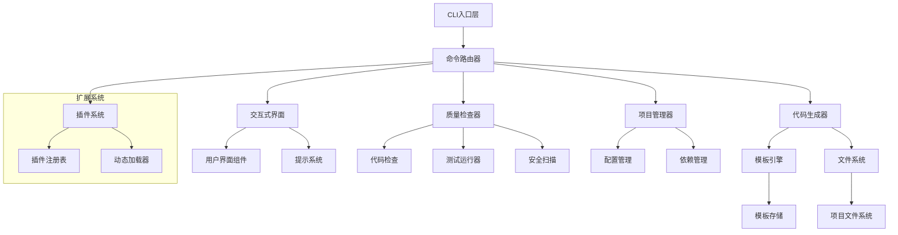

# 设计文档

## 概述

本文档描述了将switctl重构为Swit框架脚手架工具的详细设计。新的switctl将提供交互式用户界面、代码生成、质量检查和项目管理功能，同时保持高度的扩展性以适应Swit框架的快速发展。

## 架构

### 整体架构



### 分层架构

1. **CLI入口层**: 基于Cobra的命令行接口
2. **业务逻辑层**: 核心功能实现
3. **服务层**: 可复用的服务组件
4. **基础设施层**: 文件系统、模板引擎、外部工具集成
5. **扩展层**: 插件系统和动态扩展

## 组件和接口

### 核心接口定义

```go
// 命令接口
type Command interface {
    Execute(ctx context.Context, args []string) error
    GetHelp() string
    GetUsage() string
}

// 交互式界面接口
type InteractiveUI interface {
    ShowWelcome() error
    PromptInput(prompt string, validator func(string) error) (string, error)
    ShowMenu(title string, options []MenuOption) (int, error)
    ShowProgress(title string, total int) ProgressBar
    ShowSuccess(message string) error
    ShowError(err error) error
}

// 代码生成器接口
type Generator interface {
    GenerateService(config ServiceConfig) error
    GenerateAPI(config APIConfig) error
    GenerateModel(config ModelConfig) error
    GenerateMiddleware(config MiddlewareConfig) error
}

// 模板引擎接口
type TemplateEngine interface {
    LoadTemplate(name string) (Template, error)
    RenderTemplate(template Template, data interface{}) ([]byte, error)
    RegisterFunction(name string, fn interface{}) error
}

// 质量检查器接口
type QualityChecker interface {
    CheckCodeStyle() CheckResult
    RunTests() TestResult
    CheckSecurity() SecurityResult
    CheckCoverage() CoverageResult
    ValidateConfig() ValidationResult
}

// 插件接口
type Plugin interface {
    Name() string
    Version() string
    Initialize(config PluginConfig) error
    Execute(ctx context.Context, args []string) error
    Cleanup() error
}
```

### 用户界面组件

```go
// 菜单选项
type MenuOption struct {
    Label       string
    Description string
    Value       interface{}
    Icon        string
}

// 进度条
type ProgressBar interface {
    Update(current int) error
    SetMessage(message string) error
    Finish() error
}

// 颜色和样式
type UIStyle struct {
    Primary   Color
    Success   Color
    Warning   Color
    Error     Color
    Info      Color
    Highlight Color
}

// 输入验证器
type InputValidator func(input string) error

// 常用验证器
var (
    ServiceNameValidator InputValidator = func(input string) error {
        if !regexp.MustCompile(`^[a-z][a-z0-9-]*[a-z0-9]$`).MatchString(input) {
            return errors.New("服务名必须是小写字母、数字和连字符组成")
        }
        return nil
    }
    
    PortValidator InputValidator = func(input string) error {
        port, err := strconv.Atoi(input)
        if err != nil || port < 1024 || port > 65535 {
            return errors.New("端口号必须在1024-65535之间")
        }
        return nil
    }
)
```

## 数据模型

### 配置模型

```go
// 服务配置
type ServiceConfig struct {
    Name        string            `yaml:"name" validate:"required"`
    Description string            `yaml:"description"`
    Author      string            `yaml:"author"`
    Version     string            `yaml:"version" default:"0.1.0"`
    Features    ServiceFeatures   `yaml:"features"`
    Database    DatabaseConfig    `yaml:"database"`
    Auth        AuthConfig        `yaml:"auth"`
    Ports       PortConfig        `yaml:"ports"`
    Metadata    map[string]string `yaml:"metadata"`
}

// 服务特性
type ServiceFeatures struct {
    Database      bool `yaml:"database" default:"true"`
    Authentication bool `yaml:"authentication" default:"false"`
    Cache         bool `yaml:"cache" default:"false"`
    MessageQueue  bool `yaml:"message_queue" default:"false"`
    Monitoring    bool `yaml:"monitoring" default:"true"`
    Tracing       bool `yaml:"tracing" default:"true"`
}

// 数据库配置
type DatabaseConfig struct {
    Type     string `yaml:"type" default:"mysql"`
    Host     string `yaml:"host" default:"localhost"`
    Port     int    `yaml:"port" default:"3306"`
    Database string `yaml:"database"`
    Username string `yaml:"username"`
    Password string `yaml:"password"`
}

// 认证配置
type AuthConfig struct {
    Type       string        `yaml:"type" default:"jwt"`
    SecretKey  string        `yaml:"secret_key"`
    Expiration time.Duration `yaml:"expiration" default:"15m"`
    Issuer     string        `yaml:"issuer"`
}

// 端口配置
type PortConfig struct {
    HTTP int `yaml:"http" default:"9000"`
    GRPC int `yaml:"grpc" default:"10000"`
}
```

### 模板数据模型

```go
// 模板数据
type TemplateData struct {
    Service    ServiceConfig     `json:"service"`
    Package    PackageInfo       `json:"package"`
    Imports    []ImportInfo      `json:"imports"`
    Functions  []FunctionInfo    `json:"functions"`
    Structs    []StructInfo      `json:"structs"`
    Interfaces []InterfaceInfo   `json:"interfaces"`
    Metadata   map[string]string `json:"metadata"`
}

// 包信息
type PackageInfo struct {
    Name       string `json:"name"`
    Path       string `json:"path"`
    ModulePath string `json:"module_path"`
}

// 导入信息
type ImportInfo struct {
    Alias string `json:"alias,omitempty"`
    Path  string `json:"path"`
}

// 函数信息
type FunctionInfo struct {
    Name       string         `json:"name"`
    Receiver   string         `json:"receiver,omitempty"`
    Parameters []ParameterInfo `json:"parameters"`
    Returns    []ReturnInfo    `json:"returns"`
    Body       string         `json:"body"`
}

// 结构体信息
type StructInfo struct {
    Name   string      `json:"name"`
    Fields []FieldInfo `json:"fields"`
    Tags   []TagInfo   `json:"tags"`
}
```

### 检查结果模型

```go
// 检查结果
type CheckResult struct {
    Name     string        `json:"name"`
    Status   CheckStatus   `json:"status"`
    Message  string        `json:"message"`
    Details  []CheckDetail `json:"details,omitempty"`
    Duration time.Duration `json:"duration"`
}

// 检查状态
type CheckStatus string

const (
    CheckStatusPass    CheckStatus = "pass"
    CheckStatusFail    CheckStatus = "fail"
    CheckStatusWarning CheckStatus = "warning"
    CheckStatusSkip    CheckStatus = "skip"
)

// 检查详情
type CheckDetail struct {
    File    string `json:"file,omitempty"`
    Line    int    `json:"line,omitempty"`
    Column  int    `json:"column,omitempty"`
    Message string `json:"message"`
    Rule    string `json:"rule,omitempty"`
}

// 测试结果
type TestResult struct {
    TotalTests  int           `json:"total_tests"`
    PassedTests int           `json:"passed_tests"`
    FailedTests int           `json:"failed_tests"`
    Coverage    float64       `json:"coverage"`
    Duration    time.Duration `json:"duration"`
    Failures    []TestFailure `json:"failures,omitempty"`
}

// 测试失败信息
type TestFailure struct {
    Test    string `json:"test"`
    Package string `json:"package"`
    Message string `json:"message"`
    Output  string `json:"output"`
}
```

## 错误处理

### 错误类型定义

```go
// 基础错误类型
type SwitctlError struct {
    Code    string `json:"code"`
    Message string `json:"message"`
    Details string `json:"details,omitempty"`
    Cause   error  `json:"-"`
}

func (e *SwitctlError) Error() string {
    if e.Details != "" {
        return fmt.Sprintf("%s: %s (%s)", e.Code, e.Message, e.Details)
    }
    return fmt.Sprintf("%s: %s", e.Code, e.Message)
}

// 错误代码常量
const (
    ErrCodeInvalidInput     = "INVALID_INPUT"
    ErrCodeFileNotFound     = "FILE_NOT_FOUND"
    ErrCodePermissionDenied = "PERMISSION_DENIED"
    ErrCodeTemplateError    = "TEMPLATE_ERROR"
    ErrCodeGenerationFailed = "GENERATION_FAILED"
    ErrCodeValidationFailed = "VALIDATION_FAILED"
    ErrCodePluginError      = "PLUGIN_ERROR"
)

// 错误构造函数
func NewInvalidInputError(message string, details ...string) *SwitctlError {
    detail := ""
    if len(details) > 0 {
        detail = details[0]
    }
    return &SwitctlError{
        Code:    ErrCodeInvalidInput,
        Message: message,
        Details: detail,
    }
}

func NewTemplateError(message string, cause error) *SwitctlError {
    return &SwitctlError{
        Code:    ErrCodeTemplateError,
        Message: message,
        Cause:   cause,
    }
}
```

### 错误处理策略

1. **输入验证错误**: 提供具体的修正建议
2. **文件系统错误**: 检查权限和路径有效性
3. **模板错误**: 显示模板位置和语法错误
4. **网络错误**: 提供重试机制和离线模式
5. **插件错误**: 隔离插件错误，不影响核心功能

## 测试策略

### 测试层次

1. **单元测试**: 测试各个组件的独立功能
2. **集成测试**: 测试组件间的交互
3. **端到端测试**: 测试完整的用户工作流
4. **性能测试**: 测试大型项目的生成性能
5. **兼容性测试**: 测试不同Go版本和操作系统的兼容性

### 测试工具和框架

```go
// 测试接口
type TestSuite interface {
    SetupSuite() error
    TearDownSuite() error
    SetupTest() error
    TearDownTest() error
}

// Mock接口
type MockGenerator struct {
    GenerateServiceFunc func(config ServiceConfig) error
    GenerateAPIFunc     func(config APIConfig) error
}

func (m *MockGenerator) GenerateService(config ServiceConfig) error {
    if m.GenerateServiceFunc != nil {
        return m.GenerateServiceFunc(config)
    }
    return nil
}

// 测试辅助函数
func CreateTempProject(t *testing.T) string {
    dir, err := os.MkdirTemp("", "switctl-test-*")
    require.NoError(t, err)
    t.Cleanup(func() {
        os.RemoveAll(dir)
    })
    return dir
}

func AssertFileExists(t *testing.T, path string) {
    _, err := os.Stat(path)
    assert.NoError(t, err, "文件应该存在: %s", path)
}

func AssertFileContains(t *testing.T, path, content string) {
    data, err := os.ReadFile(path)
    require.NoError(t, err)
    assert.Contains(t, string(data), content)
}
```

### 测试数据管理

```go
// 测试数据
type TestData struct {
    ServiceConfigs map[string]ServiceConfig `yaml:"service_configs"`
    Templates      map[string]string        `yaml:"templates"`
    ExpectedFiles  map[string][]string      `yaml:"expected_files"`
}

// 测试数据加载器
type TestDataLoader struct {
    dataDir string
}

func NewTestDataLoader(dataDir string) *TestDataLoader {
    return &TestDataLoader{dataDir: dataDir}
}

func (l *TestDataLoader) LoadServiceConfig(name string) (ServiceConfig, error) {
    path := filepath.Join(l.dataDir, "configs", name+".yaml")
    data, err := os.ReadFile(path)
    if err != nil {
        return ServiceConfig{}, err
    }
    
    var config ServiceConfig
    err = yaml.Unmarshal(data, &config)
    return config, err
}
```

## 实现细节

### 命令行接口实现

```go
// 根命令
func NewRootCommand() *cobra.Command {
    cmd := &cobra.Command{
        Use:   "switctl",
        Short: "Swit框架脚手架工具",
        Long:  "switctl是Swit微服务框架的官方脚手架工具，提供项目生成、代码检查和开发辅助功能。",
        PersistentPreRunE: func(cmd *cobra.Command, args []string) error {
            return initializeConfig(cmd)
        },
    }
    
    // 添加全局标志
    cmd.PersistentFlags().Bool("verbose", false, "显示详细输出")
    cmd.PersistentFlags().Bool("no-color", false, "禁用彩色输出")
    cmd.PersistentFlags().String("config", "", "配置文件路径")
    
    // 添加子命令
    cmd.AddCommand(NewNewCommand())
    cmd.AddCommand(NewGenerateCommand())
    cmd.AddCommand(NewCheckCommand())
    cmd.AddCommand(NewInitCommand())
    cmd.AddCommand(NewDevCommand())
    cmd.AddCommand(NewDepsCommand())
    
    return cmd
}

// new命令
func NewNewCommand() *cobra.Command {
    cmd := &cobra.Command{
        Use:   "new",
        Short: "创建新的项目或组件",
    }
    
    cmd.AddCommand(NewNewServiceCommand())
    cmd.AddCommand(NewNewProjectCommand())
    
    return cmd
}

// new service命令
func NewNewServiceCommand() *cobra.Command {
    var interactive bool
    
    cmd := &cobra.Command{
        Use:   "service [name]",
        Short: "创建新的微服务",
        Args:  cobra.MaximumNArgs(1),
        RunE: func(cmd *cobra.Command, args []string) error {
            if len(args) == 0 || interactive {
                return runInteractiveServiceCreation(cmd.Context())
            }
            return runServiceCreation(cmd.Context(), args[0])
        },
    }
    
    cmd.Flags().BoolVarP(&interactive, "interactive", "i", false, "使用交互式模式")
    
    return cmd
}
```

### 交互式界面实现

```go
// 交互式UI实现
type TerminalUI struct {
    input  io.Reader
    output io.Writer
    style  UIStyle
}

func NewTerminalUI() *TerminalUI {
    return &TerminalUI{
        input:  os.Stdin,
        output: os.Stdout,
        style:  DefaultUIStyle(),
    }
}

func (ui *TerminalUI) ShowWelcome() error {
    welcome := `
╭─────────────────────────────────────────╮
│  🚀 欢迎使用 Swit 框架脚手架工具        │
│                                         │
│  让我们一起创建一个新的微服务！         │
╰─────────────────────────────────────────╯
`
    fmt.Fprint(ui.output, ui.style.Primary.Sprint(welcome))
    return nil
}

func (ui *TerminalUI) PromptInput(prompt string, validator InputValidator) (string, error) {
    for {
        fmt.Fprint(ui.output, ui.style.Info.Sprint("? "))
        fmt.Fprint(ui.output, prompt)
        fmt.Fprint(ui.output, ": ")
        
        reader := bufio.NewReader(ui.input)
        input, err := reader.ReadString('\n')
        if err != nil {
            return "", err
        }
        
        input = strings.TrimSpace(input)
        if validator != nil {
            if err := validator(input); err != nil {
                fmt.Fprint(ui.output, ui.style.Error.Sprint("✗ "))
                fmt.Fprintln(ui.output, err.Error())
                continue
            }
        }
        
        return input, nil
    }
}

func (ui *TerminalUI) ShowMenu(title string, options []MenuOption) (int, error) {
    fmt.Fprintln(ui.output, ui.style.Primary.Sprint(title))
    
    for i, option := range options {
        icon := option.Icon
        if icon == "" {
            icon = "○"
        }
        fmt.Fprintf(ui.output, "  %s %d) %s\n", 
            ui.style.Info.Sprint(icon), 
            i+1, 
            option.Label)
        if option.Description != "" {
            fmt.Fprintf(ui.output, "     %s\n", 
                ui.style.Highlight.Sprint(option.Description))
        }
    }
    
    for {
        choice, err := ui.PromptInput("请选择", func(input string) error {
            num, err := strconv.Atoi(input)
            if err != nil || num < 1 || num > len(options) {
                return fmt.Errorf("请输入1-%d之间的数字", len(options))
            }
            return nil
        })
        if err != nil {
            return 0, err
        }
        
        num, _ := strconv.Atoi(choice)
        return num - 1, nil
    }
}
```

### 模板引擎实现

```go
// Go模板引擎实现
type GoTemplateEngine struct {
    templateDir string
    funcMap     template.FuncMap
}

func NewGoTemplateEngine(templateDir string) *GoTemplateEngine {
    return &GoTemplateEngine{
        templateDir: templateDir,
        funcMap:     make(template.FuncMap),
    }
}

func (e *GoTemplateEngine) LoadTemplate(name string) (Template, error) {
    path := filepath.Join(e.templateDir, name)
    tmpl, err := template.New(filepath.Base(name)).
        Funcs(e.funcMap).
        ParseFiles(path)
    if err != nil {
        return nil, NewTemplateError("加载模板失败", err)
    }
    
    return &GoTemplate{template: tmpl}, nil
}

func (e *GoTemplateEngine) RegisterFunction(name string, fn interface{}) error {
    e.funcMap[name] = fn
    return nil
}

// 内置模板函数
func (e *GoTemplateEngine) registerBuiltinFunctions() {
    e.funcMap["camelCase"] = func(s string) string {
        return strcase.ToCamel(s)
    }
    
    e.funcMap["snakeCase"] = func(s string) string {
        return strcase.ToSnake(s)
    }
    
    e.funcMap["kebabCase"] = func(s string) string {
        return strcase.ToKebab(s)
    }
    
    e.funcMap["pascalCase"] = func(s string) string {
        return strcase.ToPascal(s)
    }
    
    e.funcMap["upper"] = strings.ToUpper
    e.funcMap["lower"] = strings.ToLower
    
    e.funcMap["now"] = time.Now
    e.funcMap["year"] = func() int {
        return time.Now().Year()
    }
}
```

### 插件系统实现

```go
// 插件管理器
type PluginManager struct {
    plugins   map[string]Plugin
    pluginDir string
    loader    PluginLoader
}

func NewPluginManager(pluginDir string) *PluginManager {
    return &PluginManager{
        plugins:   make(map[string]Plugin),
        pluginDir: pluginDir,
        loader:    NewGoPluginLoader(),
    }
}

func (pm *PluginManager) LoadPlugins() error {
    entries, err := os.ReadDir(pm.pluginDir)
    if err != nil {
        return err
    }
    
    for _, entry := range entries {
        if !entry.IsDir() && strings.HasSuffix(entry.Name(), ".so") {
            pluginPath := filepath.Join(pm.pluginDir, entry.Name())
            plugin, err := pm.loader.LoadPlugin(pluginPath)
            if err != nil {
                log.Printf("加载插件失败 %s: %v", pluginPath, err)
                continue
            }
            
            pm.plugins[plugin.Name()] = plugin
        }
    }
    
    return nil
}

func (pm *PluginManager) GetPlugin(name string) (Plugin, bool) {
    plugin, exists := pm.plugins[name]
    return plugin, exists
}

// Go插件加载器
type GoPluginLoader struct{}

func NewGoPluginLoader() *GoPluginLoader {
    return &GoPluginLoader{}
}

func (l *GoPluginLoader) LoadPlugin(path string) (Plugin, error) {
    p, err := plugin.Open(path)
    if err != nil {
        return nil, err
    }
    
    symbol, err := p.Lookup("Plugin")
    if err != nil {
        return nil, err
    }
    
    plugin, ok := symbol.(Plugin)
    if !ok {
        return nil, errors.New("插件不实现Plugin接口")
    }
    
    return plugin, nil
}
```

这个设计文档提供了switctl重构的完整架构和实现细节，包括交互式界面、模板系统、插件架构等核心组件的设计。设计充分考虑了扩展性和可维护性，能够适应Swit框架的快速发展需求。